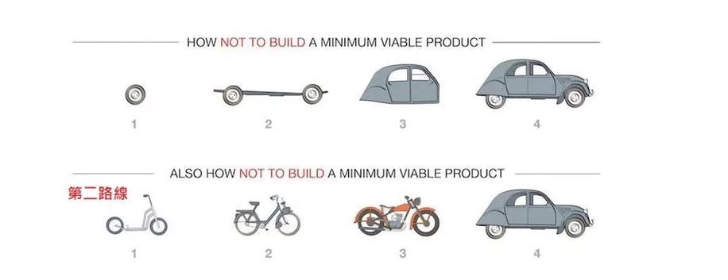
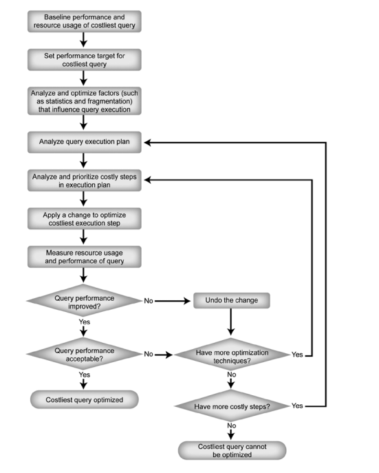

# The Effective Engineer


[TOC]

# 會前會
Date: 2018-12-28 (五)

使用 ORID 的方式分享讀後心得
* 「Objective」指了解客觀事實的問句
  * 在這個章節上，你看到了什麼？還記得哪些段落？
* 「Reflective」喚起情緒與感受的問句
  * 這章有哪些部份是讓你印象深刻的嗎？
  * 讀完這個章節的感受是什麼？
* 「Interpretive」尋找解釋前述感受的問句
  * 為什麼書中的這些部份讓你印象深刻？
  * 為什麼會帶給你這樣的感受(感動/驚訝/難過/開心)？
  * 引發你想到了什麼經驗？重要的意義是什麼？ 
* 「Decisional」找出決議和行動的問句
  * 這個章節有帶給我們可以改變或應用的地方嗎？
  * 接下來你的行動/計劃會是什麼？


詳細內容可以參考這個 -> [焦點討論法 (ORID)](http://kojenchieh.pixnet.net/blog/post/391843868-%E7%84%A6%E9%BB%9E%E8%A8%8E%E8%AB%96%E6%B3%95-(orid))

主持人輪流做，負責發會議通知、訂會議室，時間是每週二下午四點。
在參與的過程中讓每個人發言，分享自己的 ORID

用開放式的討論：
* 不要怕自己問蠢問題
* 不要用批評或攻擊的


# Chap 1 : Focus on High-Leverage Activities 
Date: 2019-1-8 (二)

## Hill

**O: 你覺得第一章的重點是什麼？**
```
Leverage = Impact Produced / Time Invested
```

* 要專注在高 Leverage 的工作上，才能稱為 Effective。
* 時間是有限的，但工作是無限的，所以我們應該選擇重要的工作優先做。
* 80/20 法則，80% 的 value 來自 20% 的工作。

**R：你對第一章的內容有什麼感覺？**

* 作者找出了一個有道理的公式，來判斷、計算完成事情的效率。
* 如果一件工作是很有價值的，但是卻很花時間(很晚才推到市場去驗證)，那也許做這件事是不值得的。
* 如果一件工作可以很快的完成，但是卻不能產生什麼價值，那也許我們不該先做這個工作。
* 挑選一個工作來做，應如同投資一樣，要選擇投資報酬率高的。


**I：第一章的內容有哪些對你來說特別有價值及意義？為什麼？**

* Leverage 的公式對我來說很有價值，因為它可以幫助我決定接下來該先做些什麼。
* Impact Produced 每個人定義可能都不同，所以要跟相關人士 (PM/QA/Others) 討論清楚。討論之前最好先做功課，有數據佐證比較有說服力。
* 之前習慣用 [Getting Things Done (GTD)](https://murphymind.blogspot.com/2007/04/2-getting-things-done.html) 的方式決定優先順序，很多時候會先做 Easy Win(像是處理 email)，而不是困難卻 High Leverage 的工作，這一章的內容提醒我要加入 Leverage 來判斷事情的優先順序。
* 思考如何增加 Leverage 的三個方式對我來說很有價值，可以問自己這三個問題來找出應優先做的工作。
  * 要如何才能減少完成某項工作的時間？
  * 要如何才能增加完成某項工作所產生的價值？
  * 有沒有其他工作比這項工作有更高的 Leverage？

**D：看完第一章，你接下來會想怎樣改變自己的工作習慣？**

* 會想把每一件待辦事項的 Leverage 算出來並排序，優先做高 Leverage 的事。跟其他同事討論的過程中也嘗試理解彼此的優先順序為何不同。
* 在工作跟同事討論接下來的工作項目時，我可以透過分享 Leverage 的計算方式，幫助同事找出應先完成的工作。

**想跟大家討論**
1. 招募人才對公司來說是至關重要的事，請問如何招募到最好的人才？如何找出最好的人才？如何留住最好的人才？
2. 要怎麼判斷一件事的 Value 是高還低？
3. 團隊中每個人覺得對於高 Value 的事情認知都不同，該怎麼辦呢？


## Ghost

### O

* Leverage = Impact Produced / Time Invested
* Onboarding Program 的方式值得我們參考借鏡
* Time is your most limited resource.
* To increase the leverage of each activity

### R

* 很期待後面怎麼給例子去定義公式的參數

### I
* 有些事(hiring)是大家都知道很重要的，但要將其轉換為有效行動是另一回事。
	用完整的 SOP 將這類事制定出來可以有效的讓大家有方法可循。
* 時刻要記得時間是有限資源，並盡可能專注在 ROI 高的工作上
* 任何必要事件都可以再最佳化其流程，在舉的幾個例子中如開會...etc
* 	
	
### D
* 試著明確將工作的 Leverage 練習定出來

> R 跟 I 我有點混淆 [name=Ghost Yang]

## Jane

**Objective**

除了對Leverage的定義以及案例的說明之外，有三個可以幫助自己反思的問題：
* 如何可以在更短的時間內做完？
* 如果可以讓自己的工作創造更多的價值跟影響？
* 還有什麼是自己可以做又能夠幫助產出增加的？

**Reflective**

以前在學校上過人力資源的課，其實第一章在講的東西和心理學有某種程度的相關聯性，我覺得看完第一章會讓我聯想到:
```
成就感
```
當成就感提升，團隊的士氣就會有被鼓舞的感覺，就會更努力的讓自己的工作更好，效率更高，追求更高的產出與品質提升。我覺得第一章的觀念其實大家都明白，只是缺乏系統性的方式讓自己深刻的了解。Leverage其實是很好幫助自己將工作排序的觀念。

**Interpretive**

承Reflective，Leverage其實是很好幫自己工作排序的工具，對我自己的價值其實是我可以更有效率的在最短的時間內為團隊帶來一定程度的影響力，前提是大家對於每個工作項目的影響力認知落差不會太大。

**Decisional**

可以開始練習把這樣的觀念落實在自己的工作與生活中，每個人在生活中都扮演不一樣的角色，有不一樣的工作，這樣的觀念可以很好的幫助我們完成各式作項目


## Ouch

### Objective

> "Give me a place to stand, and a lever long
enough, and I shall move the world." - by Archimedes

> Identify the habits that produce disproportionately
high impact for the time you invest.

> Find ways
to get an activity done more quickly, to increase the impact of
an activity, or to shift to activities with higher leverage.

### Reflective

困惑：在現實生活中，尤其是工作，很難讓你能自由的決定槓桿的價值。

### Interpretive

書中講到的新人教育訓練，有沒有辦法用系統性的方式來進行?例如透過新人 onboard 系統，提供一連串的線上課程之類的。

如果作每一件事之前都先停下來想價值、排序、想有沒有能提高槓桿價值的作事方法，應該可以壓榨出更高的"產值"。

但是，我自己還離這樣的模式很遠。

### Decisional

或許之後可以試著在作事之前先停下來排序和想它的價值在哪。


## Rocky

**O**

* 80/20法則，花20%的時間，創造80%的效益。

**R**

*價值的定義，是跟上位者的觀念有關係，要如何快速抓住上位者所要的核心價值？
*價值是浮動的，依據工作環境。

**I**

*增加自己的抉擇能力，才能清楚分辨最重要的優先順序。
*面對自己認為有價值的事情，但是優先權卻不是那麼高，要學會放下。
*任何事情都是能再優化的，但要考慮到所花費的時間。

**Decisional**

*將每天要做的事情，優先順序排出來，並且明確執行。
*學著將自己所做的事情，都能有其意義。


# Chap 2 : Optimize for Learning
Date: 2019-1-15 (二)


## Hill

**O: 你覺得這章的重點是什麼？**

* 要建立成長心態、經由努力學習新事物 、 決定自己要變成什麼人，別讓別人定義你。
* 把自己當成一個剛開始創業的公司一樣投資，只有「成長」是最重要的事。
* 每天成長1%，一年後我們就會成長到 3700%，而不是365%。

* Own your story >>> make your own future. 掌握自己的未來

**R：你對這章的內容有什麼感覺？**

願不願意跨出那一步
>>作者原本是一個內向的人，不喜歡參與社交活動，尤其是跟不認識的人交談
但是突然想開想當一個健談的人，於是接下來的一年不斷訓練自己的社交能力
如果在一個話題無法好好發揮，會想再下一次改進

呼應之後說的 Continuous iteration

#### Adopt a Growth Mindset

growth mindset >> 成長型思維模式 >> 要相信自己可以不斷進步

環境是很重要的，如何找到一個對自己有正面幫助的環境
在「Seek Work Environments Conducive to Learning」這個章節裡面，
除了可以檢視目前的工作環境有沒有符合，也可以當作下一份工作時，挑選公司的指標

#### Invest in Your Rate of Learning
- 複利的力量
- 就像是財務投資，越早投資，時間拉長就能加速成長
- 投入越多複利的效果越大

#### Seek Work Environments Conducive to Learning
- Fast growth - 判斷是不是一家快速成長公司
- Training 
- Openness - 開放的企業文化, 可以開誠布公討論各種問題，可以知道公司內部訊息
- Pace - 工作節奏
- People - 有沒有值得學習、交流的對象
- Autonomy - 是否有可以接觸不同的項目，而不是一直做單一項目

#### Dedicate Time on the Job to Develop New Skills

檢視目前的工作環境，有什麼方式可以讓自己繼續成長
1. 去看公司內最強的人是怎麼寫程式的
2. 既然看了，就找機會去練習
3. 如果不錯的文件、教材，就抓來看
4. 也要精通目前使用的程式語言、開發工具
5. 可以把自己的程式讓別人 review，看看有沒有更好的方法
6. 參加自己有興趣的課程
7. 如果對於有興趣的專案，主動去加入。
8. 不要讓自己侷限於某一個項目，去接觸不同項目，多元發展
9. 確定團隊中還有學習的對象
10. 不要害怕去看沒有文件、說明的程式碼

#### Always Be Learning

1. Invest in skills that are in high demand. 可以參考目前最熱烈討論的技術 去學習
2. 也要跟別人互動，驗證、發掘自己的想法如何


**I：這章的內容有哪些對你來說特別有價值及意義？為什麼？**

* Treating yourself like a startup  把自己當作一家公司在經營
* 每次學習之後都找機會上場，再根據反饋改進

> 要不斷成長

**D：看完這，你接下來會想怎樣改變自己的工作習慣？**
* 永遠投入學習。投資有高需求的技能、廣泛閱讀書、加入討論群組、參加各種 talk、conference、meetup、建立跟保持人脈、追蹤教學 blog、寫教學文章、投入 side project。
* 除了不斷的學習，也要找機會練習出來 >> 多跟別人交流、討論，不要太過自閉或自負
* 整個流程是一個 Learning Cycle，週期不要太長，但是要頻繁、不斷累積
* Own your story >>> make your own future. 掌握自己的未來

## Wofy

**O: 你覺得這章的重點是什麼？**

*  作者很棒很厲害
*  作者挑戰離開舒適圈很棒
*  Ho w we view our own effectiveness impatcs how much effort we invest in improving it	
*  Learning, like interset, also compunds

**R：你對這章的內容有什麼感覺？**
* they view challenges and failures as opportunities to lean
* it's not about  apoloizing for where your resume doesn't line up but rarther telling your story- who you are, what skills you've built, what you're excited about donig next
* Treat yourself like a startup.

**I：這章的內容有哪些對你來說特別有價值及意義？為什麼？**

* 我們的工作每天都充滿這挑戰與關卡,只有面對挑戰跟樂於學習才有版法解決問題跟持續進步


**D：看完這，你接下來會想怎樣改變自己的工作習慣？**
* 持續學習,確保自己每天都有進步

## Rocky

**O: 你覺得這章的重點是什麼？**

* 真好奇，作者為什麼要跳離舒適圈？
* 沒有什麼事情比 學習 更重要。
* 把自己當成一個 品牌 經營，學習 和 自省 是增加自身品牌價值的方法。
* 當自己自身(品牌)強大以後，開始建立傳承/系統化的方式，讓品牌不僅可以被複製，也達到複利的效果，讓自身(品牌)價值更高。

**R：你對這章的內容有什麼感覺？**

* 勇於跳脫舒適圈是一件很棒的，因為代表我們即將創立另一個屬於自己的舒適圈，當自己曾經擁有的舒適圈越來越多，代表自身越來越強大，到什麼環境都能自處的很好。
* 持續學習，挑戰壓力，讓自己心理和生理達到一個平衡，才是真正的健康。
* 複利的力量，沒有奇蹟只有累積。

**I：這章的內容有哪些對你來說特別有價值及意義？為什麼？**

* 勇於挑脫舒適圈以後，也要時時調整自己的學習和做事方式，因為我們的環境和自身，每一分鐘都在改變。
* 有正面積極的學習心態，面對挫折和挑戰時，會更有耐心和理性的去面對問題。

**D：看完這，你接下來會想怎樣改變自己的工作習慣？**

* 學習後要行動，找人練習，請對方給予回饋，才會讓書中的知識，內化為自己的經驗。
* 保持對人的興趣。
* 遇到難題挑戰時，先處理完事情，再處理自己的情緒。
* 人生就是一本書，書殼是由父母給，章節內容自己寫，厚度自己無法決定，精彩度卻能自己創造，當書的內容豐富，自然就對越來越多人產生影響，成就自己也成就他人。

**想跟大家討論的問題**

* 學習方式？

## Ghost

**O: 你覺得這章的重點是什麼？**

* 人是能學習進步的，不擅長的事也可以累積起可觀的資源
* 持續投資自己，並且盡早投資
* 持續投資的複利結果是豐碩的
* 持續評估環境狀況，適時跳脫舒適圈
* 作者給的評估建議

**R：你對這章的內容有什麼感覺？**

* 對職涯而言，越早投資自己越有利，而學習是逐漸累積起來的，每次一小步的進步，都會讓結果更可觀；而投資自己最大的成本是時間，盡可能提醒自己時間是可貴的，要盡量拿來投資自己。
* 維持進步的方式建議都是自己需要加強或維持的。

**I：這章的內容有哪些對你來說特別有價值及意義？為什麼？**

* 時間是每個人都有的資源，公平且平等，要好好把握這個有限資源，時時刻刻提醒自己不要浪費生命。

**D：看完這，你接下來會想怎樣改變自己的工作習慣？**

* 維持與同事 Code Review 的習慣，加強自己
* 主動去與能力好的同事多討論


# Chap 3 : Prioritize Regularly
Date: 2019-2-12 (二)


## Hill

**O: 你覺得這章的重點是什麼？**

* Write down and review to-dos.
人的腦袋是用來處理事情，不是記事情的。
* Work on what directly leads to value.
別想完成所有的事，因為這是不可能的。先做那些high leverage的事情。
* Work on the important and non-urgent.
工作再忙，也要投資自己的能力，多學一點東西，長期來看，這是很有價值的。學習是沒有deadline的，所以大家常常忽略了。
* Reduce context switches.
保護自己的專注力，讓自己有長一點的block可以進入工作狀態。避免同時進行太多工作，一直切換效率不好。
* Make if-then plans to combat procrastination.
設定一個觸發條件，「如果怎麼樣，我就做什麼」來增加自己按時進行工作的機率，避免拖延。
* Make prioritization a habit.
試著建立自己的工作流程，讓定期priorzation成為自己的習慣。


**R：你對這章的內容有什麼感覺？**

* Track To-Dos in a Single, Easily Accessible List
  * 建立 checklist 可以幫助我們在做複雜的工作時，不會忘記必要的步驟。人類的腦袋不擅長記憶，擅長處理事情，所以把要做的事情記在一個To-do list裡吧。
* To-do list 要清楚的列出待做的工作，還要放在一個容易取得的地方。

* 估計每件事情的Leverage，排序後就可以從最高Leverage的事情開始做。
* 雖然估計Leverage很困難，但我們定期的反思，並優先做最高Leverage的工作，長期來看，會使我們的工作成效最好。

如何找出高Leverage的工作，以下有兩個策略可以使用。


* Focus on What Directly Produces Value
  * 做那些可以直接產生Value的工作。
  * 減少那些不產生Value的工作，像是寫進度報告、開會、低效率的溝通、組織事物、花太多時間回email。
  * 要確保自己的努力是值得的。
  * 學會說不，不是每件事情都值得你去做。

* Focus on the Important and Non-Urgent
我們被每天的工作淹沒，所以常常會忽略某些值得投資的事物。
別讓每天的各種小事、急事，中斷、影響了你最重要的工作。讓最重要的工作決定我們的schedule。
投資我們的能力，使我們未來更 effective。
* 可以試著把自己的to-do list中的工作分為四個象限。
事情依重要/不重要，緊急/不緊急分為四個象限，緊急的事不等於重要的事。
重要但不緊急的事如：計畫未來、建立良好的關係、提升自己的能力、建立良好的習慣、使用工具改進我們的workflow、確保基礎建設可以scale、學新的程式語言、在conference上演講、mentor其他的團隊成員。
重要但不緊急的事情沒有deadline，所以常常不被注意。
雖然工作很多，但還是要分出時間來使自己成長。


* Protect Your Maker’s Schedule
我們的工作需要長一點的時間才能進入Flow的狀態，所以要保護自己的schedule，不要常常被切的很零碎。

* Limit the Amount of Work in Progress
當我們手上有多個project要進行，難免常常要做切換，而這樣就使我們很難有好的表現。

* Fight Procrastination with If-Then Plans
事先想好If-Then的規則，讓自己下意識準備去做某件事，可以降低我們拖延做某件重要但不太想做的事。
`
如果我有20分鐘的空閒，那我就做XXX
`
* Make a Routine of Prioritization
建立自己的Routine，沒有最好的Routine，只有最適合自己的。

作者提到自己的 work flow，是使用Asana管理 Todo List，並把把所有計畫要做的事放在Backlog。
* 每週的開始，選擇一些工作放在This week
* 每天的開始，從This week中放一些工作進入Today

每個工作前面用[]標記估計的時間，單位可以是蕃茄鐘的數量或其他時間單位。

* 盡量避免不需要自己出席的會議。若避免不了，就盡量把會議集中在一起。若可以把會議集中在一起，集中在一天的開始或結束，那就更好。
* 養成習慣，每天早上進行 Prioritization，Review 前一天的工作狀況。
* 當一天中有空的時候，把一項工作從Today移到Doing，然後專注的完成它。
* 使用Focus Booster專注在一個蕃茄鐘之中。統計自己工作花了多少時間，用來驗證自己的事前估計是否準確。

* 完成任務就checkout，使用Asana就知道自己的一天是否productive。
* 有新任務出現時，若緊急的話就放入Today或This week，如果不急就放入backlog。
* 每週結束，要花30分鐘做planning。Review自己前一週的工作，找出Priorities無法完成的原因。
* 每週/月 Planning時，可以做出更大的改變，排入重要但非緊急的學習課程，或者自動化工作流程。


**I：這章的內容有哪些對你來說特別有價值及意義？為什麼？**

* Focus on the Important and Non-Urgent
很多緊急且重要的問題是來自於對於學習的投資不足。可能是因為沒有自動回復的系統、測試率不足、對於計畫的估計或安排能力不足。**投資在不緊急但重要的工作上，可以有效減少緊急且重要的工作**。

* Make a Routine of Prioritization
重要的不是follow作者的習慣，而是建立出一套適合自己的系統，讓priorizating變成自己定期的習慣。
priorizating雖然不是在完成工作，所以常常讓人感受不到效用，但其實它可以幫助我們 get the right thing done，產生更多 影響力。

**D：看完這章，你接下來會想怎樣改變自己的工作習慣？**

* Reduce context switches.
保護自己的專注力，讓自己有長一點的block可以進入工作狀態。避免同時進行太多工作，一直切換會造成效率不好。
蕃茄鐘對我的幫助很大，設定一段時間強迫自己專注在項目內。並統計自己工作花了多少時間，用來驗證自己的事前估計是否準確。每個蕃茄鐘之間有設定一段休息時間(10 mins)，用來休息、準備下一個項目。


**想跟大家討論的問題**
* 各位有用什麼 to-do list/備忘錄  的軟體？
  * 自己常用的 to-do list 是 trello
  * 備忘錄的是 evernote ，但是覺得打字太慢。有一段時間是用 語音備忘錄，比較起來可以在當下紀錄較多的事情，但是要再花時間整理成文字。
  * 會如何去 review 所訂下的工作事項

## Wofy

**O: 你覺得這章的重點是什麼？**

* The right focus can signific antly accelerate a product’s growth rate, the
wrong ideas can set back growth by months or years.
把焦點放在對的事情上可以加速產品成長,反之會讓產品退步。

* There will always be more tasks to do than you have time for, regular prioritization is a high-leverage activity,
永遠有做不完的事,所以要經常的檢視重要性,並選擇有價值的

* Prioritization is hard work, and like most skills, it requires practice.
Prioritization 就像其他的技能需要練習。

* brainpower is much better spent on prioritizing our work and solving engineering problems than on remembering everything we need to do
大腦是用來處理事情的,把要做的事跟idea列出來,而不是用記的

* focusing on what directly produces value, and focusing on the important and non-urgent.
關注在能產生價值,重要但不緊急的任務上


**R：你對這章的內容有什麼感覺？**
* When you get the important things right, the small things often don’t matter.
* Don’t try to get everything done. Focus on what matters—and what matters is what produces value
在權衡中,當重要的事情做對了,次要的事情被犧牲通常是可以被接受的,通常我們不可能完成所有的任務,引此專注在重要的事物上非常重要,很多時候我們會發現有些看似緊急的事件,過了一陣子似乎就不是那麼緊急或自動解決,這類的任務其實是可以排在waiting list的


**I：這章的內容有哪些對你來說特別有價值及意義？為什麼？**
* Partitioning of activities based on urgency and importance.
將待辦事項分類,依據緊急跟重要性分成四類,這方法有效的讓我找出應該專注的事項

* When possible, preserve larger blocks of focused time in your schedule
儘可能保留完整的時間在專注的事情上,當中間有其他工作插入時,重新檢視權重,如果非必要緊急,儘可能排在下一個空檔


**D：看完這，你接下來會想怎樣改變自己的工作習慣？**
每天早上review 跟重新調整每天的工作內容,確保自己是在做有價值的工作上

## Jane

**O: 你覺得這章的重點是什麼？**

* Focus on something valuable and impactable
* To-do list is important, make sure it's easily accessible
* Don't forget to keep learning; for long-term, it makes big change


**R：你對這章的內容有什麼感覺？**

* 很多我們已知的觀念被有系統的闡述，並且作者提供了案例以及許多思考方式幫助我們更能夠實際運用於生活中，看完這張覺得思考滿受啟發的 


**I：這章的內容有哪些對你來說特別有價值及意義？為什麼？**

* 要專注於有影響的事情，但是也不要忘記投資自己。
  先前職場的前輩跟我說過，做好自己手上的事情，不停的學習新知，但是也不要忘記你原本擁有的，才 
  能夠好好累積，時間久了，你就會有意想不到的進步
* 利用零碎的時間處理一些沒有產值但是必要的事情


**D：看完這，你接下來會想怎樣改變自己的工作習慣？**

* 練習規劃一個不受打擾的時間區段給自己，也練習讓工作的夥伴了解自己的工作習慣


## Ouch

### Objective

這個章節裡面有三句話讓我印象特別深刻。

> Work on what directly leads to value.

> Make if-then plans to combat procrastination.

> Limit the Amount of Work in Progress.

### Reflective

把上面的三句話串起來，恰巧能和我自己上過的課程或是工作坊以及 Scrum 的精神產生連結。

`Work on what directly leads to value.` 恰巧就反映到了我們怎麼把 Product Backlog 中的項目放到 Sprint Backlog 中 -- 挑最有價值的事情作。

`Make if-then plans to combat procrastination.` 和 Timebox 的概念類似，如果我在給定的時間裡不能完成這個工作，要嘛我就得再花一個 Timebox 的時間繼續作，或是決定去作其他更有價值的東西。

`Limit the Amount of Work in Progress.` 這個完全可以跟我們之前玩的翻硬幣遊戲連結在一起。 在敏捷的世界裡，半成品等於是浪費。

### Interpretive

我很慶幸自己被分配到的大多數工作都屬於 `important and non-urgent` 這類 -- 例如建立我們部門的 Team Site、文件庫和部落格等等。

當然，總是會有突如其來的緊急又重要的工作，例如要購買新的 data provider，或是要在一到兩天之內提一份報告給老闆。

面對這些無法避免的狀況，我已經能試著給自己訂下一個 Timebox，並且盡力在這個 Timebox 之內完成。

### Decisional

大家都知道學無止境。在這個資訊爆炸的時代，要學的東西永遠學不完。
把自己的知識變為稀缺的，才能更有效率的提升自己的價值。(但是這個超級難...)

另外，想跟大家分享 O365 上面的 [Planner](https://tasks.office.com/superadminict888.onmicrosoft.com/zh-TW/Home/Planner/)，和微軟的 [To-Do](https://todo.microsoft.com/zh-tw/) App。

## Tony

**O: 你覺得這章的重點是什麼？**

* 將排優先順序做為習慣
* To-Dos的重要性，不要將能量花在記憶事物上。
* 重要的是你創造了多少價值，而不是完成的數量。
* 觀注重要卻不緊急的事務，投資自己。


**R：你對這章的內容有什麼感覺？**

* 如何讓自己的時間產生最高的槓桿，這章提供了許多方法來協助我們走在正確的到路上，不是只有觀念，而是有實際的方法，對實際規劃代辦事項很有幫助。


**I：這章的內容有哪些對你來說特別有價值及意義？為什麼？**

* Prioritize Regularly
如果你花時間在一個影響不大且學不到東西的工作上，那麼你做的工作和什麼都沒做有何不同。

* Focus on What Directly Produces Value
在回顧時，重要的是你創造了多少價值，而不是根據工作小時數，完成的任務數，編寫的代碼行數或參加的會議數來衡量。**學會說不，不要試圖讓一切都完成。**

* Focus on the Important and Non-Urgent
找出屬於第二象限的事情，並取消第三第四象限不重要的事情。
很多問題都是源自於第二象限的投資不足。

* Protect Your Maker’s Schedule
將會議連續的安排在一天的開始或結束時，而不是在一天中分散。
安排”No Meeting Wednesdays” 來鞏固大量的時間。

* Limit the Amount of Work in Progress
當我們同時處理太多事情時，大腦的大部分精神都會花在事情的移動，而不是關注他們的表現。

* Fight Procrastination with If-Then Plans
拖延是因為不願意花能量於開始任務。
創造情境或提示（if）與你應該遵循的行為（then）之間的聯繫。當提示觸發時無意識的自動繼續接下來的動作。

* Make a Routine of Prioritization
隨著時間的推移，我們目前的任務可能不再創造最高的槓桿。
每天先花5到10分鐘來檢查待辦事項。
使用番茄鐘來創建時間區塊，並在所有代辦事項估計需要多少區塊完成。


**D：看完這，你接下來會想怎樣改變自己的工作習慣？**

* 每天先花5到10分鐘來檢查待辦事項。並讓集中的時間區塊可以創造最大的價值。

## Max

**O: 你覺得這章的重點是什麼？**

* 雕刻雕像不會從眉毛開始, 專注於重要且能創造價值的事物
* Make if-then plans to combat procrastination, Binding an intention to do something to a trigger significantly increases the likelihood that you'll get it done.
* 限制WIP的數量, 讓自己能專注
* Priority是可以動態調整的, 要配合當下的情境


**R：你對這章的內容有什麼感覺？**

* 對自己的手上的事務做好權重安排, 可以避免做一些不太重要的事情, 在團隊中有事先做好planning meeting, 並切好Must do, should do, can do也可以幫助我們專注在重要的事情
* 重要但不緊急的事情都要時時關注, 像我們團隊中經常會有被忽略(之後再做), 但等到發生事情的時候才會想起來

**I：這章的內容有哪些對你來說特別有價值及意義？為什麼？**


**D：看完這，你接下來會想怎樣改變自己的工作習慣？**

* 每天睡前5分鐘思考明天要做的事情並切分好工作, 整理至trello or 筆記本(To-Do list)
* 在每天上午的兩小時先專注衝刺Priority高的工作,並避免與人交談及不必要的事務
* 用最初的兩成時間全力推展進度, 如無法完成8成Minor的事情, 提前告知主管進度可能拖延, 避免最後一刻才讓主管知道無法如期完成
* 重啟番茄鐘, 讓自己半小時都專注於單一task

**Others**
* 分享書籍 - https://www.books.com.tw/products/0010766414

## Rocky
### Objective：你覺得這章的重點是什麼？
*Write down and review to-dos.
*Work on the important and non-urgent.
*Make if-then plans to combat procrastination.
*Make prioritization a habit.

### Reflective：你對這章的內容有什麼感覺？
善用To-dos list，人腦的平均記憶力比我們想像的低(大部分的人都是金魚腦XD)
有了To-dos list 後可以依據 important, non-important, urgent and non-urgent四大象限來分類事情的優先順序。
排列出來以後，可以使用If then plans去執行，讓自己再時間內專注衝刺某件事情。


### Interpretive：這章的內容有哪些對你來說特別有價值及意義？
我已經在使用Trello當做To-dos list。If then plans 我自己是使用 toggl。
讀完此章，我知道自己目前使用的方式，方向是與作者相似的，但是在依據四大象限來排列事情優先順序的部分，我沒有做得很好，接下來會在工作上找出對於團隊高槓桿的事情來做。在人生上，最高優先權永遠是學習，投資自己絕對穩賺不賠。
會規劃還要行動，不要變成計畫巨人，行動侏儒。

### Decisional：看完這，你接下來會想怎樣改變自己的工作習慣？
每天review自己的To-dos list，排列出當天的行動優先順序，將之培養成習慣。

分享影片：[小罐子帶出大的人生哲理](https://www.youtube.com/watch?v=R0C_uHXiH10)


# Chap 4 : Invest in Iteration Speed

Date: 2019-2-19 (二)

## Hill

### 摘要

這章一開始透過說明Continuous Deployment(CD)的優點來陳述為什麼投資在Iteration speed是 High Leverage 的。因為 High Leverage 開發環境要能快速做出變化和迭代，時常發佈，拿到資料協助做決定。


**O: 你覺得這章的重點是什麼？**
* 把重複的工作自動化，快速取得回饋做迭代
* 不要忽略溝通
* **開發工具是一件不緊急但重要的事情。***


* Move Fast to Learn Fast
Facebook的走廊上有句標語是：「MOVE FAST AND BREAK THINGS.」，Facebook希望成員可以不怕犯錯，快速的產出結果。
越快的 Iteration，就越快的知道什麼可行、什麼不可行。**做的更多、學的更多**。
CD 主要的優點是降低風險，因為發生錯誤時，可以很快的找出原因，因為每次的修改都很小。

* Invest in Time-Saving Tools
如果有一項工作需要手動完成，而且這個工作要做三次以上，那就應該製作一個工具讓它可以自動完成。
投資在工具上，也許一開始要投資時間去開發工具，但只要這個工具常常被使用，長期來看，一定是比較省時間的。

  程式的compile速度太慢的話，會導致programmer不願意經常compile。有可能會每個開發cycle解決多個bug，那就使得debug更加的困難，因為無法縮小造成bug的範圍。
compile速度越短時，越能使programmer學到更多東西，因為可以更快看到實際的狀況，而不是用猜的。

  當compile速度很快時，還可以做hot reload的工具，即改即所得。
當compile速度很快時，可以每個commit都觸發一次rebuild，然後自動跑一個完整的test，讓programmer可以很快的找出錯誤，而且又不用花時間去手動測試。
  
  有很多大型軟體公司甚至會有專門開發工具的team，因為他們知道，只要一個工具可以省下一分鐘，當有一千個programmer使用「一次」就能省下一千分鐘，那可是十幾個小時。
prototype可以用一些compile很快的程式語言去做，不要去用C++，可以省下很多時間。
有些時候，當我們做出省時間的工具，但同事不一定會願意使用，因為會改變他們的工作流程。所以要想辦法盡少的改變原本的工作流程，讓他們比較願意採用新工具。

  證明自己投資時間做出來的工具真的能省時間，這樣管理者才會比較願意給我們時間去做其他工具。
  
  在工作中，我們常常會被緊急的事情追著跑，但我們可以從小的工具開始做起，向其他人證明這個工具有用，會給我們更大的餘裕去開發更有野心的工具。

  **開發工具是一件不緊急但重要的事情。**

* Shorten Your Debugging and Validation Loops
大多programmer知道test case/unit test要極簡化，但不知道工作流程也是要極簡化。
假設我們在查一個bug，這個bug需要三個步驟來重現，但其實我們可以花點時間修改程式，讓我們可以程式一開啟時就到達bug出現的地方。
讓需要一個己知的複雜方式才能重現的bug，用程式自動重現。
A/B testing的時候，做一個設定，讓我們可以直接指定某一種情況。
投資時間在減短debug或測試的時間很不直覺，尤其是當我們有一個能用的流程的時候。但別掉入這個陷阱，多投資點時間在縮短debug流程，可以幫助我們更快的修好bug。
在debug前，記得先花時間讓程式可以一開啟時，就直接到達要debug的地方。

* Master Your Programming Environment
有些事情是programmer每天都要做的，像是使用文字編輯器、IDE、web browser、mobile device，還有version control、command line。還有code navigation、搜尋程式碼或文件、程式排版還有其他。試想如果每件事都多花了一些時間，累積起來就很驚人。
有些事是可能要常常做的，像是：確認version control上的改變、compile or build code、跑測試或程式、網頁修改後的重啟、測試單行的程式碼、找function的文件、跳到function的定義、程式自動排版、找到呼叫function的地方、重新排版視窗、跳到檔案的某個地方。
雖然都是些小動作，但試想我們可能會在職業生涯中進行無數次、任何的小進步都會有複利的效果，增進我們的開發效率。

  有意識的找出常常花我們時間的地方來進步，然後找出方法使我們更有效率。
幸運的是，我們的前人已經投資許多時間在開發這些工具，我們只需要投資時間把他們學好。
Get proficient with your favorite text editor or IDE.
   * 不管最常用什麼工具，盡可能的熟悉它。
   * 可以google某個工具的productivty tip。
   * 可以看其他更有效率的同事如何工作。
   * 導航、搜尋、取代、自動完成，或其他常見的text editor操作，學習並練習這些熱鍵。

* Learn at least one productive, high-level programming language.
至少學會一個可以快速開發的script language， compile language通常會花上兩三倍的時間。
* Get familiar with UNIX (or Windows) shell commands.
可以學習像是grep、sort、uniq、wc、awk、sed、xargs、find這樣的指令。
把一些有用的單行指令記下來。
* Prefer the keyboard over the mouse.
使用滑鼠移動是很花時間的，所以有經驗的programmer都會訓練自己盡可能的使用鍵盤。
* Automate your manual workflows.
學寫shell scripts、browser extensions都是值得投資的技能。
只要一件事做三次以上，就想辦法看看能不能自動化。
* Test out ideas on an interactive interpreter.
Python、Ruby跟JavaScript都有直譯的工具，可以讓我們很快的測試一個expression是否正確，讓我們可以對自己寫的code有信心。
* Make it fast and easy to run just the unit tests associated with your current changes.
有工具可以只測試自己寫的一小部分程式。
更好是可以將測試整合到自己的開發環境，讓我們可以只按熱鍵鍵就觸發測試。
有多快能跑測試、測試有多快能跑完、在開發中更常使用測試，這些都表示更多的時間被省下來了。

* Don’t Ignore Your Non-Engineering Bottlenecks
找出最大的瓶頸，想辦法消除它。
不一定是跟程式有關的問題，有時候是公司制度或者其他問題。
有一個常見的瓶頸是dependency on ther people，人的問題。
溝通是處理人事相關的瓶頸的關鍵。
如果不得已的話，還是要自己去溝通，消除這些瓶頸，一開始不知道怎麼做是正常的，多練習就會比較好了。

  還有一個常見的瓶頸是事情需要決策者的批準。
  盡可能找到決策者有空的時間，並且做好事先的準備，讓我們更容易取得允許。
  明確的詢問決策者他們最在乎的點。
  如果要做的事情需要別人review，提早計畫、溝通，不要拖到最後一刻以免delay。
  大公司可能會因為要徵求批準所以流程很慢，小公司可以在取得信任後，減少徵求批準的時間，加速流程。


**R：你對這章的內容有什麼感覺？**

* Iteration 的速度會影響我們成長的速度。


**I：這章的內容有哪些對你來說特別有價值及意義？為什麼？**

* 吃飯工具該投資就投資，花點錢或力氣增加效率，複利加成後未來會更好。
* 讓大家一起好更好，不過要找到可以說服的點。例如把comment寫好，可以轉成文件，降低大家溝通成本
* 工作不可能一個人完成，大公司考量更多，有時要從電腦前把頭抬起來，看一下四周狀況
* 不過這章還是學到要iteration快一點，不要怕犯錯。寧願犯的早一點、小一點，也不要拖很久，讓錯大到無法收拾

**D：看完這章，你接下來會想怎樣改變自己的工作習慣？**

* 要有意識的加快自己Iteration的速度，犯錯快一點，學到的東西也多一點。
* 試著每天花半小時的時間，投資在熟悉工具、或者自己開發工具上，增進Iteration的速度。


## Ouch

### Objective

我對這個章節的幾句話印象深刻：

> The faster you can iterate, the more you can learn.

雖然作者在文章裡面強調的是 CD(Continuous Deployment)，但是我覺得上面這句話更重要。
而且我覺得這句話其實就是 CI 的精神和重要之處：越快速而小規模的整合，越能提早發現問題的時間。

> Optimize your debugging workflow.

讓我印象深刻的點是因為這邊提到的是`"流程"`而不是`"技能"`。

> Invest in tooling.

`"工具"` 可以具象化到我們使用的開發工具，或是抽象到我們開發時使用的框架和方法論。

### Reflective

* 不耐煩
其實我在看這個章節的時候心情是有點不耐煩的，因為這個章節有點長，而且裡面和技術相關的東西充其量不過就是一些工具的名詞，而不是我原本預期能在裡面看到各種工具無縫整合之類的架構圖。

* 找到共鳴
耐著性子繼續往下看之後，和我自己的親身經歷產生了聯結，開始有了共鳴。

### Interpretive

延伸我有共鳴的部份，舉出幾個讓我有衍生想法的例子：
作者舉出了幾個例子，說明不同熟練程度的人來作這些事可能會花費數倍的時間：

    * Testing out the behavior of an expression
    例如說，我要測試一段 C# 語法的結果的時候，我會找線上編譯器，而不會直接開 VS 來測試。
    我要測一段 LINQ 語法的時候，我會用 LinqPad 來測，或是使用 LinqPad for VS 的 plugin 來測。
    除此之外，我自己有一準備了一個專門用來測語法或是寫一些小功能的專案樣版，方便我作 POC 或小工具。
    
    * Looking up the documentation for a certain function
    這個讓我聯想到一個很重要的技能：Google 的能力。
    例如說，在 WinForm 裡面的 PieChart 預設繪圖的起始點是在 90 度的地方，怎麼把它改成從 0 度開始?
    
    * Jumping to a function definition
    
    
    * Reformatting code or data in text editor
    
    
    * Finding the callers of a function


    * Rearranging desktop windows

### Decisional


就如同上一章給我的啟發，在這個資訊爆炸的時代裡，講求的是效率。
除了精準的滿足需求之外，學習和實作的速度也很重要。
所以我還是會持續透過各種不同的方式來加強自己的能力，例如參與外面的訓練課程，以提升自己對技術和工具的掌握度，進而縮短解決問題的時間。


## Rocky

### Objective：你覺得這章的重點是什麼？

* The faster you can iterate, the more you can learn.
	越快整合，越快產生疊代好處，失敗為成功之母，享受困境吧！
* 	Invest in tooling. Optimize your debugging workflow.
	在每個workflow上都節省時間，將會累積出很可觀的自由時間，讓自己有更多時間去做更有價值得事情。
    
	[David Pogue 節省時間之十大科技訣竅](https://www.youtube.com/watch?v=VuBUc0fdCwg)
	[延伸想法：如何掌握你的空閒時間](https://www.ted.com/talks/laura_vanderkam_how_to_gain_control_of_your_free_time/transcript?embed=true&language=zh-tw)

### Reflective：你對這章的內容有什麼感覺？

* The next time you find yourself repeatedly going through the same motions when you’re fixing a bug or iterating on a feature, pause. Take a moment to think through whether you might be able to tighten that testing loop.
自己先嘗試解決問題 -> 帶著已經試過的方案，尋求協助 -> 解決問題，做成筆記。

* 對於自身常用的工具都要記shortcuts，把滑鼠丟了吧!

* 思考團隊有哪些可以精進的地方，提出改善方案。多溝通讓跟人有關的瓶頸問題可以改善，只要有出現改變的情況，再小都是好事。

* 重複的事情，能用自動化程序去跑就花時間去做，節省時間。

### Interpretive：這章的內容有哪些對你來說特別有價值及意義？

* Move Fast to Learn Fast。
越快進行整合，越快了解成功與否，對於專案是很重要的，而不是做完以後發現有重大的缺陷。

* 對於每天使用的IDE和OS都能多記shortcuts，幫助操作流程上更迅速。

### Decisional：看完這，你接下來會想怎樣改變自己的工作習慣？

* 重複的事情，寫成automated script，讓tool幫忙做。

* 常用的tool，shortcuts。

* 持續每天Review自己整天的行程和作的事情，寫下哪裡可以改善，如何改。

## Wofy

### Objective
O: 你覺得這章的重點是什麼？
* Invest in automation tools to replace manual task or improve the performance and stability, switching costs may discourage other engineers then investing the additional effort to lower the switching cost and to find a smoother way to integrate the tool into existing workflow
* Start small. Find an area where a tool could save time, build it, and demonstrate its value.
* Learn at least one productive, high-level programming language. Scripting languages work wonders in comparison to compiled languages when you need to get something done quickly.
* Non-engineering bottlenecks, like communication, workflow, can be imporved also.
### Reflective
R：你對這章的內容有什麼感覺？
* Continuous Delivery is so very important, keep working on it
* Tools need to be continuous improved, enhanced when possible
### Interpretive
I：這章的內容有哪些對你來說特別有價值及意義？為什麼？
* Be mindful of which of your common, everyday actions slow you down, and then figure out how to perform those actions more efficiently
* Automate your manual workflows
### Decisional
D：看完這，你接下來會想怎樣改變自己的工作習慣？
* Regularly review my biggest bottlenecks and work to optimize them.

## Tony

**O: 你覺得這章的重點是什麼？**
* 持續部屬和迭代速度的重要性。
* 工具的重要性。
* 不要忽落”流程”所花的時間

**R：你對這章的內容有什麼感覺？**

* 這個章節所講的到觀念，如:持續部屬、使用工具…等，大部分的觀念其實許多書或是大家討論時都會提到，但我覺的實際困難的是如何排除各種因素順利的實現，才是最重要的事。


**I：這章的內容有哪些對你來說特別有價值及意義？為什麼？**
* Invest in Iteration Speed
持續部屬和迭代速度的重要性，更改的範圍較小，就較容易debug。
* Move Fast to Learn Fast
可以越快地進行迭代，就越了解哪些有效，哪些無效。
大多數公司的成長，他們放的太慢了，因為他們比起行動太慢而失去機會，更害怕犯錯誤。
如果你從來沒有破壞過任何東西，那可能是你行動不夠快。
* Invest in Time-Saving Tools
你必須手動做兩次以上的事情，那就為了第三次寫一個工具。
工具是乘數，節省時間的工具可以帶來巨大的回報。
工具的省時特性也隨團隊而擴展，當有團隊中的10個人使用它時，每天可節省一小時的工具可節省10倍的時間。
* Master Your Programming Environment
考慮到我們在程式設計環境中花費了多少時間，掌握我們每天多次使用的基本工具是一項高槓桿投資。
* Don’t Ignore Your Non-Engineering Bottlenecks
    1.	dependency on other people
    2.	obtaining approval from a key decisionmaker
    3.	review processes that accompany any project launch

**D：看完這，你接下來會想怎樣改變自己的工作習慣？**

* 1.檢視自己的迭代速度。
* 2.試著讓工具輔助的工作。

## Knock

**O: 你覺得這章的重點是什麼？**
* 持續部屬和持續迭代的重要性
* 工具是加速流程的手段，重複性的流程可以考慮產生工具
* ”工作流程”耗費的時間比想像的還要多

**R：你對這章的內容有什麼感覺？**
* 持續部屬和持續迭代速度越快，對於越大型團隊的開發越有幫助
* 工具可幫助加速開發與除錯的，如果流程重複性過高，可以考慮投資工具
* 工作流程的簡化也可幫助加速開發


**I：這章的內容有哪些對你來說特別有價值及意義？為什麼？**
* 了解 deployment 對於整體架構熟悉度很有幫助
* 工具確實可加速開發與除錯或找尋時間，ex: curl, telnet, sqlSearch ...
* 熟悉快捷鍵也可幫助加速開發，In91大大也很強調快捷鍵的重要性，不過痛苦指數真的很高


**D：看完這，你接下來會想怎樣改變自己的工作習慣？**
* 嘗試練習快捷鍵來訓練金魚腦
* 找機會練習寫工具

### Open Discussion

1. Hill: 我們 Deployment 是不是有遇到什麼困難?
   Wofy: 以 App 來說比較單純，但是 Web 的話除了 Code 還有 Config 之間的 Dependency 比較高，加上 QA 需要測試，以及 User 的需求不同，不同的 Branch 就會長得不一樣，沒辦法 Sync。
   Knock: 因為我們是以 Dll 為基礎來當作 release 的基礎，188 則是以 Code 為基礎，所以會有差別。 
   
   
# Chap 5 : Measure What You Want To Improve

Date: 2019-2-26 (二)


## Ouch

### Objective

這個章節裡有幾個部讓我印象比較深刻的部份：

> **If you can’t measure it, you can’t improve it.**
> *-- by Peter Drucker, The Effective Executive*

> 

> **The higher your system’s complexity,
the more you need instrumentation to ensure that you’re not
flying blind.**

> **Having bad data is worse than having
no data**

### Reflective

* 同感

  這個章節圍繞著要`讓數字說話`的點讓我很認同。 作者在章節裡提到的一些績效指標的選擇也引發了我更深一層的省思。

* 擔心

  目前公司也是往績效導向的方向在前進，KPI 會變成之後衡量績效最重要的指標。 但是就如同書中說的，我們關注的指標是對的嗎? 我們對於指標衡量的標準或方式是對的嗎?

### Interpretive

* 讓數字說話

  從我們的 Sprint meeting 裡面就可以看到，有越來越多的人會用圓餅圖來展示目前工作的進度。 我覺得這個是一件好事，但是就如同書中說的，是不是我們應該把焦點放在"`和前期相比變化的量`"上面，會比放在"目前的值"還要來得更好?
  
* Different metrics incentivize different behaviors.

  一個XX，各自表述這種現象在生活中很常見。
  就像上次 Wofy 提到關於 Downtime 計算的方式，如果對於比較投機的份子，可能就會用不同的手段來拿到更好的 KPI。
  
* 我們有多瞎?

  針對目前的系統，我們設定了哪些重要的指標? 而又哪些指標是真正重要而且有價值的? 又有哪些重要的工具/功能的 Log/Monitoring 不足，而導致我們是矇著眼睛開飛機的呢? 舉例來說，針對 Redis 的健康程度，我們目前還沒有 Monitoring 的工具。
  
* 說好的標準(NFR)呢?

  看了這個章節的 Table 1，讓我驚覺我們缺乏對於程式中每個簡單的動作效能(或是說花費時間)的標準。
  例如：
  * 在__地區開啟我們的 GC 所花費的時間應該低於 2 秒。
  * 輸入賽果之後，會員應該要在__之內看到結果，並且更新餘額。
  
* 針對我們 Scrum 運作的指標呢?

  系統上標準相對的好訂，但是針對我們工作流程的指標就相對的難訂定了。

### Decisional

針對要達到 87% 的敏捷這件事，我覺得我們得多花一點時間去想想可以怎麼衡量，再來考慮要怎麼達到。

另外，`Different metrics incentivize different behaviors.`，我有空的時候也會多想想到底老闆們要把這家公司帶往哪個方向。

## Jane

**O: 你覺得這章的重點是什麼？**

* 找到適合而且正確的方式去評估自己是否正朝著正確的目標前進
* 目標可能會變動，評估的方式以及對應的做法也要相對應的調整
* 永遠要對於自己看到的數據以及結果抱持懷疑和調整的彈性


**R：你對這章的內容有什麼感覺？**

* 這章的內容對於如何實踐在個人的工作上，給我一種很障礙的感覺，這方面想聽聽大家的想法。


**I：這章的內容有哪些對你來說特別有價值及意義？為什麼？**

* 對「永遠對數據報持懷疑」這個部份我覺得非常同意，在工作上也是，要抱持著「找反例」的精神去面對自己的工作，這樣才能一直確保產出的品質或是自己是不是在正軌上


**D：看完這，你接下來會想怎樣改變自己的工作習慣？**

* 承R，這章的內容我覺得比較偏向整個團隊的部分，關於自己個人實踐的部分還沒有太多具體的想法。


## Hill


### 摘要

* Measure your progress - 衡量你的進度
* Carefully choose your top-level metric - 謹慎選擇你的首要指標
* Instrument your system - 量測你的系統
* Know your numbers - 瞭解你的數字(所代表的意義)
* Prioritize data integrity - 優先確保資料的完整性


**O: 你覺得這章的重點是什麼？**

> “If you can’t measure it, you can’t improve it.” 

* 讓數字／資料說話，以科學方式實際的解決問題


### Use Metrics to Drive Progress - 使用指標推動進度

* Google 對使用者幸福的最佳指示是 - 長時間點擊 (long click)
> 1. 當有人點擊搜索結果並且不返回搜索頁面，或停留在結果頁面上很長時間。 
> 2. 長時間點擊意味著 Google 已成功顯示用戶一直在搜索的結果。 

* 另一方面，當有人按照鏈接僅立即返回到結果頁面以嘗試另一個鏈接時，則會發生 - 短暫點擊 (short click)
> 1. 表示使用者對結果不滿意。
> 2. 不滿意的用戶也傾向於更改他們的查詢或轉到搜索結果的下一頁。

“If you can’t measure it, you can’t improve it.” - Peter Drucker, The Effective Executive

* 好的監測指標有下列好處：
> * They help you focus on the right things 他們幫助你專注於正確的事情 
> * When visualized over time, good metrics help guard against future regressions 當隨著時間的推移，良好的指標進行視覺化將有助於防止未來可能出現的問題
> * Good metrics can drive forward progress 良好的指標可以推動進步
> * A good metric lets you measure your effectiveness over time and compare the leverage of what you’re doing against other activities you could be doing instead 隨著時間的推移，一個好的指標可以讓你衡量你方法的有效性並比較你目前的行為與其他可將之取代的活動間的槓桿影響力

### Pick the Right Metric to Incentivize the Behavior You Want - 選擇正確的指標來激勵你想要的行為

* Hours worked per week vs. productivity per week > 每週工作時間 vs. 每週生產力
* Click-through rates vs. long click-through rates > 點擊率 vs. 長期點擊率
* Average response times vs. 95th or 99th percentile response times >  平均響應時間 vs. 第95或第99百分位數響應時間
* Bugs fixed vs. bugs outstanding > Bugs 修復量 vs. bugs 修復質量
* Registered users vs. weekly growth rate of registered users > 註冊用戶 vs. 註冊用戶的每週增長率
* Weekly active users vs. weekly active rate by age of cohort > 每週活躍用戶數 vs. 依註冊時間長短分類的每週user活躍率

* The metric you choose influences your decisions and behavior. 你選擇的指標會影響你的決定和行為
* What you don’t measure is important as well. 你不測量什麼也很重要

* 產品和目標越複雜，測量和不測量的選項越多，並且指導工作花費的時間和產生的輸出的靈活性越大。
* 當決定使用哪些指標時，以下三點可參考：
> 1. maximizes impact - 最大化影響
>> 效果團隊是否應該削減產品功能以提高網頁加載時間？
>> Ans: 如果他們只是優化網站速度指標，那麼這個決定可能是一個yes，但如果他們優化更高級別的產品指標，它將更有討論的地方（更有可能與公司的預期影響相一致）。

> 2. actionable metric - 可操作的指標
>> * 其指標的變化是可由團隊所付出的努力來解釋。
>> * eg. 通過 A/B 測試，我們可以由註冊頁面上的更改或新功能推出來解釋可操作指標的變化。

> 3. responsive yet robust - 反應靈敏。
>> 一個響應式指標的快速回應，可以反饋操作團隊其給定的修改是正面還是負面的，以便您的團隊作為之後的參考。

### Instrument Everything to Understand What’s Going On - 監測一切以掌握全局

* 效能監測機制
> eg. 錯誤何時開始，最新代碼部署的時間，身份驗證服務的網絡流量，每個帳戶在各個時間點上的身份驗證嘗試次數以及可能更多的信息

* Etsy 使用 Graphite 這個系統進行即時的系統資訊視覺化支持靈活的實時圖形化，還有使用一個稱為 StatsD 的函式庫來蒐集指標資料。而通過將這些指標與程式碼部署時間進行視覺化的關聯，他們能夠很快地發現某個部署失敗的時間。
* Google，網站可靠性工程師使用一個名為Borgmon的監控系統來收集，統計和繪製指標，並在檢測到異常時發送警報。 
* Twitter 構建了 Observability 分佈式平台，每分鐘收集，存儲和呈現 1.7 億個指標。
* LinkedIn 開發了 inGraphs 圖形分析系統，可讓工程師查看網站儀表板，隨時間比較指標，並設置基於閾值的警報。
* 開源監測工具：Graphite，StatsD，InfluxDB，Ganglia，Nagios 和 Munin。

### Internalize Usefal Numbers - 內化有用的數字

* 有用數字的知識提供了一個寶貴的捷徑，知道在哪裡投資心力可以獲得最大化收益。
* 這些數字幫助您建立更直觀的關於在哪裡指導努力最大化您的槓桿。它們允許你做快速推理決策所需的心理數學和回歸計算。其他可能有助於內部化或至少有現成的數字包括：
> 1. 註冊用戶數，每週活躍用戶和每月用戶數
> 2. 每秒請求的數量
> 3. 存儲的資料量和總容量
> 4. 每天寫入和訪問的數據量
> 5. 支持給定服務所需的服務器數量
> 6. 不同服務或端點的吞吐量
> 7. 交通增長率
> 8. 平均網頁加載時間
> 9. 跨產品的不同部分的流量分佈
> 10. 跨網絡瀏覽器，移動設備和操作系統版本的流量分佈

* eg. MySQL的顧問時常幫助客戶調整資料庫的設定，他們會記錄一些有用的數字，比如說一般來說一次查詢應該可以多快，他們就可以知道現在這個資料庫是否有問題。

* 當你想知道幾個功能中哪一個可能更有價值，例如，一個功能是否可以做得更好？或一個指標是否正常？暫時放下手邊的工作，考慮這些情境是否反覆地出現，以及一些有用的數字或測試方法是否有助於回答這些問題。如果是這樣，請花一些時間收集和內化數據。

### Be Skeptical about Data Integrity - 對資料完整性保持懷疑的態度

* 使用數據來支持你論述的效果是強大的。
> 正確的度量標準可以劃分辦公室政治，思考偏見和產品方針，從而快速解決討論。
> 不幸的是，錯誤的度量可以做同樣的事情 - 災難性的結果。
> 這意味著我們必須小心如何使用數據。

* Google的一個反直覺教訓是，所有數據都可能被濫用，人們會按照他們想要解釋的方式來解釋數據。
> * 選擇容易測量或不甚相關的指標來說明發生了什麼的錯誤
> * 搞混了數據間的因果關係
> * eg. 我們可以看到頁面瀏覽量持續增長，並因此慶祝了瀏覽量的增長 - 但是很大一部分新的請求只是來自一個部署了自動抓取產品數據的機器人。

* 開發團隊有可能會針對產品進行一些實驗，並記錄用戶互動以收集不同的指標。數據最初看起來是可以接受的，甚至團隊沒謹慎的確認資料正確性然後就將注意力轉移至他處。一兩個星期後，當他們開始分析數據時，他們意識到它已被錯誤記錄或某些關鍵行為未被跟踪。當他們開始修復日誌記錄時，幾個星期的迭代時間被浪費了 - 所有這些都是因為他們沒有主動投資數據的準確性。

* 鑑於指標的重要性，投資努力確保您的數據準確是高槓桿。以下是一些可用於提高數據完整性的信心的策略：
> 1. 記錄數據，以免事後證明它是有用的
> 2. 構建工具以更快地迭代數據準確性
> 3. 編寫端到端整合測試以驗證整個分析流水線
> 4. 快速檢查收集的數據
> 5. 當一個數據看起來怪怪的，提前瞭解原因

* 確保您的數據可靠。唯一比沒有數據更糟糕的是擁有正確數據的錯覺。


**R：你對這章的內容有什麼感覺？**

- 讓數字／資料說話，以科學方式實際的解決問題
- 以數字與記錄來檢視過往的表現
- 測量標準影響我們的工作和努力方向


**I：這章的內容有哪些對你來說特別有價值及意義？為什麼？**

- 慎選測量目標
- 判讀數據要謹慎

**D：看完這章，你接下來會想怎樣改變自己的工作習慣？**

- 建立自己的品質指標與相關領域的 Common sense
- 年度計畫和可測量性

一個專案中，個人方面可以想想自己寫的程式內的:
- 時間複雜度(Time Complexity)
- 空間複雜度(Space Complexity)
整體方面，可以進行
- 效能分析(Performance Analysis)

附：[Get the fastest build times in Xcode](https://medium.com/@hillhung/%E6%8F%90%E5%8D%87-xcode-%E7%9A%84%E9%80%9F%E5%BA%A6-%E4%BD%BF%E7%94%A8-ramdisk-4db7ac5485cc)

# Chap 6 : Validate Your Ideas Early and Often

Date: 2019-3-05 (二)

## Max

**O: 你覺得這章的重點是什麼？**

* 從Cuel的失敗案例, 沒有頻繁的交付及找尋一線的測試人員即時反饋, 導致他們產品花了太多Effort在投資客戶不需要的高效率索引,但卻花很少時間在品質上面(搜尋引擎找出詭異的資料, 且資料量輸給競爭對手), 即便工程師都是固定班底且有深厚技術能力, 但偏離市場需求
* 一人團隊需特別小心
    * 頻繁上Code, 並找尋他人協助Code review(上傳至社群之類), 即時找尋Feedback
    * 多與人討論, 跳脫框架
    * 在系統設計初期先定義API及介面, 長遠下來是可以幫你省時間的(避免遺漏功能)
    * 先做出簡單的設計文件讓客戶知道你要幹嘛, 也可以讓他們即早提出問題
    * 建構共享環境而非獨立的專案,以便與團隊其他成員交流
    * 在投入太多時間進去之前,盡早爭取意見,了解到哪些功能是有爭議的
* 建立feedback loops, 這樣你能夠透過那些數據評估你的專案是否有成效及價值.
* 歐巴馬競選信件測試 - 透過每日寫不同的郵件進行測試, 並在下面附上Donate連結進行測試, 透過數據找出最佳解後大量寄出
    * https://www.marketingsherpa.com/article/case-study/obama-email-campaign-testing
* 驗證方法 ：
    * 建立假設
    * 設立實驗
    * 進行測試(可能是A/B Test或簡單測試)
    * 尋求反饋, 並從結果中學習

* MVP(最小可行性產品) : 避免一開始就把整個產品都定義完成，但最後做出來的東西根本是市場不要的，而浪費了時間、金錢與精神


* Rather than building the entire signup flow , they validated the idea by adding a fake signup button: when visitors clicked the button, a pop-up message appeared, reading, “*Thanks for your interest—the feature is coming soon.* ” 


**R：你對這章的內容有什麼感覺？**

* 團隊中目前還是隕石流開發, 雖然推Scrum, 但客戶不願意接受最小化產品交付, 他們希望上到UAT就是完美的, 導致部分功能上到PROD沒半個人用, 放久了在操作卻出現Bug, 這部分希望可以跟各位討論
* A/B Test是很好的反饋機制
* 建立反饋機制, 無論是Code review或者主動與人討論需求,　都可以幫助自己走出盲點


**I：這章的內容有哪些對你來說特別有價值及意義？為什麼？**

* unfinished

**D：看完這，你接下來會想怎樣改變自己的工作習慣？**

* 需求下來不要被動的做功能，盡早與BA反應自己覺得不合理的地方,讓其提早去反應給User,避免上版後才發現不是他們要的
* 正在努力建立Code review機制, 雖然現在GitLab可以自己Merge code到QAT,但還是盡量找人幫忙看,同時帶的新人也都要求其要把Merge request發給其他人(老屁股雖然無法影響,但新進人員可以宣導), 未來也希望可以建立一定的review standard
* 驗證自己想法這點, 在學習資料庫校能調校時, 書中也有教導如何確認自己做的東西有效果及符合80/20法則, 未來也會繼續使用此方法


* Talk is cheap, show me the code
    * 從事科學類型的工作, 應該透過蒐集反饋讓數據來說話, 而非憑感覺說:我覺得..我猜..

## Jane

**O: 你覺得這章的重點是什麼？**

* **Find Low-Effort Ways to Validate Your work** :尋找一個容易且有效的方式去檢視自己的工作產出是不是正確的 (要頻繁確認)
    * Minimum viable product
    * Spend 10% of your effort building a small, imformative prototype
    * List of scenarios in which small validations (Validate your project assumptions and goals)
 > "Can I expend a small fraction of the total effort to collect some data and validate that what I'm doing will work?" 
* **Continuously Validate Product Changes with A/B Testing** 
    * Time is the limited resource when decisiding to do A/B testing
* **Beware the One-Person Team** : 常常我們會有自己工作的時候，但我們應該試圖得到外界的訊息去確保自己的工做是在正軌上的
    * Don't despair even if you find yourself working a one-person project
        * Be open and receptive to feedback
        * Commit code early and ofter
        * Request code reviews fro thorough critics
        * Ask to bounce ideas off your teammates
        * Design the intergace or API of a new system first
        * Send out a design document before devoting your energy to your code
        * If possible, structure ongoing projects so that there is some shared context with your teammates
        * Solicit buy-in for controversial features before investing too much time.
* **Build Feedback Loops for Your Decisions**


**R：你對這章的內容有什麼感覺？**

* 對於平常工作來說，建立一個取得feedback的循環滿重要的，適時的跟同事討論進度、討論遇到的問題，甚至尋求不一樣的意見跟做法都很不錯
* Code Review 很重要


**I：這章的內容有哪些對你來說特別有價值及意義？為什麼？**

* 覺得對於怎麼檢視自己的工作以及如何在投入大量資源去實作之前縮小實際需求與自己認知之間的差距有更深刻的想法


**D：看完這，你接下來會想怎樣改變自己的工作習慣？**

* 試試看如何能夠找到一些小的方式去確認現在的工作符合需求
    * TDD?
* Question: 公司有A/B Testing framework嘛?


## Hill

### 摘要

Cuil 例子說明儘早獲得使用者回饋的重要性 
- Cuil 是幾乎做完才上線，上線後惡評如潮。

從 Cuil 的例子延伸，當事人記取之前的教訓，在 BloomReach 身上做法不同，儘早獲得回饋，找出什麼才是可行的，因而成長。

本章前段段說產品，後半段說到個人開發時，為什麼以及怎麼快速且時常取得回饋。

## Find Low-Effort Ways to Validate Your Work
- MIT 機器人例子，解釋取得回饋修正的重要性。
- 要有回饋循環來驗證概念是很重要的，不然只是在猜測而已。
- Squre工程師經理 Zach Brock 提到：先處理最複雜的部分，讓你可以提前主動解決問題，避免後面才被難處理問題的嚇到。
- 大專案進行時應問: 是否可先花點力氣收集資料，驗證之後要做的事？
- 最小可行產品 (MVP) 是要花最少力氣，來驗證產品的假說是否正確，藉此最大化產品未來的成功可能性。
 - MVP 是和客戶溝通，不一定是產品，例如Dropbox 的MVP 是介紹影片，把產品優點推銷出去 。
 - 如何確定從 MySQL 換成 NoSQL 是對的方向？
- 花個10%力氣建立一個原型來測試。
 - 42Floors 利用 Google AdWords 送使用者到靜態頁來測試此設計是否會讓客戶來request tour。從中選擇效果最好的才花時間建置。(一開始花了時間卻達不到數字，因為決定改變方式)
 - Asana 利用假按鈕 (按下顯示coming soon) 來確認Google Login 事不是大家想要的。

## Continuously Validate Product Changes with A/B Testing
- 歐巴馬競選團隊，先少量測試 email 標題哪個可以達到最佳募款數字，最後才大量寄出效果最好的數字。並因此成立相關團隊處理測試。
- A/B testing 在一個時間內，將使用者分別送到 A或Ｂ，藉此減少其他改變造成得數字變化 (當時網路狀況，產品持續改進等)
- A/B testing 不只是定性測量哪個比較好，還可以定量知道這個改變有多少。
- A/B test 鼓勵產品開發得迭代改進，團隊可以不斷的驗證理論，朝向可以改善的方向前進。
- Etsy list page team 透過迭代測試，了解什麼是有效，什麼是無效的。花了8個月，送出最佳效果的產品，並且是可測量的。
- Quora 也有類似的測試framework，讓產品的改良是有數字可循的。
- A/B test 自建、免費、付費 軟體可選。
- 慎選metrics 。大小公司各有需求。需要有足夠數字才能得到有效可分析結果。
- 一開始怎麼選會很tricky，但是隨著更多實驗進行，應該可以更容易排定優先順序和決定哪些測試可以獲得較高leverage 

## Beware the One-Person Team
避免單兵作戰導致和同事互動不足，無法儘早且時常得到回饋。

- 作者在Google 實習經驗，講述一次上一大塊code的風險(得不到及時回饋，可能和原本需求偏離 導致所寫的code無法簽入等)
- 如果至少能多一個人，卡住時可以一起分擔痛苦，達到成就時可以一起慶祝
- 提出一個專案也能避免
	1. Be open and receptive to feedback  對於回饋採取開發且接受的態度
	2. Commit code early and often
	3. Request code reviews from thorough critics 要求嚴謹的code review 
	4. Ask to bounce ideas off your teammates 和同事討論
		- 透過解釋自己的想法，是學習的最佳方式之一
	5. Design the interface or API of a new system first 先設計 API 介面
	6. Send out a design document before devoting your energy to your code 送出design 文件
	7. If possible, structure ongoing projects so that there is some shared context with your teammates 架構進行中專案，讓同事有機會和你在持續進行專案的脈絡裡
	8. Solicit buy-in for controversial features before investing too much time 投入之前，有爭議的feature 先尋求認同
		- 取得回饋或接受是重要的，或者看起來很辦公室政治，但是讓在此領域的人接受，確保沒有偏離航道，或者至少先把問題提出。
 
- 這下策略是為了克服一人團隊獲得回饋的困難度，能夠時常及早獲得回饋並且驗證想法。
- Team Geek: 縱使喜歡一人工作，如果能讓自己工作概念成團隊活動並且建立回饋循環會讓你更有效率。

## Build Feedback Loops for Your Decisions
- 建立回饋循環來驗證概念/想法是重要的
- Nimrod Hoofien, a Director of Engineering at Facebook 
  - 所有工作都需要回饋循環
-  不一定是實際去實驗，也可能是概念討論
- 一個團隊應該有幾人？ 當一個團隊開始像兩個團隊時，就是太大了
- 在 Ooyala, Hoofien 實驗了
	1. should tech leads also be managers (yes) 
	2. should positions like site reliability engineers, designers, and product managers be embedded in development teams (yes for product managers); 
	3. under which situations should teams adopt methodologies like Scrum (it varied). 
- 什麼是最適合狀況因人而異，適合書中的可能和我們平日狀況不同。
- 無論如何，核心是願意在工作上以科學方法進行實驗來證明。
- Validation means  驗證是指
	1. formulating a hypothesis about what might work, 建立假說 
	2. designing an experiment to test it,  設計實驗
	3. understanding what good and bad outcomes look like, 了解好壞的可能結果會是什麼樣子 
	4. running the experiment, 進行實驗 
	5. and learning from the results 從結果學習
- 只要有對的心理 - 願意測試自己的想法 - 什麼都可以建立回饋循環。


**O: 你覺得這章的重點是什麼？**

> The shorter each iteration cycle, the more quickly we can learn from our mistakes.

- 觀察→ (新)假設→實驗→分析→結論
- 如果不想花了很長的時間做了一件事情然後白費，真的就要時常、盡早要求feedback，因為這樣做白工真的很痛苦。
- 驗證的時候可以用A/B Testing，確認自己做的東西真的有用。
- 要避免一個人長時間自幹，要時常從他人處取得feedback，避免成為井底之蛙。
- 如果做一件事之前可以做小規模的實驗，就做吧，不要用猜的，很多時候結果是違反直覺的。


**R：你對這章的內容有什麼感覺？**


- 工程師不是被動的做需求，主動找出可以提升產品的方式
- 工程師也要有產品思維
  - 提高每次工作產出的價值，最終提升影響力

**I：這章的內容有哪些對你來說特別有價值及意義？為什麼？**

建立 feedback loops 
- 驗證想法。如果不符合市場需求儘早改進
- 確定目前朝目標邁進，而不是偏離目標


**D：看完這章，你接下來會想怎樣改變自己的工作習慣？**

- 做一個比較大的功能之前，先將架構、設計資料準備好，跟相關的人討論後再往下做，避免浪費大量的時間。
- 除了導入Code Review的流程，也要常常跟 PM/BA 討論需求


### Question

- 如果將 Iterative 的概念套用在目前的產品上，會有什麼衝突嗎？


## Ouch

### Objective

這個章節裡有幾個部讓我印象比較深刻的部份：

1. Cuil 失敗的故事
   在 Google 眾多的競爭對手裡，Cuil 算是最常被拿出來鞭屍的。
2. Minimum Viable Product
   * DropBox 的四分鐘影片。(但是我個人覺得這個不是MVP)
   * Asana 的假按鈕。(我個人覺得這個比較像 A/B Testing)

> *Invest a small amount
of work to gather data to validate your project assumptions and goals.* 

3. Beware the One-Person Team
   避免閉門造車。
   
4. Commit code early and often.
   提早 Code Review 的時間，提高 Code Review 的次數。

### Reflective

* 哀傷
  這個世界總是不缺乏失敗的案例。 而成功的經驗卻沒那麼容易被複製。 (可能加上我今天心情比較差的關係?)

### Interpretive

* 我們是否走在正確的路上?
  Cuil 失敗的故事讓我想到一個有趣的問題，究竟 Cuil 失敗的責任應該算在誰的頭上? 是當初市場分析錯誤? 還是技術人員的能力不足? 或是打從一開始就沒把目標設定好? 
  如果他們一開始就有 MVP 的話，結果會是看到他們成功的把 Google 幹掉嗎?(那作者就失業了...)
  
* 針對我們的產品，能作出怎樣的 MVP 呢?
  這個讓我想到最近工作中遇到的問題：我們總是習慣想像作完一個完整的系統需要怎樣的時間，但是在整個評估的流程裡卻往往漏掉邊作邊調整的心態，導致於常常在整個專案作完之後才發現沒人用，或是不好用、不是 User 要的。
  這些問題有沒有可能透過 MVP 的方式來提早驗證呢?
  
### Decisional

人生只有一次，最有限的資源是時間。
我在想，在人生中能用什麼樣的 MVP 來作驗證?(尤其是針對小孩)
不過我還沒想到我的答案。


## Tony
**O: 你覺得這章的重點是什麼？**
* 了解實際需求，並持續得到反饋。
* 迭代的週期越長，之前不正確的假設會使錯誤不容易發現，而越來越偏離正確軌道。
* 花小部分時間驗證目前正在做的事情是否正確有效。
* MVP(最小可行性產品)，盡可能驗證客戶的假設，提高產品成功的機會。
* 即使確定某個change會有很大的進步，A/B Test也可以告訴你實際上便的多好。
* 沒有A/B Test的話，我們只是在猜設什麼會改進我們的產品。
* 如何在建構A/B Test與資源拿貼上取得平衡。
* 一人團隊很難看到自己的缺陷，也無法得到持續的反饋。
* 做任何決定前都應該有反饋機制，否則只是在猜測。

**R：你對這章的內容有什麼感覺？**

* 持續得到反饋很重要，雖然我們有在跑Scrum，但是否能在每兩個禮拜的會議得到有用的反饋值得討論。
* A/B Test可以得到實際數據的反饋，是很強而有利的指標。
* 一人團隊有許多潛在的問題會發生，可以討論如何避免一人團隊或使一人團隊得到正確的反饋。


**I：這章的內容有哪些對你來說特別有價值及意義？為什麼？**
這章有針對對一人團隊開發提出的幾個明確的方法
* 保持開放並接受反饋
* 儘早並經常提交代碼
* 要求嚴謹的Code Review
* 從同事得到不同的想法
* Design the interface or API of a new system first.
* 投入時間到文件上
* 在投入時間之前，應先確定需提早得到反饋的功能

若可以按照以上方法執行一人團隊，應可以把一人團隊的風險降到最低


**D：看完這，你接下來會想怎樣改變自己的工作習慣？**

* 1.頻繁的跟BA/PM討論需求，避免偏離軌道。
* 2.如果有自己一人開發的功能，要尋求其他人得到反饋，並頻繁的持續交付。

## Wofy
**O: 你覺得這章的重點是什麼？**

* Build MVP and release early to get feedback instead of spend time to build the whole system


* Spend 10% of your effort building a small informative prototype to measure  and validate will save a significat amout of pan

* When working on a solo project find way to get regular feedback, deliver change with small chunk each time


**R：你對這章的內容有什麼感覺？**
* Not validating product early will lead to wrong direction.


**I：這章的內容有哪些對你來說特別有價值及意義？為什麼？**
* Effective: reduce waste

**D：看完這，你接下來會想怎樣改變自己的工作習慣？**

* (MVP)“minimum viable product” will be used in my future products.providing workable product first and earler to get feedback to improve it

* Instead of lunch system for all products, do it one by one.

# Chap 7 : Improve Your Project Estimation Skills

## Knock

**O: 你覺得這章的重點是什麼？**
- 確定具體的項目目標和可衡量的里程碑
- 拆分任務粒度並準確的評估
- 根據歷史數據驗證估算值
- 謹防錨定偏見 : 
   在進行決策時，會過度偏重先前取得的資訊（這稱為錨點），傾向於利用此片斷資訊(錨點)，快速做出決定，即使這個資訊與這項決定無關。
   在接下來的決定中，再以第一個決定為基準，逐步修正。但是容易過度利用錨點，來對其他資訊與決定做出詮釋，當錨點與實際上的事實之間的有很大出入，就會出現當局者迷的情況。
- 使用時間來約束可在範圍內增加的任務
- 謹慎地對待重寫項目
- 加班可以摧毀團隊成員
- 成員大部分低估的時間是2倍

**R：你對這章的內容有什麼感覺？**
- 準確評估須要有基準參考值，基準參考值可能來自於大量經驗或歷史數據，評估確實很困難
- 不準確的評估可能造成額外的工作時間
- 一開始就做風險最大的任務可減低項目失敗機率
- 資訊不足容易產生錨定偏見
- 重寫項目可能產生系統損壞


**I：這章的內容有哪些對你來說特別有價值及意義？為什麼？**
- 目標或里程碑明確
   * 當項目規格詳細且明確時，比較容易做出準確判斷與評估
- 防止錨定偏見
   * 搜集更多資訊再決擇或判斷，比較能客觀的判斷
- 謹慎對待重寫
   * 重寫是個高槓桿的任務且會影響日後維護，所以必須要更謹慎
- 先做風險最大的任務
   * 一開始就把精力花在最困難的地方，後面所耗費的專注力與時間就會減低

**D：看完這，你接下來會想怎樣改變自己的工作習慣？**
- 還在學習評估的方式，想多參考其它人評估的作法

#### Question
* 大家是如何做出評估的?


## Hill

### Key Takeaways
- Incorporate estimates into the project plan.
不要讓目標影響了時程估計，要客觀去評量。
>根據專案**實際開發需要**時間估計，不是**別人想要的**時間估計
- Allow buffer room for the unknown in the schedule. 
總是會有生病、意外的發生，保留點緩衝吧。
- Define measurable milestones.
要有清楚、可測量的milestone，讓自己知道是否 in time / delay。
- Do the riskiest tasks first.
越早處理有風險的部分，可以越早更正時程估計。
不要先做簡單的部分。
- Know the limits of overtime.
加班不能解決所有問題。要清楚了解加班的缺點。
不要在長期的大案子做到一半時加班，考慮其他選項，如找出delay的原因、延後時程、刪去部分工作。
百分之百確定自己加班可以準時完成工作時再加班。


In 2009, after studying over 50,000 software projects, the Standish Group concluded that 44% of projects are delivered late, overbudget, or missing requirements; 24% fail to complete; and the average slipped project overruns its time budget by 79%. 
根據統計，delay 是常態。


#### Use Accurate Estimates to Drive Project Planning
Engineers create estimates, and managers and business leaders specify targets

* 將專案切微小任務 - 超過兩天的小任務要再切小一點
* 根據專案實際開發需要時間估計，不是別人想要的時間估計
* 不要只是根據完美狀態估時，要算入可能干擾
* 讓實際開發的人估時 - 畢竟每個人對codebase熟悉度不同。作者傾向和團隊做坐來討論。
* Beware of anchoring bias 小心下錨偏見 - 在實際專案架構出來前，避免或早承諾時間，不然較低的估時會形成下錨偏差，導致後面更精確地估時無法被接受。
* 使用多種方式估計相同的任務 - 切小任務估時。找以前經驗估時。計算所需要建立小系統，估計每一個所需要平均時間。
* 小心人月迷思 - 加一個成員不代表時間立刻縮減，多的溝通成本，熟悉專案成本在 人-時間 估計裡不會顯示。
* 參考歷史資料
* 利用固定時間來針對不確定範圍的任務作估計 - ex. 估計使用何種技術，以三天為限得到期限內最佳解
* 讓大家來挑戰估時

建立關於估時的回饋循環有助於增加未來的精準度。
避免有未知的狀況，通常將估時x2
做專案時同時追蹤估時，通常有助於未來milestone 的估計

#### Budget for the Unknown
之前缺乏測試，coding style, 其他需求打斷，人員流動等等加在一起導致專案完成時間嚴重延遲。

延遲是很多小問題累積起來的，而不是一陣龍捲風般的大狀況造成的。

需要時間和日曆應該要分開，需要一個月做和日曆上的一個月不一定一樣。通常說一個月做完，deliver會超過月曆的一個月。

*  8小時工作時間不會都在工作上，會有其他事項需處理
*  一些一次性事情會影響，例如度假 受傷生病 陪審團義務 (花時間較多專案會被影響)
* 當發現延遲時，再加上的時間的開發速度可能沒之前快。例如有被delay要趕快開發的客戶需求，在開發後的度假。
* 估時應該為不可預期性設定buffer
* 註明實際可使用開發時間
* 每週紀錄當週狀況 可作未來參考

#### Define Specific Project Goals and Measurable Milestones
* 根據要解決的問題，明確定義專案目標，利用milestone驗證測量這些目標的進度。
* 明確定義目標，讓大家可以分辨一定要做的事，和nice to have的事。
工程師可以明確知道哪些事情可以現在做，哪些之後才work around 

* 所有主要參與者之間要有明確且特定的專案目標，且對焦過。
* 明確定義目標和為了達到他們所需要的可測量的milestone
明確的milestone，有明確項目和時間，讓我們可以精確知道專案是否有延遲。

#### Reduce Risk Early
* 一開始就要做最難的部分，提早得知錯誤估計的風險。
* 大型專案的系統整合也是容易超時的部分。
*  One effective strategy is to build end-to-end scaffolding and do system testing earlier.

#### Approach Rewrite Projects with Extreme Caution
* 重新開始很開心，但其實是風險最高的專案。
* 想要做出更多優化，其他新功能會跟重寫部分相依，過度設計。
* 將重寫系統分為數個連續的小專案。
* 重構時保留行為，每次重寫一小部分，可以降低bug數。
* 逐步重寫或許會增加整體工作量，但是可以大量的降低風險。
* Ooyala 製作HTML5 playet之前，先花時間建立可以同時使用HTML5/Flash hybrid player的架構。Lob 利用proxy server 讓API可以逐步更新。
* 逐步開發提供餘裕還可以接受其他需求。
* 如果無法新舊並存，那下一種方式則是以分離、有目的性的階段進行。
* Writely port to Google Doc, 先做C# port to Java, 再重構。先求能跑再優化。

#### Don’t Sprint in the Middle of a Marathon

* 人不是機器 隨著時數增加，生產力會降低
* 中途發現delay，如果加上後面估時可能不準，代表專案延遲程度可能比已知的還嚴重
* 額外工作會讓人然燒殆盡
* 對團隊氣氛有害，不是每個人都可以加班
* 許多的溝通和進度查詢會導致時程延誤(開發時間被撥一部分去溝通)
* 衝刺會堆積更多技術債

如果真的要靠加班衝刺

* 確定大家知道延遲的原因
* 修正出符合現實的時間計畫
* 如果還是無法達成時間，要有放棄衝刺準備

不要拿加班當作沒有備用計畫的應急品。Don’t rely on the possibility of overtime as a crutch for not making a contingency plan

有效率的工程師應該要事先計畫。

**O: 你覺得這章的重點是什麼？**
* 將專案切成小任務增加估時精確度 (也更能和需求端溝通)
* 對於未知和實際的工作時數，應該盡量精確，不要太樂觀
* 大專案要定義出明確目標，可以測量和有訂出時間的milestone，透過每個milestone來得知是否有delay
* 重寫專案要謹慎。考慮分階段進行的可行性。
* 不要拿加班當擋箭牌 (切身經驗)
* 估了時程，任務做完了還要回來看跟自己預估的差多少，才能讓自己估計時程的能力進步。

* 避免 討價還價，不行就要勇敢說不，不要跟對方說 “我會試試”


**R：你對這章的內容有什麼感覺？**
* 知易行難，放開一開始的 anchoring bias 不容易，放開想要的功能不容易
* Anchor effect - 為什麼之前可以那麼短做完，翻新卻要拉那麼長？ (如何讓管理層得知技術債的痛點？每次都不放假趕工是不健康的)


**I：這章的內容有哪些對你來說特別有價值及意義？為什麼？**
* 綜合本章和前幾章，怎麼有衡量標準來判斷估時是否正確？
* 當實際時數不可執行時，要如何溝通專注開發最重要的功能？該一開始就做逐步規劃，還是到後面才來切phase?
* 什麼可以當標準來衡量什麼事該在限時內先開發好的，如何定義MVP? (如果世上頭先喊了時間，PM才來規劃)

**D：看完這，你接下來會想怎樣改變自己的工作習慣？**
* 本章介紹不少做法，逐步找機會執行。
* 每次收到需求，或加入專案，開始詢問時間點和範圍，從建立自己的milestone做起。

## Jane

**O: 你覺得這章的重點是什麼？**

* **Use Accurate Estimates to Drive Project Planning** :用準確的評估方式去驅動專案的規劃，有以下策略：
    * Decompose the project into granular tasks
    * Estimate based on how long tasks will take, not on how long you or someone else wants them to take
    * Think of etimates as probability distributions, not bast-case scenarios
    * Let the person doing the actual task make the estimate
    * Beware of anchoring bias
    * Use multiple approaches to esitmate the same task
    * Beware the mythical man-month
    * Validate estimates against historical data
    * Use timeboxing to constrain tasks that ca grow in scope
    * Allow others to challenge estimates
* **Budget for the Unknown** 
    * Unit test for new codebase, and all related work (mocking, assertion libraries,...,etc.)
    * For long-term code quality, develop guidelines.
    * Inturrupted by a few hight-priority customer deals.
    * Difficult-to-reproduce bugs.
    * Firefighting scalability problems in the product, need to process more analytics data per day.
    * Losing an early engineer, necessitating a large amount of knowledge transfer and work redistribution
    * Refactoring
* **Define Specific Project Goals and Measurable Milestones** 
* **Reduce Risk Early**
    * To build end-to-end scaffolding and do system testing earlier.
* **Approach Rewrite Projects with Extreme Caution**
    > Wouldn't it be nice to redesign it and make it cleaner?
    > Wouldn't it be great if we could do X and Y?
* **Don't Sprint in the Middle of Marathon**
    * Number of reasons why working more hours doesn't necessarily
        * Hourly productivity decreases with additinal hours worked
        * You're probably more behind schedule than you think
        * Additional hours can burn out team members
        * Working extra hours can hurt team dynamics
        * Communication overhead increases as the deadline looms
        * The sprint toward the dealine incentivizes technical debt
    * Increase the probability that overtime will actually accomplish your goals by:
        * Making sure everyone understands the primary causes for why the timeline has slipped thus far
        * Developing a realistic and revised version of the project plan and timeline
        * Being ready to abandon the sprint if you slip even further from the revised timeline


**R：你對這章的內容有什麼感覺？**

* 在規劃團隊或自己工作的時候，其實有很多方法可以準確評估自己的時程
* 風險高的東西越早解決越好

**I：這章的內容有哪些對你來說特別有價值及意義？為什麼？**

* 常常被問說什麼東西什麼時候可以做完，除了依據經驗回答之外，要記得把未知的狀況算進去(Budget of Unkown)，當給出一個答案之後，在過程中也要注意自己當初的判斷是不是有偏誤(Anchoring Bias)，然後可以運用前兩章的東西去判斷自己的東西是不是走在正確的道路上


**D：看完這，你接下來會想怎樣改變自己的工作習慣？**

* 練習評估自己的工作時程，看是不是能夠越來越準確


# Chap 8 : Balance Quality with Pragmatism

## Knock

**O: 你覺得這章的重點是什麼？**
* 建立可持續的代碼審查流程並得到反饋
  **好處**:
  1. 提早捕捉錯誤或設計缺點
  2. 增加代碼更改的責任
  3. 正向的建立好的代碼
  4. 分享代碼庫的工作知識
  5. 提高長期敏捷性
* 通過抽象來管理複雜性, 作者在Google編寫一個簡單的C++的工具用來計算搜尋索引中數十億網頁中每個單詞出現頻率(只花半小時),後續工程師可以專注應用程序的邏輯(OS:透過工具抽象出複雜的部分)
  **正確的抽象好處**:
    1. 將原始問題的複雜性降低
    2. 簡化未來的應用程序維護
    3. 解決了一次難題並且可以重用
    
  **正確的抽象應該是**:
    1. easy to learn
    2. easy to use even without documentation
    3. hard to misuse(難以誤用)
    4. sufficiently powerful to satisfy requirements(足以滿足要求)
    5. easy to extend
    6. appropriate to the audience(適合大眾)
* 如何學習抽象
   1. 到GitHub上的存儲庫中查找流行的抽象.並閱讀他們的文件,看他們的原始碼並嘗試擴展.
   2. 瀏覽Google，Facebook，LinkedIn和Twitter等科技公司的開源項目
   3. 研究由Parse，Stripe，Dropbox，Facebook和Amazon Web Services開發的流行API的接口，並找出使開發人員能夠輕鬆構建其平台的原因
* 自動化測試不僅可以減少錯誤，也使工程師能夠以更高的可信度進行更改，特別是大型重構.
* 測試提供了原始作者考慮的案例以及如何調用代碼的執行方式.
* 隨著代碼和團隊的成長，對代碼庫的平均熟悉程度會降低，因此如果沒有足夠的測試，很難進行未來的修改
* 有效的工程師的關鍵是在有必要在截止日期前完成工作時承擔技術債務，但要在周期內償還債務
* 在有限的時間內，選擇最高槓桿的代碼償還債務，而不是盲目地償還技術債務.

**R：你對這章的內容有什麼感覺？**
* 花費時間 Code Review 每個Changes 以減低發生問題之後的大規模檢查
* 好的抽象和好的工具一樣重要，都是為了簡化複雜度
* 測試可幫助了解執行方式與相關規格
* 依據時間限度選擇最小化的技術負債

**I：這章的內容有哪些對你來說特別有價值及意義？為什麼？**
* 依據公司的文化來做Code Review與抽象化

**D：看完這，你接下來會想怎樣改變自己的工作習慣？**
* 持續Code Review 並從中取得不同想法或做法
* 至少測試最重要的部分
* 盡可能的減少技術債


## Hill

這一個章節說明了不一樣的 code review 原則的優缺點，沒有一體適用的原則，要根據團隊找出適合的方式。

有下列幾種方法：

1. 所有 push 到 codebase 的 codes 都要由另一個人 review 過才能夠 push 到 Codebase，包含 demo code 與 prototype code
2. 所有進 production code 才需要被 review
3. 依不同模組選擇性的 code review，作者舉例了只有 controller 與 view的 bissiness 的 code 才會被 review，而且是在 push merge 之後才做 review

### 建立持續的 code review 流程

* 儘早找到設計 bugs 與缺陷
* 問責制的代碼變更
* 寫出高品質的程式碼
* 分享 Codebase 的知識
* 建立長期的敏捷性

#### Code Review 方式
- Google 所有進 codebase 的程式碼都要被 review；
- Instragram 則利用分享畫面來做 review code 的流程；
- Square 或 Twitter 是採用 Pair Programming 來取代 Code Review；
- Ooyala 只有程式碼 commit 後才 review 重要的 Controller 與 View Business 規則。

在你的團隊找出適合的 code review 策略，讓程式碼品質跟 Code review 的時候可能達到平恆

### 抽象化複雜規則

Google 將分散式處理減化為 MapReduce 介面，開發人員只需要專注在處理 Map 與 Reduce 的實作，不需要花費時間處理分散式架構與主機等其他的細節。

* 降低了原本問題的複雜度
* 減化了未來維護的成本與更容易的新增功能
* 一次性解決了困難問題並且可以套用不同的功能上

正確的抽象化可以節省大量的開發時間，Google 開發了 Sawzall 簡化分散式 Log 處理，而 facebook 則是開發了 Thrift 來支援多語言的開發環境。hive 用來查詢半結構化資料。利用 Tao 減化 MySQL 的 Graph Query。而作者在 quora 也開發了 WebNode 與 LiveNode 來處理 real-time 更新 web 應用。

另一方面過度的抽象化會浪費時間與經力去維護。Asana 的經驗是花了近一年的時間開發了 Lunascript，最終團隊放棄了 lunascript，選擇了原本的 javascript。


` 糟糕的抽象不旦是花費精力，而且也拖慢了未來開發效率。`


優秀的抽象化應具備

* 易學
* 在沒有文件的情況下易用
* 不易誤用
* 足以滿足需求
* 易於擴充
* 適合多數的人


### 設計好的抽象化

* 從自己的 codebase 或 github 找到受歡迎的抽象化專案，閱讀其文件與程式碼，並且試著擴展功能
* 看看 Google, Facebook, Twitter 的 Open Source 專案。像 Protocol Buffer, Thrift, Hive 與 MapReduce
* 閱讀受歡迎的 api 像是 Parse, Stripe, Dropbox, Facebook, Amazon Web Services，了解其簡易之處，也可以試著去想想看這些 api 中，你喜歡哪些？ 不喜歡哪些設計？

### 自動化測試
本小節提出了有自動化測試比起與手動測試在 release 時，Software Error rates 平均會小上許多。另外自動化測試也有帶來幾個好處

* 更有信心做大幅度重構
* 更快的發現損壞的 build 與發佈這個變更的負責人
* Unit tests 能夠做為文件，讓其他人可以理解設計方式與使用方式
* 不必要求 100% Tests Coverage
* 專注在高投資報酬率的整合測試

可以用下圖描述，增加需求或是大幅度重構完，跑完測試的心情：


### 償還技術債

開發 prototype 時不一定需要 Unit Tests 與遵守 design guideline

在累積到一定程度時適時償還技術債

技術債會有幾個明顯的問題

* 容易造成 bugs
* 難以快速開發功能


不同公司採用不同的方法來解決技術債

* Asana 每季的最後一個禮拜
* Quora 每個禮拜投票來決定要處理哪些技術債
* Google 舉辦 Docs Fixit
* LinkedIn 暫停功能開發，花 2 個月的時間來解決
* 其他公司由個別的工程師來安排時間解決技術債


解決技術債原則

* 選擇常被閱讀，修改、異動的程式碼
* 不要盲目的去解決所有的技術債

**O: 你覺得這章的重點是什麼？**

* 這個章節提出數個案例來分別說明 好/壞 的 code review 、 重構、抽象化 所帶來的影響。
* 沒有一體適用的方式，要根據團隊找出適合的方式

**R：你對這章的內容有什麼感覺？**

* 個人的經驗都是先求有、再求好
* 希望可以學到更好、效率的做法
* 有些技術債是妥協下的產物

**I：這章的內容有哪些對你來說特別有價值及意義？為什麼？**

* 根據公司文化、不同階段，採取不同的做法

**D：看完這，你接下來會想怎樣改變自己的工作習慣？**

* 選擇常被修改、異動的程式碼開始修改
* 先從小模組開始，做好自動化測試
* 即使沒有時間做 code review，還是可以從別人的程式碼學習。或是提醒別人有適當的做法。

## Jane

**O: 你覺得這章的重點是什麼？**

* **Establish a Sustainable Code Review Process** :
    * Catching bugs or design shortcoming early
    * Increasing accountability for code changes
    * Positive modeling of how to write good code
    * Sharing working knowledge of the codebase
    * Increasing long-term agility
* **Manage Complexity through Abstraction** 
    * How the right abstraction increases engineering productivity:
        * It reduces the complexity of the original problem into easier-to -understand primitves
        * It reduces future application maintenance and makes it easier to apply future improvements
        * It solves the hard problems once and enables the solutions to be used multiple times
    * Good Abstractions:
        * Easy to Learn
        * Easy to use even without documentation
        * Hard to miuse
        * Sufficiently powerful to satisfy requirements
        * Easy to extend
        * Appropriate to the audience
    * Some ideas to get start to do abstraction:
        * Find the popular one in your codebase or from repositories on GitHub, read through the documentation, dig through the source code, and try extending them
        * Learn from open source projects at technology companies like Google, Facebook, LinkedIn, and Twitter
* **Automate Testing**
    * Automated tests can smooth out the spikes and reduce overall error rates by validating the quality of new code and by safeguarding changes of old code against regressions
    * Doesn't just reduce bugs; also decreasing repetitive work, can programmatically and quickly run though large numbers of branches to verify correctness, leads engineers to be much more accountable for the quality of their own work
    * Allow engineers to make changes, like large refactorings 
* **Repay technical debt**
    * Technical debt doesn't just accumulate when we make quick and dirty workarounds, also happened when we didn't fully understand problem space
    * Pay-off the debt periodically

**R：你對這章的內容有什麼感覺？**

* Having a code review process is important, it helps build up coding model
* Good code structure design will simplify difficult and complex problem
* Automation testing
* Manage your technical debt with planing, focus on it the incurs the more interest

**I：這章的內容有哪些對你來說特別有價值及意義？為什麼？**

* Code Review, Automation Tests是真的可以有效提升Release的品質，會希望可以運用在現在的團隊裡


**D：看完這，你接下來會想怎樣改變自己的工作習慣？**

* 找別人幫忙Code Review，也希望撥空去看別人的Code
* 之前沒有做成Report的Automation Test，希望可以做完

## Wofy
**O: 你覺得這章的重點是什麼？**

* Coding standard: 有效提升偕同開發的效率與可維護姓
* Revew: 可以避免取巧骯髒的code出現,必要時有back up可以支援
* Abstract: 將常用/共用的 功能抽出,可再利用並節省開發
* Automation testing: 確保產品邏輯正確性,避免修改時發生回歸錯誤


**R：你對這章的內容有什麼感覺？**
* 以上的方法都是可以有效提升產能跟品質的方法,但是要取得平衡.

**I：這章的內容有哪些對你來說特別有價值及意義？為什麼？**
* 這些方法看起來都很不錯,但是team在導入上還有很大的距離,中間勢必會經過一些適應的階段,還有準備工具.如果能開始往這些目標走,應該會有效的提升開發效率與品質,但是要怎麼開始朝目標前進,都還需要摸索,最好是能有具備經驗的人來帶領

**D：看完這，你接下來會想怎樣改變自己的工作習慣？**

* 參考大家寫code的方式與習慣,提升開發工具的品質與維護性
* 加速導入自動化測試的工具

## Tony
**O: 你覺得這章的重點是什麼？**

* 建立Code Review機制，有以下幾個優點:
	* 提早抓到錯誤和缺點
	* 對Code的責任
	* 學習其他人的Coding方式
	* 確保有人熟悉你的工作， 即擁有backup
	* 互相理解可增加迭代速度
* 好的抽象化可以提高效率，好的抽象化應該是:
	* 簡單易學
	* 即使沒有文件也易於使用
	* 不容易誤用
	* 足夠滿足要求
	* 易於擴展
	* 適合多數人
* 自動化測試可以減少害怕修改和改進一段Code。
* 適時的償還技術債，可提高工作效率。


**R：你對這章的內容有什麼感覺？**
* 這章提出了一些方法，也舉例一些團隊執行的結果，同一方法在不同團隊將有不同的結果。

**I：這章的內容有哪些對你來說特別有價值及意義？為什麼？**
* 這章提出幾個方法讓我們的專案可以有更高的品質，但是實行這些方法時，也需要思考如何在這之中取得平衡。


**D：看完這，你接下來會想怎樣改變自己的工作習慣？**

* 若要寫測試，從最有價值的測試開始。
* 在時間允許的情況下，順手清理技術債。

## Rocky

### Objective：你覺得這章的重點是什麼？

* Establish a culture of reviewing code.
* Scale code quality with automated testing.
* Manage your technical debt.

### Reflective：你對這章的內容有什麼感覺？

* Review code 可以減少技術債的產生？現實中，在落實時，常常會因為時程的急迫，就算規劃好良好的流程，依舊被打折。
* 自動化可以幫助節省時間，持續測試，讓大家專注在更高價值得事情。
* 技術債，真的會拖慢開發速度，但是很難避免。

### Interpretive：這章的內容有哪些對你來說特別有價值及意義？

* 自動化的的範圍要在廣一些，loading test, UI test, API testing。有了這些，才能整合出一套更方便，容易使用的自動化測試工具。
* 將自己寫的架構，上傳到github，讓全世界來幫我 review code。

### Decisional：看完這，你接下來會想怎樣改變自己的工作習慣？

* 持續BuildUp自動化相關，參加Conference，Events and so on。
* 清明連假把自己的自動化工作上傳到Github。

# Chap9 : Minimize Operational Burden - 最小化操作負擔

## Knock

**O: 你覺得這章的重點是什麼？**
* 最小化運營負擔
* 有效的工程師專注於簡單。簡單的解決方案會降低操作負擔，因為它們更容易理解，維護和修改。
* 當你第一次嘗試解決問題時，你提出的第一個解決方案非常複雜，大多數人都會停在那裡。
  但是，如果你繼續前進，並解決問題並剝掉更多的洋蔥層，你可以經常得到一些非常優雅和簡單的解決方案。大多數人只是沒有投入時間或精力去那裡。 -- 史蒂夫喬布斯
* 構建系統快速失敗 - 緩慢失敗的系統使代碼錯誤的根源變得混亂，使我們很難發現出錯的地方
* 快速失敗的例子:
   1. 遇到配置錯誤時在啟動時崩潰
   2. 驗證載入的軟件，特別是如果它們在很久之後才被消耗
   3. 從不知道如何處理的外部服務中冒出錯誤，而不是吞下它
   4. 當對數據結構進行某些修改（如集合）時，會盡快拋出異常會導致依賴的數據結構（如迭代器）無法使用.
   5. 如果關鍵數據結構已損壞而不是在系統內進一步傳播該損壞，則拋出異常
   6. 判斷關鍵的不變量在復雜邏輯流之前或之後保持並附加足夠描述性的失敗消息
   7. 儘早向工程師發出有關任何無效或不一致程序狀態的警報
* 快速失敗並不一定意味著讓用戶崩潰你的程序，使用快速失敗技術立即解決問題並儘可能接近實際的錯誤來源;並使用全局異常處理程序對它們進行補償，該處理程序向工程師報告錯誤，同時向最終用戶正常失敗。
* 每當你做一台機器可以做的事情時，問問自己是否值得自動化它
* 自動化可以幫助的是:
  1. Validating that a piece of code, an interaction, or a system behaves as expected
  2. Extracting, transforming, and summarizing data
  3. Detecting spikes in the error rate
  4. Building and deploying software to new machines
  5. Capturing and restoring database snapshots
  6. Periodically running batch computations
  7. Restarting a web service
  8. Checking code to ensure it conforms to style guidelines
  9. Training a machine learning model
  10. Managing user accounts or user data
  11. Adding or removing a server to or from a group of services
* 自動化決策須要慎重考慮 : 當一台服務器出現故障時，將流量導至其它正常服務器.但如果是一半的服務器都故障時，將流量導到另一半時，往往會讓整群服務器崩潰.
* Make Batch Processes Idempotent : 讓批次處理幕等的好處是不管是執行一次還是多次結果都一樣，不用去考慮其中的狀態或副作用，降低失敗處理時的複雜度
* Hone Your Ability to Respond and Recover Quickly :
  防範重大意外失敗的最佳方法是經常失敗 - Netflix
* 計劃異常的"假設":
  1. 如果將關鍵錯誤作為發布的一部分進行部署，該怎麼辦？我們可以多快回滾或回復修复，我們可以縮短那個窗口嗎？
  2. 如果數據庫服務器失敗怎麼辦？我們如何故障轉移到另一台機器並恢復丟失的數據？
  3. 如果我們的服務器超載怎麼辦？我們如何擴展以處理增加的流量或減少負載，以便我們至少正確地響應一些請求？
  4. 如果我們的測試或登台環境被破壞怎麼辦？我們將如何培養新的？
  5. 如果客戶報告緊急問題怎麼辦？通知工程需要客戶支持多長時間？工程需要多長時間才能完成修復？
  
  
**R：你對這章的內容有什麼感覺？**
* 專注簡單，好理解與易維護的代碼.
* 快速展現異常可加速問題處理
* 利用自動化來幫助異常處理
* 計畫異常的"假設"可降低Oncall所花費的時間

**I：這章的內容有哪些對你來說特別有價值及意義？為什麼？**
* 簡單，好理解與易維護的代碼在Debug時，可減少耗費的時間.
* Netflix 他們建立了一個名為Chaos Monkey的系統，該系統隨機殺死自己基礎設施中的服務。 
  提早打爆自己，就不會被打爆了
* 自動化實作的評估來自於團隊成員被占用的時間, 自動化的投資效益會在後期發酵.

**D：看完這，你接下來會想怎樣改變自己的工作習慣？**
* 讓異常拋出訊息更明確，使維護更容易.
* 設計時，除了考慮成功的場景，也盡可能地"假設"各種異常或失敗的情境.

## Hill

#### 摘要

* Do the simple thing first
* Fail fast to pinpoint the source of errors
* Automate mechanics over decision-making
* Aim for idempotence and reentrancy
* Plan and practice failure modes

#### Embrace Operational Simplicity - 擁抱操作簡單性

* 額外的複雜性可能是一個必要之惡 - 但通常，它不是。
* 『當你第一次嘗試解決問題時，你提出的第一個解決方案通常是非常複雜的，大多數人就都因此止步不前了。但如果你持續下去探究這個問題，經過層層的抽絲剝繭姐，你通常會得到一些非常優雅和簡單的解決方案。大多數人只是不願意投入時間或精力罷了。』 - 史帝夫·賈伯斯 

* 過度複雜的架構會在幾個方面影響增加維護成本：
> * Engineering expertise gets splintered across multiple systems - 工程專業知識跨越多個系統
> * Increased complexity introduces more potential single points of failure - 增加的複雜性引入更多的潛在的錯誤風險
> * New engineers face a steeper learning curve when learning and understanding the new systems - 當學習和理解新系統時，新進工程師將面臨更陡峭的學習曲線
> * Effort towards improving abstractions, libraries, and tools gets diluted across the different systems - 改進抽象化結構，函式庫和相關工具的努力會因為橫跨不同的系統而被稀釋

* Pinterest 原本的系統架構是由 MySQL, Cassandra, Membase, Memcache, Redis, Elastic Search, and MongoDB 等技術所組成，隨後將其複雜度調整為 MySQL, Memcache, Redis和Solr，也因此他們通過增加每個服務中的機器數量而不是引入任何新服務，獲得了超過 4 倍的增長！

* 四個值得注意的 high-leverage 的簡單操作情境：
> * 對於一個原型或玩具專案來說，嘗試一種新的程式語言是件好事，但是在新的生產系統中使用它之前要考慮一下。其他團隊成員是否具有該語言的經驗？是容易學習的嗎？是否很難順利地招聘工程師？
> * 新的資料存儲技術的支持者會宣稱他們的系統解決了經過許多實戰測試的關連式資料庫（如MySQL和PostgreSQL）中的問題，但是，在生產中使用這些新的存儲系統之前要先做些研究，了解其他團隊是否已經成功地將它們用於類似範圍的專案，以及他們是否能夠以比更標準的解決方案更低的操作負擔來維護和擴展它們。
> * 當處理一個新問題時，考慮是否重用現有的抽像化或工具將比重新開發新的解決方案更簡單。人們經常會說：『使用正確的工具來做這項工作』，但這會因此增加了現有工具的數量。不斷成長的元件間的複雜性其使用優點是否已經超過了通過標準化的簡單性的好處？
> * 如果您正在處理大量數據，請考慮數據是否實際足夠大，以至於您需要一個分佈式集群，或者是否使用單一的，強大的機器就足夠了。集群比單台機器更難管理和調試。

#### Build Systems to Fail Fast - 快速迭代地建構系統

* 不當的錯誤捕捉及錯誤紀錄方式會導致雖然系統能夠正常運行但會因此更難正確地找到問題原因
> * Suppose an analytics program that processes log files simply skips over all corrupted data that it encounters. It’ll be able to continue generating reports, but days later, when customers complain that their numbers are inconsistent, we’ll be scratching our heads and struggling to find the cause.
> * Reflective => 雖然這比喻不太恰當，但我想到了 ***倖存者謬誤***

* A valuable technique for shortening that feedback loop is to make your software fail fast.
* "Failing fast is a nonintuitive technique: ‘failing immediately and visibly’ sounds like it would make your software more fragile, but it actually makes it more robust. Bugs are easier to find and fix, so fewer go into production.” 13 By failing fast, we can more quickly and effectively surface and address issues." - Jim Shore, IEEE, Fail Fast
> * Reflective => 尼采：" ***凡是殺不死我的，都將使我更強壯*** " 

* **操作概念就是，有錯誤就一層一層往外拋出 (throw)，讓最外面的異常處理程序再處理就好，絕對不要私自吞掉！**
> * Reflective => npm jwt 就有這個問題，出 error 程式就停了也沒有 callback 回來，也沒資料回傳，就只能等 timeout ...

* 當Web請求逾時，應用程序作為 MySQL 共享連接池 (shared connection pool) 的一部分卻沒有被正確地重置。當下一個不確定的Web請求進入並重用相同的連接時，其第一個查詢將獲得針對超時請求的響應。
* Memcached 的過期時間以秒為單位表示，但最多只有30天。任何大於30天（2,592,000秒）的數字被解釋為 UNIX 時戳 (從1970年開始算)，也就是設定馬上過期。
> * => 學習了！

* 構建系統快速失敗可能是一個非常高槓桿的活動。它通過更快更直接地處理有問題的問題，有助於減少維護和程式碼除錯的時間。

#### Relentlessly Automate Mechanical Tasks - 持續地自動化機械任務

* 每次你做一些機器可以做的事情，不斷問自己這是否值得自動化。不要讓你努力工作付出卻只是讓這些人工任務來虛耗你的時間。

#### Make Batch Processes Idempotent - 使批處理等冪

* 等冪
> * 使批處理更容易維護和更有彈性地故障的一種技術是使它們等冪。
> * 無論運行一次還是多次，冪等過程都會產生相同的結果。
> * 無副作用 (side effect)

* A failed process might still be holding onto a global lock or have emitted partial output; designing the process so that it knows how to handle these inconsistent states can reduce the amount of manual handholding required later. Make each process either fail entirely or succeed entirely.


* 等冪特性的優點：以更頻繁而不是嚴格必要的速率運行不頻繁的進程，以更快地暴露問題。


#### Hone Your Ability to Respond and Recover Quickly - 磨練你的能力以快速回應和回復

* Netflix 的工程師們建立了一個名為 Chaos Monkey 的系統，隨機殺死其自己的基礎設施中的服務。他們不是花費資源讓服務能順利活著，而是積極地對自己的系統造成破壞。事實證明，這個策略實際上使他們的基礎設施更加健壯。針對重大故障的最佳防禦是經常失敗。當 Netflix 依賴於其雲服務的 Amazon Web Services 遭受重大故障時，Netflix 能夠逃脫服務中斷，而其他公司，如Airbnb，Reddit，Foursquare，Hootsuite 和 Quora 遭受了多個小時的停機時間。
* Netflix 的方法說明了降低運營負擔的強大策略：開發快速恢復的能力。不管我們做了多少努力，事情總是會在某些時候出錯。 
* Netflix，Google和Dropbox都假設意外和不期望的情況會發生。他們練習他們的失敗情況，以加強他們迅速恢復的能力。他們認為，當事情一切順利時，最好主動計劃和編寫腳本，而不是在不受控制的情況下爭取解決方案。

* 最大限度地減少我們自己的運營負擔意味著我們也可以將更多的時間投入到更有意義的方式來推動影響力


**O: 你覺得這章的重點是什麼？**

**R：你對這章的內容有什麼感覺？**

* [一窩蜂驅動開發](https://blog.chunfuchao.com/?p=656)

**I：這章的內容有哪些對你來說特別有價值及意義？為什麼？**
* KISS - Keep It Simple and Stupid - is always the best practice.

**D：看完這，你接下來會想怎樣改變自己的工作習慣？**
* 保持簡單思維，持續不斷問自己，有沒有更簡單的做法！ 
* 永遠先假設自己會犯錯，犯錯不是重點，重點是要能快速的偵錯並能快點回復原來的狀態！

## Rocky

### Objective：你覺得這章的重點是什麼？

* Do the simple thing first. Simpler systems are easier to understand, extend, and maintain.
* Automate mechanics over decision-making.
* Plan and practice failure modes.

### Reflective：你對這章的內容有什麼感覺？

* Do the simple thing first.這概念可以搭配持續交付使用。持續交付，每次都會有feedback，就會朝著彼此要的方向前進。
* 將最重要高效能的項目，優先自動化，不要讓自己每次的努力工作，只是花在重複的事情上。
* 反向思考，快速反應。

### Interpretive：這章的內容有哪些對你來說特別有價值及意義？

* 自動化價值如何能在前期就展現出來？而不要都是後期才能看到成效。
* 哪些東西要自動化？可以自己整理清單並列出優先順序，然後找人討論優先順序。
* 錯誤無所不在，想得多不如做得多，計畫永遠趕不上變化！

### Decisional：看完這，你接下來會想怎樣改變自己的工作習慣？

* 反向思考，持續不斷反問自己，有沒有更好更簡單的方法，去繁為簡。
* 持續練習，唯有遇到更多的問題，才會讓自己對於問題的追蹤和反應能力越來越快。


## Jane
**O: 你覺得這章的重點是什麼？**

* To minimize operational burden:
    * Do the simple thing first - 簡單的系統跟操作容易被理解、擴充跟維護
    * Fail fast to pinpoint the source of errors - 減少掩蓋錯誤或延緩錯誤的發生       讓debugging的過程變得容易
    * Automate mechanics over decision making - 積極的自動化一些人工的流程去節省       時間，另外，與此同時，如果你想自動化決策過程，必須三思，因為涉及決策的部分通常很難利       用自動化做到精準
    * Aim for idempotence and reentrancy - 可以重複利用的這些Properties可以幫助       你更容易在發生錯誤的時後重現問題
    * Plan and practice failure modes - 增加快速反應以及建立可以Recover的自信，這       樣可以幫助我們更能夠有把握把專案進程推前

**R：你對這章的內容有什麼感覺？**
* Embrace Operational Simplicity - Do the simple thing first
    * 越多以及越複雜的系統會導致大家能夠全面了解系統的時間變長，而且當複雜度變高，出現問題的潛在風險也會增加；當有新的成員加入團隊時，學習的門檻會變高，所以希望可以讓所有的系統越簡化越好，以下有幾個方法：
        * 可以多嘗試新的程式語言或者技術在POC上面，但當確定要用在產品上的時候必須三思，要全面考量團隊成員對於新技術的熟悉程度以及學習門檻是不是很高等等
        * 當你遇到新的問題，可以考慮利用現有的工具來解決
* Build Systems to Fail Fast - 
    * Slow failing systems muddy sources of code errors, making it difficult for us to discover what went wrong. You can have fast failing system with:
        * Crashing at starup time when encountering config errors
        * Throwing an exception as soon as possible when certain modifications to a data structure, like a collection, would render dependent data structures, like an iterator
        * Alerting engineers about any incalid or inconsistent program state as early as possible
    * 當系統越複雜，Fast failing techniques可以為我們節省越多時間
* Relentlessly Automate Mechanical Tasks
    * 時間是我們最珍貴的資源，所以自動化是非常重要的，當要開始之前可以問自己：「Will I save more time overall by mannually doing a particular task or by paying the upfront cost of automating the process?」,通常我們沒有太多自動化測試或者自動化工具有幾個原因：
        * 現在沒有時間
        * 已經對於一切流程視為理所當然，不太確定改變的結果因而停滯
        * 對於自動化工具的不熟悉
        * 低估了未來人工作業的頻率
        * 沒有思考到長遠來看可以節省的時間
    * 自動化可以幫助我們做到：
        * Validating
        * Extracting, transforming and summarizing data
        * Detecting spikes in the error rate
        * Building and deploying software to new machines
        * Capturing and retoring database snapshots
        * Periodically running batch computations
        * Restarting a web service
        * Checking code to ensure it conforms to style guidlines
        * Training a machine learning model
        * Managing user accounts or user data
        * Adding or removing a server to of from a group of services
    * 通常一開始實作自動化會花上很多時間，但長遠來看其實效益是更大的
* Make batch processes idempotent
    * Idempotence and reentrancy can reduce some of the complexity and recuring costs involved in maintaining automated and batch processes.

**I：這章的內容有哪些對你來說特別有價值及意義？為什麼？**
* 很多工作在一開始會花很多時間，但長遠來看可以節省更多的時間，在決定做與不做之前可以多考慮一下
* 利用簡單的系統，迅速的讓我們知道系統可能發生的問題，會節省未來在除錯時可能花費得更多時間精力

**D：看完這，你接下來會想怎樣改變自己的工作習慣？**

* 思考看看有沒有可以自動化的東西，或是從流程上可以更簡化的部分

# Chap 10：Invest in Your Team’s Growth

## Knock
**O: 你覺得這章的重點是什麼？**
* 當你爬上的工程等級越高，你的有效性就越多，不是你個人的貢獻，而是你對周圍人的影響
  思考如何幫助你的同事成功灌輸正確的習慣，這反過來會導致你自己的成功
* 良好的面試過程實現了兩個目標
  1. 篩選可能在團隊中表現良好的人的類型
  2. 讓面試者對團隊，使命和文化感到興奮
  即使面試者沒有得到Offer，他也會推薦朋友來面試
* 面試官的目標是要把要提問問題作最好的優化，問題類型取決於與團隊最相關的部分
  谷歌，微軟，Facebook和亞馬遜大部分是要做白板題，但往往無法衡量工程師是否可在實際工作環境完成工作而在Quora，會在直接在筆電上對他們的白板題套件進行實用的編碼練習
  Dropbox，Airbnb，Uber，Square和許多其他公司則是會出回家作業，而這些題目須要更大的設計和投資，但許多團隊發現這些好處非常值得
* 面試官的策略: 
    1. 花時間與團隊一起確定團隊成員最關心哪些品質
    2. 定期開會討論當前招聘和審視過程並尋找在團隊中取得成功的新員工有哪些給力的部分
    3. 設計具有多層難度的面試問題，可以通過添加或刪除變量和約束來考驗面試者的能力
    4. 控制面試速度以保持高品質
    5. 利用短問短答的方式來快速了解面試者理解範圍
    6. 面試過程與另一個團隊成員面試並設法從面試者獲得一些回饋來校準與改善面試流程
    7. 如果某些方式可以幫助識別團隊所關心的部分，就不要害怕使用非傳統的方式來面試
* 與所有技能一樣，您在面試和招聘中變得更有效的唯一方法是通過迭代和練習
* 設計一個良好的入職流程，高質量的入職流程是提高團隊效率的有力槓桿點
  Quora的入職計畫是配對導師，導師從他們的任務列表中分配小功能或錯誤作為練習項目
  對於新員工是很好的學習機會，而導師則可以把時間轉移到更適合他的項目，產生一種雙贏的局面
* 培訓不足意味著難以準確識別低績效者，做得不好因為能力問題或他們只需要更多時間適應環境?
* Quora的入職計劃有4個項目:
    1. [Codelabs](https://codelabs.developers.google.com/)
       藉用谷歌的codelabs概念來介紹Quora的抽象和工具
    2. Onboarding talks
       幫助確保新員工學習了基礎知識
    3. Mentorship
       導師在第一周每天與他們的受訓者一起檢查，責任包括審查代碼，討論設計權衡和規劃工作優先級，向團隊中的其它人員介紹新員工以及幫助他們適應公司的節奏
    4. Starter tasks
       目標是讓他們每個人完成第一個入門任務
* 有一種常見的誤解是，作為負責項目的唯一工程師會增加您的價值
* 共享代碼所有權不僅有利於您自己，也有利於整個團隊
  如果你是唯一一個完全了解工作系統並且發生故障的人，你會發現自己是第一個（或唯一的！）防線
  那麼你很難找到空閒時間學習和建立新事物
* 增加代碼共享所有權的ㄧ些策略:
  1. 避免單人團隊
  2. 查看彼此的代碼和軟件設計
  3. 在整個團隊中輪換不同類型的任務和職責
  4. 保持代碼可讀性和代碼質量高
  5. 介紹有關軟件決策和架構的技術講座
  6. 通過高級設計文檔或代碼級註釋來記錄您的軟件
  7. 記錄您完成工作所需的複雜工作流程或非顯而易見的變通方法
  8. 花時間教學和指導其他團隊成員
* 美國宇航局進行項目驗屍以建立團隊的集體智慧的做法對我們的工作仍然極具價值
* 工程文化包括團隊中人們共享的一系列價值觀和習慣，好的文化讓工程師感到有能力完成任務，這使他們更快樂，更有生產力，而好的工程師尋求強大的工程文化，也成為招聘人才的有用工具
* 好的工程文化特質:
  * 優化迭代速度
  * 堅持不懈地推進自動化
  * 構建正確的軟件抽象
  * 使用代碼審查專注於高代碼質量
  * 保持尊重的工作環境
  * 構建代碼的共享所有權
  * 投資自動化測試
  * 分配實驗時間，通過20％的時間或黑客馬拉松
  * 培養學習和持續改進的文化
  * 僱用最好的
* 最好的工程師希望建立在高質量和經過良好測試的代碼庫之上。他們希望擁有較短的迭代和驗證週期，以便他們快速學習並且不會浪費精力。
 
 
**R：你對這章的內容有什麼感覺？**
* 幫助別人成功自己其實也收穫不少
* 面試官應避免造成面試者的緊張且客觀的找出面試者的優劣與團隊匹配性並設法獲得反饋
* 好的入職計畫可加速新人上手時間
* 驗屍報告不是為了譴責，而是要了解並改善
* 好的工程文化不只讓工程師待的久更可吸引好的工程師

**I：這章的內容有哪些對你來說特別有價值及意義？為什麼？**
* Codelabs內容很有趣(https://codelabs.developers.google.com/)

**D：看完這，你接下來會想怎樣改變自己的工作習慣？**
* 持續幫助團隊成員完成任務
* 持續分享工作中一些複雜的工作流程或變通作法
* 面試的提問找大家一起討論


## Hill

* 「Sink or swim」是作者第一次加入新創公司(Ooyala)時，CTO對他說的話。這段onboarding經驗讓他非常痛苦。這段經歷讓作者學到，建立一個好的onboarding program是很有價值的。所以當作者加入Quora時，作者就主動承擔建立onboarding program的責任。
* 團隊的成員會影響自己的工作效率，所以要成為Effective Engineer，必須使團隊中其他的成員變的更好。
* 如果你可以讓一個team變得更好，你就是主任工程師(staff engineer)；如果你可以讓整間公司變得更好，你就是技術總監(principal engineer)；如果你可以讓整個產業變得更好，你就是傑出工程師(distinguished engineer)。


* 你的員工和你的團隊對你自身的效率有重大影響，你不必是一個經理或高級工程師來影響你的團隊的未來走向。對於一些人來說，培養一個團隊可能不如程式開發來得有趣，但如果你想提高你的效率，重要的是要認識到，建立一個強大的團隊和積極的文化有很大的槓桿作用。

#### Make Hiring Everyone’s Responsibility - 讓招聘成為每個人的責任


* 良好的面試過程實現了兩個目標。
> 1. 找出適合團隊的人
> 2. 使面試的人對於團隊、任務、文化感到興奮。
* 理想的情況是，即使候選人沒有拿到 offer 回家，他們仍然留下對團隊的良好印象，並轉告他們的朋友要接受公司的面試邀約。因此，作為面試官的主要槓桿之一，使面試經驗既有趣又嚴謹。

* 身為一個面試官，要讓自己的問題可以區分出面試者能力的好壞
> 要提高「訊號雜訊比」。

* 面試的策略：
  - 事先跟團隊成員討論，他們覺得面試者的什麼特質比較重要，確認面試時有測試到各個方面。
  - 定期討論哪些面試流程最後錄取的人表現較好。
  - 設計不同難度的面試問題，可透過「加入或減少」「變數及常數」來調整面試問題，以便更加了解面試者的能力。比是非題更好。
  - 控制好面試的步調，維持高的「訊號雜訊比」。
  - 用問一些可以快速回答的問題來掃描紅旗。
  - 定期和團隊成員一起面試，以改進面試流程。
  - 不要怕使用非常規的面試方式，只要它能幫助你辨視出你們團隊在乎的訊號。
* 有了以上的策略，唯一可以改進面試流程的方法就是iteration跟練習。
  - 改進面試流程是非常值得的，增加一個優秀的工程師所能提供的額外產出，會遠超過其他你所能投資的東西。


* **以實際編寫可用的元件來取代傳統的白板面試**

* 各公司的面試方式：
> * 支付新創公司 Stripe 設計了類似的情境以模擬他們工程師的日常工作，問題包括設計和實現一個小的 end-to-end 系統，解掉一個開源專案中的bug，重構一個組織不良的應用程序，並在一個獨立的項目上配對編程。
> * Ooyala 讓面試者實作和展示功能性俄羅斯方塊遊戲，以測試他們管理項目的能力，並在時間限制下權衡去採用不同的技術。
> * Dropbox，Airbnb，Uber，Square和許多其他公司也在他們的面試中加入了動手實作，甚至帶回家的編程練習。這些面試問題需要更大的前期投資來設計和校準，但是他們越來越多的經驗顯示許多團隊發現收益是非常值得的。

* Quora 新入職計劃中的一個部分是將每個新進員工與一個導師配對。導師從其任務列表中分配小功能或程式錯誤，以作為新進員工訓練項目。
* 這些是新員工的極好的學習機會，因為導師有每個項目的背景知識，可以提供指導和回答問題。它也釋放了導師將他們的注意力從不那麼有趣的任務轉移到他們更適合處理的高槓桿項目。
* 入職這樣就形成了雙贏的局面：新員工接受了有價值的培訓，導師則能做更多有價值的事。

* 一個好的入職流程應該實現的四個目標：
> * 盡可能快地訓練新進工程師
> * 耳濡目染團隊文化和價值觀
> * 所需基礎知識的扎實訓練
> * 融入團隊

* 由上述目的，作者在 Quora 建立了四個項目來支持新進員工訓練：
> * 建立 Codelabs
> * 入職談話
> * 導師制度
> * 啟動任務

* 這些目標和實現方式只是在為你自己的團隊設計入職過程時需要考慮的一些例子。重要的是要意識到，構建一個好的入職程序是一個迭代過程。實施你最有價值的想法，然後訪談新員工和他們的導師，看看這些措施是否有實質上地幫助。然後一次又一次的檢討與改進。

#### Share Ownership of Code - 共享程式碼的所有權

* 有一個常見的迷思是身為負責項目的唯一工程師會增加你的價值，畢竟，如果更少的人知道你知道的，那麼你的知識的稀缺將轉化為更高的需求和價值，對吧？然而，共享代碼所有權不僅有利於自己，而且有利於整個團隊。

* 當你是一個項目的瓶頸，你將失去處理其他事情的靈活性。高優先權的錯誤會更頻繁地指派到你身上，只因為你的專業知識使你能夠更快地解決它們。當你是唯一一個完全了解一個工作系統，而且它出狀況時，你發現自己作為第一（或唯一！）防線。當你有一大部分時間用於回應問題，執行維護，調整功能或修復系統中的錯誤，只是因為你是最了解的人，你很難找到空閒時間學習和建立新的東西。適時培養你團隊中可以協助處理這些需求的人，你將可以更自由地專注於其他高槓桿活動。這是為什麼投資你的團隊，尤其是通過教學和指導，從長遠來看幫助你的一個關鍵原因。

* 要增加共享所有權，請減少其他團隊成員在瀏覽，了解和修改您編寫的程式碼或您構建的工具時可能遇到的阻礙。這裡有一些建議：
> * 避免一人團隊
> * 審核團隊成員彼此的程式碼以及軟體設計架構
> * 在整個團隊中輪換不同類型的任務和工作職掌
> * 保持程式碼擁有高的可讀性及質量
> * 舉辦關於軟體決策和架構的技術會談
> * 通過高級設計文件或程式註釋來記錄軟體
> * 記錄複雜的工作流程或你為完成任務所需的非顯而易見的解決方法
> * 投入時間在教學和指導其他團隊成員

#### Build Collective Wisdom through Post-Mortems - 通過事後檢討建立集體智慧

* 在處理完服務中斷，高優先權錯誤或其他基礎建設問題後，有效的團隊會進行詳細的事後檢討。他們討論和分析事件，寫下發生了什麼，如何和為什麼發生，以及他們可以做些什麼，以防止它將來再次發生。
* 事後檢討的目的不是指責，這可能對討論起反作用，而是共同努力找出更好的解決方案。如果情況不可預防，事後檢討可能會建議團隊建立新工具，以使恢復更容易，或建立一份文件來解釋如何處理類似的情況。事後檢討報告通常會在團隊間共享，因為組織中的許多人都想知道發生了什麼狀況。

* 有一些關於事後評估的建議：
> 1. 如果您的團隊沒有為發布定義明確的目標或指標，則很難評估其完成與否。
> 2. 如果你的團隊不想公開宣布幾個月的工作是失敗的，那麼很容易結束討論。
> 3. 如果你的團隊不斷地被新項目所淹沒，很難有時間進行反思。結果就是，建立集體智慧的機會就失去了，整個團隊也就失去了學習教訓的機會。這些珍貴的經驗就只能被保留在部分成員之間，而導致錯誤可能不斷重現。重複錯誤。而當這些成員離開時，集體智慧只能不可避免地下降。


* 亞馬遜和 Asana 公司使用 ***豐田模式*** 的『**五個為什麼**』來了解運營問題的根本原因
> * eg. 當網站崩潰時，他們可能會問
> * “為什麼網站崩潰？” 因為一些服務器負荷過載。 
> * “為什麼它們超負荷？” 因為一個異常高比例的流量擊中了幾個服務器。 
> * “為什麼流量不是隨機分佈？” 因為請求都來自同一個客戶，他們的數據只託管在這些機器上。
> * => 到第五個為什麼被問到，他們已經從症狀轉移到根本原因。

* 團隊要學習的課程是建立在誠實的對話之上，而且，對一個項目進行誠實的對話可能會令人不舒服，它需要承認幾個月的努力可能導致失敗，並將失敗視為增長的機會。它需要將目標專注在改善產品及團隊的共同目標，而不是該怎麼做責任的釐清歸屬任。它需要團隊成員開放的心態和接受反饋，討論內容要圍繞在什麼地方出錯，以及我們要怎樣才能做得更好來建立集體智慧。如果一個艱難的一小時的談話可以增加你下一個月的團隊項目成功的機會，它的高槓桿和非常值得的時間和情感投資。

* 很難在整個組織中灌輸集體學習的文化。然而，持續努力的應用是一直走下去的不二法門。從你正在與你的團隊合作的小項目開始，逐步建立起大型項目後進行事後檢討的做法，你將從每次經驗中學到的越多，進而將越多地經驗帶入你的下一個項目，你將因此而獲得更多的成功。


* 檢討報告 不是為了追究責任，是要解決問題
> * 以NASA 為例，根據每一次模擬任務後的經驗，累積之後的智慧變成 Flight Rule，詳細記述之前遇上了哪些問題，以及這些問題該怎麼解決
> * 目的是會了提高下次成功的機會

#### Build a Great Engineering Culture - 建立偉大的工程師文化

* 工程師文化包括團隊中的人們共享的一套價值觀和習慣，一個偉大的文化提供了許多好處：
> * 工程師感到有能力完成工作，這使得他們更快樂，更有成效。
> * 工程師們感覺到幸福且高效意味著更高的員工留職率，這樣的文化提供了一個資源共享的環境和一個框架以幫助團隊和組織更快地針對他們遇到的問題做出決策。
> * 因為最好的工程師尋找強大的工程文化，它成為招聘人才的有用工具。
> * 僱用這些工程師進一步加強文化，並創造一個積極的反饋循環。

* 偉大的工程師文化有下述的特徵：
> * Optimize for iteration speed - 優化迭代速度
> * Push relentlessly towards automation - 不遺餘力地朝著自動化
> * Build the right software abstractions - 構建正確的軟體抽象化
> * Focus on high code quality by using code reviews - 通過使用程式碼審查，專注於提高程式碼品質
> * Maintain a respectful work environment - 保持尊重的工作環境
> * Build shared ownership of code - 構建代碼的共享所有權
> * Invest in automated testing - 投資自動化測試
> * Allot experimentation time, either through 20% time or hackathons - 分配實驗時間，通過20％的時間或黑客松
> * Foster a culture of learning and continuous improvement - 培養學習和持續改進的文化
> * Hire the best - 僱用最好的

* 一個偉大的工程文化不是一天建成的;也不是公司第一次啟動時就已經存在。它從初始團隊成員的價值開始，這是一個持續的工作進展，每個工程師都幫助塑造。它隨著我們做出的決定，我們所講的故事，以及我們採用的習慣而演變。它幫助我們做出更好的決策，更快地適應，吸引更強的人才。當我們專注於高槓桿活動時，我們不僅成為更有效的工程師，我們也為更有效的工程文化奠定了基礎。


**O: 你覺得這章的重點是什麼？**

* Help the people around you be successful - 幫助你周圍的人成功
* Make hiring a priority - 優先專注於招聘
* Invest in onboarding and mentoring - 投資入職流程和指導
* Build shared ownership of code - 構建代碼的共享所有權
* Debrief and document collective wisdom - 匯報和文件集體智慧
* Create a great engineering culture - 建立偉大的工程文化

**R：你對這章的內容有什麼感覺？**

* 好的 onboarding 除了可以讓新加入的人快速上手，也可以從中觀察新人的主動、積極程度。

* 用**五個為什麼**來了解運營問題的根本原因

* 有一些關於事後評估的建議：
> 1. 如果您的團隊沒有為發布定義明確的目標或指標，則很難評估其完成與否。
> 2. 如果你的團隊不想公開宣布幾個月的工作是失敗的，那麼很容易結束討論。
> 3. 如果你的團隊不斷地被新項目所淹沒，很難有時間進行反思。結果就是，建立集體智慧的機會就失去了，整個團隊也就失去了學習教訓的機會。這些珍貴的經驗就只能被保留在部分成員之間，而導致錯誤可能不斷重現。重複錯誤。而當這些成員離開時，集體智慧只能不可避免地下降。


**I：這章的內容有哪些對你來說特別有價值及意義？為什麼？**

* 因為文化是很難改變的，尤其是牽涉到人性的部分
  * 先從自己做好榜樣，並試著找有相同觀念的人一起進行
  * 除了公司之外，也可以往社群方面發展。

* 檢討報告 不是為了追究責任，是要解決問題以及預防。
  * 不要怕衝突，不當濫好人

* 讓團隊成員輪流負責不同類型的工作，並舉行有關相關架構分享給彼此，已提高程式碼可讀性和品質

**D：看完這，你接下來會想怎樣改變自己的工作習慣？**

* 針對每週的工作項目，找出值得分享、紀錄的部分
  * 公司 >> wiki
  * 個人 >> blog


# Book list

* [OKR：做最重要的事 Measure What Matters: How Google, Bono, and the Gates Foundation Rock the World with OKRs](https://www.books.com.tw/products/0010813170?gclid=CjwKCAjwvuzkBRAhEiwA9E3FUvqvT2v39p1p9p7wSUGaQWC413sfaOfxOJQJq-oYdW0mPV7zqlHBcBoCz6QQAvD_BwE)
  * [什麼是OKR？](https://www.youtube.com/watch?v=nZ_rPzI6JUA)
* [The Culture Code: The Secrets of Highly Successful Groups](https://www.amazon.com/dp/0804176981/ref=cm_sw_em_r_mt_dp_U_TpcNCbMCQ7A42)
* [Nonviolent Communication](https://www.theceolibrary.com/nonviolent-communication-2502.html)
* [Zero to One: Notes on Start Ups, or How to Build the Future](http://www.eslite.com/product.aspx?pgid=1002160042392434&kw=Zero+to+One+Notes+on+Start+UPS+or+How+to+Build+the+Future&pi=0)

## Jane
**O: 你覺得這章的重點是什麼？**
*  要增加巴士因子，不然當唯一理解domain或是事情全貌的人不在的時候，會有很多問題發生
*  要主動積極的去成長一個Team
*  要重視onboarding, mentoring的流程跟細節，花費心力在這上面可以幫團隊變得更有效率
*  創造好的文化幫助大家生產力變得更高，然後有機會吸引到更厲害的團隊成員，形成正向循環
 
**R：你對這章的內容有什麼感覺？**
* 團隊的價值應該是大家要一起共同創造的，從剛加入這個團隊到熟悉，甚至到可以去帶領別人，幫助團對所有成員獲得成功，這樣形成一個正循環之後，團隊就會自然而然的成長起來

**I：這章的內容有哪些對你來說特別有價值及意義？為什麼？**
* 要增加巴士因子這個特別有感覺，很多技術或者domain不應該只有一個人會，所以會希望自己能夠分想自己會的，然後遇到自己不熟的也多向熟悉的人請教，當然如果團隊本身的運作就可以讓大家能夠充分的學習到不同的東西那就更好 (但可能因為support的困難程度跟大家的時間有限沒有辦法所有技能樹都點滿?)

**D：看完這，你接下來會想怎樣改變自己的工作習慣？**
* 比較有想要問大家有沒有可以分享如何具體增加巴士因子或者當你進入一個新團隊你希望被怎麼對待跟你如果幫助團隊成員一起獲得成功?

# Book list
* https://www.theceolibrary.com/nonviolent-communication-2502.html
