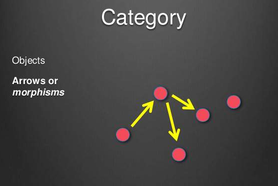
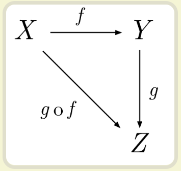
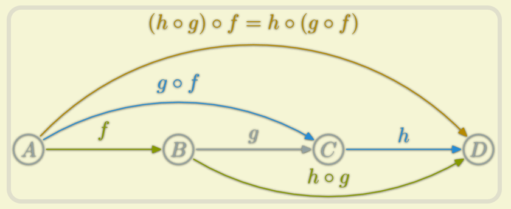

# Function Program Notes _2019-04-07

---


# [函数式编程初探 - 阮一峰 - 2012-04](http://www.ruanyifeng.com/blog/2012/04/functional_programming.html)
## 定義
"函數式編程"是一種["編程範式"(programming paradigm)](https://en.wikipedia.org/wiki/Programming_paradigm), 就是如何編寫程序的方法論.

它屬於["結構化編程"](https://en.wikipedia.org/wiki/Structured_programming)的一種,主要思想是把運算過程盡量寫成一系列嵌套的函數來調用.


>PS: **結構化編程**:用簡單有層次的程式流程組成，分為循序(sequence)、選擇(selection)、重複(repetition).
>   * 循序(sequence) : 程式正常執行的方式，執行完一個指令後，再執行下一個指令
>   * 選擇(selection) : 依據程式的狀態，選擇某段程式區塊來執行，一般使用if..else或switch..case等關鍵字來識別
>   * 重複(repetition) : 一直執行某段程式，直到滿足特定條件，或集合體中所有元素均已處理過，一般使用while、repeat、for、do..while等

ex: 某個數學表達式:
```match
( 1 + 2 ) * 3 - 4
```

傳統的過程式編程會如下寫法:
```match
var a = 1 + 2;
var b = a * 3;
var c = b - 4;
```

函數式編程要求使用函數，所以我們會把運算過程定義為不同的函數，然後寫成如下:
```
var result = subtract( multiply( add(1, 2), 3 ), 4 );
```

這就是**函數式編程**.

## 特點
1. 函數是 "第一等公民"
   指的是函數與其它數據類型一樣，處於平等狀態，可以賦值給其它變量，也可作為參數被傳入另一個函數或作為另一個函數的返回值.

ex: 下面代碼中的print就是一個函數並且作為另一個函數的參數
```javascript
var print = function (i) { console.log(i); };

[1, 2, 3].forEach(print);
```

2. 只用"表達式" 不用 "語句"
"表達式"(expression)是一個單純的計算過程，總有返回值.
"語句"(statement)是執行某種操作，沒有返回值
函數式編程要求只使用表達式，不使用語句.也就是說每一步都是單純的運算，而且必有返回值.

原因是函數式編程的開發動機，一開始就是為了處理運算(computation)，不考慮系統的讀寫(I/O).
"語句"屬於對系統的**讀寫操作**，所以就被排除在外.

但實際應用中，不做I/O是不可能的. 因此編程過程中，函數式編程只要求把I/O限制到最小，不要有不必要的讀寫操作，保持計算過程的單純性.

3. 沒有"副作用"
所謂的["副作用"(side effect)](https://en.wikipedia.org/wiki/Side_effect_(computer_science))，指的是函數內部與外部互動(最典型的情況就是修改全局變量的值)，產生運算以外的其它結果.

函數編程強調沒有"副作用"，意味者函數要保持獨立，所有功能就是返回一個新的值，沒有其它行為，尤其是不得修改外部變量的值.

4. 不修改狀態
上面已提到，函數式編程指示返回新的值，不修改系統變量，因此不修改變量也是它一個重要的特點
(OS: 如果是函數內暫時儲存的狀態呢? 因為recursive是必會暫時儲存一些狀態)

在其它類行的語言中，變量往往用來保存"狀態"(state). 不修改變量，意味者狀態不能保持在變量中.
函數式編程使用參數保存狀態，最好的例子就是遞歸(recursive).

ex: 將一個字串逆序排列的函數，它演示了不同的參數如何決定運算所處的"狀態":
```javascript
function reverse(str) {
  if(str.length === 0) {
    return str;// str沒了就返回空字串
  }
  else {
    // 1. 用遞迴來拆解字串，每次都被拆解成 : 剩下的字符串 + 第一個字符串
    // 2. 最後一個終止的組合是 "" + 第一個字串符
    // 分解如下:
    // abc
    //  |
    //  bc + a
    //  |
    //  c + b
    //  |
    //  "" + c
    //  |
    //  ((("" + c) + b) + a)
    return reverse( str.substring(1, str.length)) + str.substring(0, 1);
  }

}
```

由於使用遞歸，函數式語言的運行速度比較慢，這是比較詬病的地方.

5. 引用透明
引用透明(Referential transparancy)，指的是函數的運行不依賴於外部變量或"狀態"，只依賴於輸入的參數，任何時候只要參數相同，引用函數所得的返回值總是相同.

## 意義
1. 代碼簡潔，開發快速
和C語言比較，若C要一年時間完成的功能，Lisp語言只須要3個星期左右
2. 接近自然語言，易於理解
```javascript
subtract( multiply( add(1, 2), 3), 4)
```
改成如下也很簡易了解:
```javascript
add(1, 2).multiply(3).subtract(4)
```

3. 便於代碼管理
因為不依賴也不改變外部的狀態，只要給定輸入參數，返回結果必然相同.
所以單元測試和除錯很有利

4. 易於"併發編程"
函數式編程不用考慮"死鎖"(deadlock)，因為它不改變變量，根本不存在"鎖"線程的問題.
也不必擔心一個線程的數據被另一個線程修改，所以可以放心把工作分攤到多個線程.

```
var s1 = Op1();

var s2 = Op2();

var s3 = concat(s1, s2);
```

由於s1和s2戶不干擾，不會修改變量，誰先執行無所謂，所以可以放心增加線程，把它們分配到兩個線程完成.
其它語言可能會因為s1修改到系統狀態，而s2又用到此狀態，造成s2必須在s1執行完畢才能執行，這樣就無法利用多線程來處理.

5. 代碼的熱升級
函數編程沒有副作用，只要保證接口不變，內部實現是與外部無關的.
所以可以在運行狀態下直接升級代碼，也不須要重啟或停機.Erlang語言早就證明了這點

---

# [函数式编程入门教程 - 阮一峰 - 2017-02](http://www.ruanyifeng.com/blog/2017/02/fp-tutorial.html)

## 範疇論 (Category Theory)
函數式編程的起源是一門叫 "範疇論"(Category Threory)的數學分支.

### 1.1 範疇的概念
什麼是範疇?
> 維基百科的定義: "範疇就是使用箭頭連接的物體"(In mathematics, a category is a collection of "objects" that are linked by "arrows".)

就是說彼此之間存在某種關係的概念、事物、對象等等、都構成"範疇".
只要能找出他們之間的關係就能定義一個"範疇".


上圖中，各點與他們之間的箭頭，就夠成一個"範疇".

箭頭表示範疇成員之間的關係，正式名稱叫做"態射"(morphism).範疇論認為，同一個範疇的所有成員，都是不同狀態的"變形"(transformation). 通過"態射"，一個成員可以變形成另一個成員.

### 1.2 數學模型
既然"範疇"是滿足某種變形關係的所有對象，就可以總結出它的數學模型
  * 所有成員是一個集合
  * 變形關係是函數

也就是說，範疇論是集合論更上一層的抽象，簡單理解就是"集合 + 函數".
理論上通過函數，就可以從範疇的一個成員，算出其它所有成員.

### 1.3 範疇容器
我們可以把"範疇"想像成一個容器，裡面包含兩樣東西
  * 值(Value)
  * 值的變形關係，也就是函數.

下面用代碼定義一個簡單的範疇:
```javascript
class Category {
  constructor(val) {
    this.val = val;
  }
  
  addOne(x) {
    return x + 1;
  }
}
```

上面代碼中，**Category**是一個類，也是個容器，裡面包含一個值(this.val)和一種變形關係(addOne). 這里的範疇，就是所有彼此之間相差 **1** 的數字.

### 1.4 範疇論與函數式編程的關係
範疇論使用函數來表達範疇之間的關係.

**本質上，函數式編程只是範疇論的運算方法，跟數學邏輯、微積分、行列式是同一類東西，都是數學方法，只是碰巧能用它來寫程序.**

這就是為什麼函數式編程要求函數必須是純的且不能有副作用，因為它是一種數學運算，原始目的就是求值.

在編程運算中，函數是一個 **管道(pipe)** . input進一個值，output就出來一個新值，沒有其他作用.


## 函數的合成與柯里化
函數式編程有兩種基本的運算: 合成(compose)和柯里化(currying)

### 2.1 函數的合成
若一個值經過多個函數才能變成另一個值，就可把所有中間步驟合併成一個函數，這叫"合成"(Compose).


圖中，X 和 Y 之間的變形關係就是 **函數f**， Y 和 Z 之間的變形關係就是 **函數g**，
那麼 X 和 Z 之間的變形關係就是 **函數f** 和 **函數g** 的合成函數 **f·g**

ex:
```javascript=
const compose = function (f, g) {
  return function (x) {
    return f(g(x));
  }
}
```
函數合成必須滿足結合律和交換律

```javascript=
compose(f, compose(g, h));
// equal to
compose(compose(f, g), h);
// equal to
compose(f, g, h);
```
以上合成函數必須是純函數，原因就是不純的函數無法計算與達到預期行為.
函數就像數據的管道(pipe)，那 **合成(compose)** 就是將管道連接起來並讓數據一口氣從多個管道穿過去.

### 2.2 柯里化(Currying)
**f(x)** 和 **g(x)** 合成為 **f(g(x))**，有個隱藏的前提，就是 f 和 g 都只能接受一個參數. 如果是多個參數，比如 f(x, y) 和 g(a, b, c)，那合成就會出現問題.
所以就需要 **"柯里化"** 來簡化函數. 所謂的 **"柯里化"** 就是把**多個參數**的函數轉換成**單一參數**的函數.
ex:
```javascript=
// before currying
function add(x, y) {
  return x + y;
}

add(1, 2); // 3

// after currying
function addX(x) {
  return function (y) {
    return x + y;
  }
}

addX(1)(2);// 3
```


...todo
---

# Todo ...
1. [函数式编程入门教程](http://www.ruanyifeng.com/blog/2017/02/fp-tutorial.html)
2. [图解 Monad](http://www.ruanyifeng.com/blog/2015/07/monad.html)
Ref1: [Railway Oriented Programming](https://fsharpforfunandprofit.com/rop/)
Ref2: [Functional Programming Design Patterns](https://fsharpforfunandprofit.com/fppatterns/)
3. [Pointfree 编程风格指南](http://www.ruanyifeng.com/blog/2017/03/pointfree.html)
4. [Ramda 函数库参考教程](http://www.ruanyifeng.com/blog/2017/03/ramda.html)
5. [Javascript面向对象编程（二）：构造函数的继承](http://www.ruanyifeng.com/blog/2010/05/object-oriented_javascript_inheritance.html)
6. [JS 函数式编程指南](https://legacy.gitbook.com/book/llh911001/mostly-adequate-guide-chinese/details)
7.  [Paper - Monads for functional programming](http://bit.ly/monad-paper)
8.  [Awesome Functional Programming](https://github.com/xgrommx/awesome-functional-programming)
9.  [Fantasy Land Specification](https://github.com/fantasyland/fantasy-land)
10.  [Functional Programming Concepts](https://github.com/caiorss/Functional-Programming/blob/master/haskell/Functional_Programming_Concepts.org)

---


# Monad
Monad是一種模式，值、運算情境及容器是其結構.
Monad模式是要將重複的行為封裝起來.
巢狀、瀑布式或回呼地獄，則是發掘出這類結構的場合.


前言: 
Haskell中的Typeclass，某種程度上就類似C#中的interface
規範一組應當實現的行為，Functor Typeclass規範了要將某型態對應（map）至另一型態的行為 **fmap**
它的函式型態是(a -> b) -> f a -> f b
ex:
> 執行map chr [65, 66, 67]
> 結果是     ['A', 'B', 'C']
> chr的型態是(Int -> Char)
> [65, 66, 67]型態是[Int] , ['A', 'B', 'C']型態是[Char]
> 對照fmap的函式型態，a就是Int、b就是Char，那麼f就是[]這個值建構式


為何開發者要瞭解Monad？認識它，可讓開發者在面對結構類似的連續流程時，重新思考能否轉變為接續不斷的獨立運算系統.


Monad 是一種模式，行為上的特徵就是建立 M<T>、在 M<T> 上做某些動作、取得 T 並將之對應為 M<U>，接著可能還有一些其他的動作。
Monad 模式就是要將重複的行為封裝起來，將那些運算情境隱藏起來，只顯露將 T 對應為 M<U> 的部份

Monad 模式就是要將重複的行為封裝起來，將那些運算情境隱藏起來，只顯露將 T 對應為 M<U> 的部份。

PS: 迴圈的本質是可變的(Muttable)，Haskell中沒有迴圈這東西
作個查陣列length函數
```java=
List<Integer> lt = Arrays.asList(1, 2, 3);
int size = 0;
for(Integer ele : lt) {
  size += 1;
}
```
```haskell=
length' :: [a] -> Int
length' lt =
  if null lt -- null函數 帶入陣列lt, 若list為空就返回True否則返回Flase
     then 0
     else 1 + (length' $ tail lt) -- tail函數會取得扣掉第一個元素之後的子清單

```

```haskell=
sum' :: [Int] -> Int
sum' lt = 
  if null lt
  then 0
  else head + (sum' $ tail lt) -- head函數會取得第一個元素值
```


[Ref1: 良葛格Blog/Haskell Tutorial](https://openhome.cc/Gossip/CodeData/HaskellTutorial/index.html)  
[Ref2: CodeData/Haskell - 良葛格](http://www.codedata.com.tw/tag/haskell/1)  
[Ref3: haskell Wiki](https://wiki.haskell.org/All_About_Monads)  
[Ref4: Learn You a Haskell for Great Good!](http://learnyouahaskell.com/chapters)  
[Ref5: iThome/探索Haskell的Monad](https://www.ithome.com.tw/voice/93723)  
[Ref6: iThome/神祕的Monad不神祕](https://www.ithome.com.tw/voice/86448)  
[Ref7: iThome/非純粹的界線：IO Monad](https://www.ithome.com.tw/voice/94372)  
[Ref8: iThome/尋找野生的Monad](https://www.ithome.com.tw/voice/91846)  
[Ref9: 良葛格Blog/補救 null 的策略](https://openhome.cc/Gossip/Programmer/Null.html)  
[*Ref10: Functor、Applicative 和 Monad - 雷纯锋的技术博客](http://blog.leichunfeng.com/blog/2015/11/08/functor-applicative-and-monad/)  
[*Ref11: Functors, Applicatives, And Monads In Pictures](http://adit.io/posts/2013-04-17-functors,_applicatives,_and_monads_in_pictures.html)  
[*Ref12: CodeData/Java 8 Patterns - 良葛格](http://www.codedata.com.tw/social-coding/java8-patterns/)  
[*Ref13: HASKELL 趣學指南](https://learnyoua.haskell.sg/content/zh-tw/ch01/introduction.html)  
