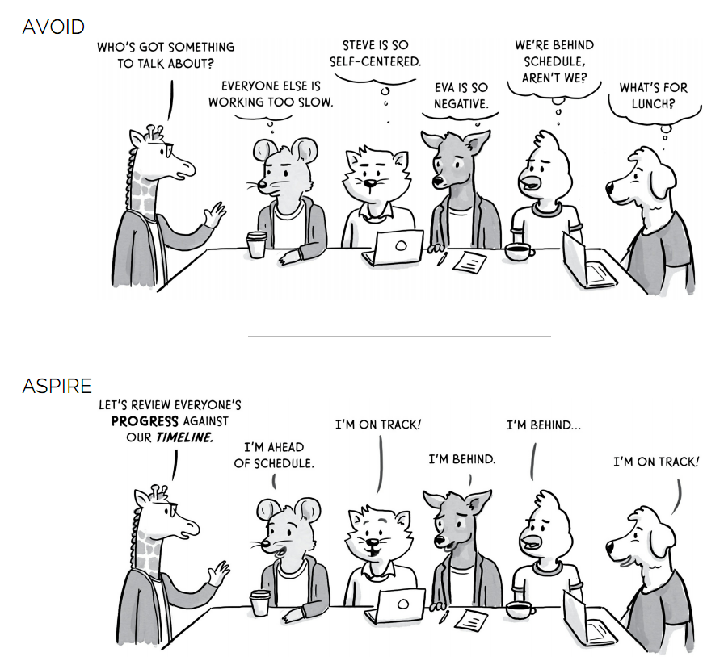
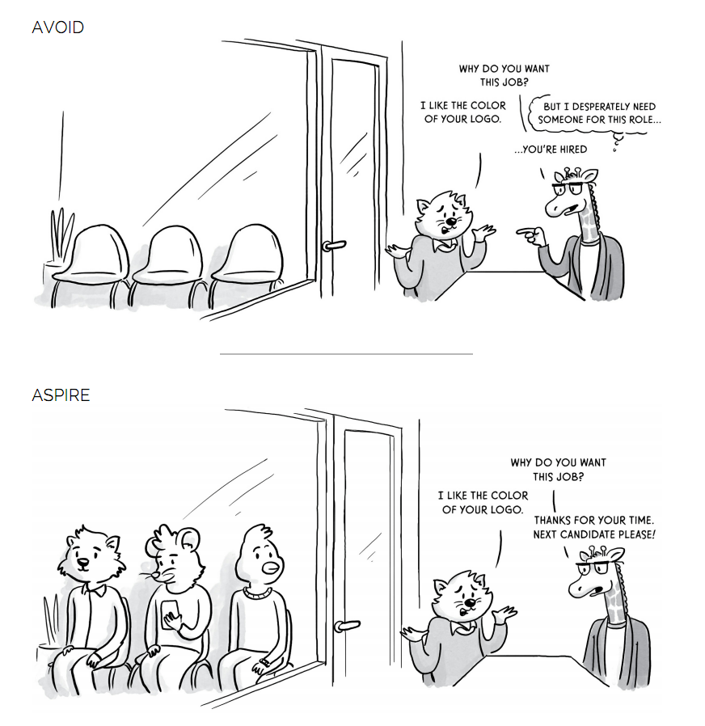
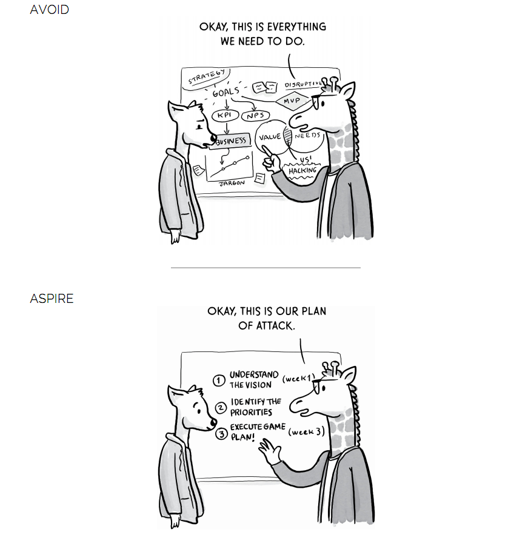
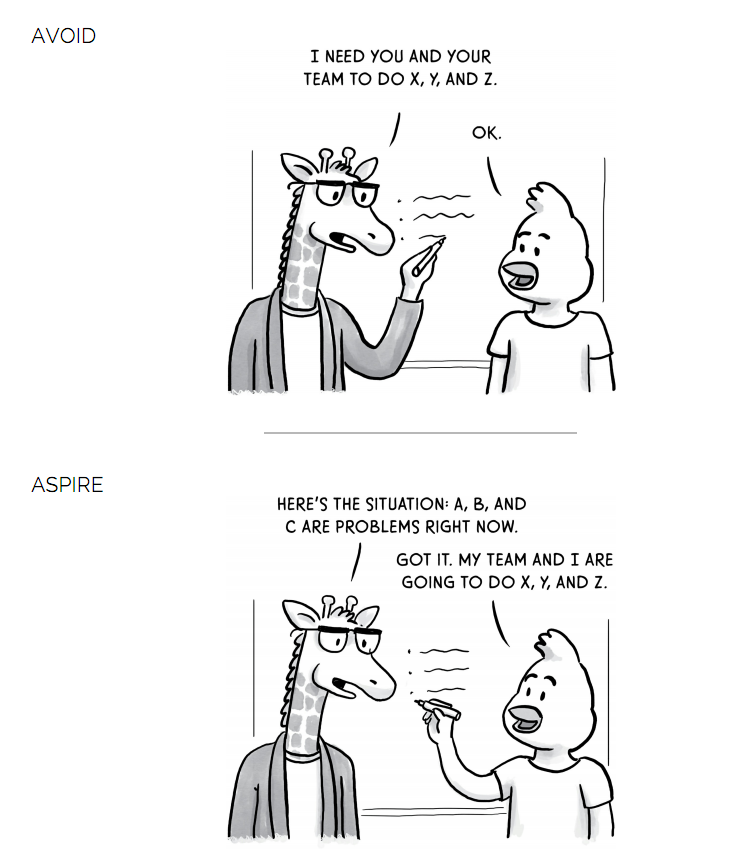
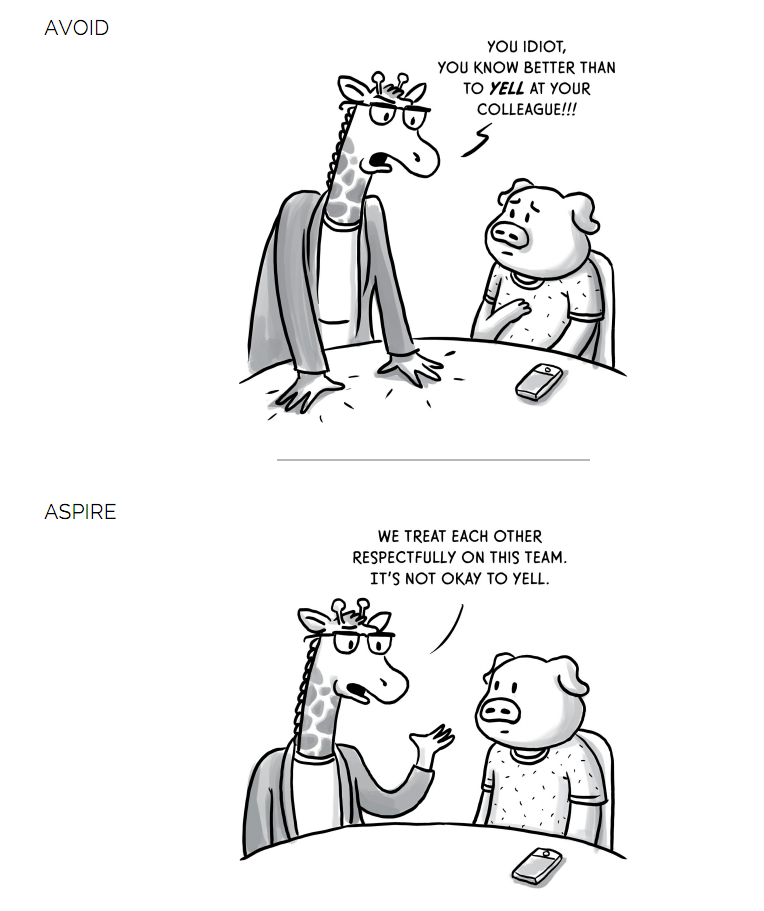

# The Making of a Manager

Chapter One - What Is Management?
Chapter Two - Your First Three Months

> This is a book about how someone with no formal training learned to become a confident manager.

**O**
* 管理是什麼?
  作者剛開始的認知
  * 召開會議報告，幫助他們解決問題
  * 分享反饋關於好或不好的
  * 弄清楚誰應該晉升，誰應該被解僱  
  3年後的改變
  * 建立一個合作良好的團隊
  * 支持成員實現其職業目標
  * 創建流程以順利高效地完成工作

* 管理人職業的一線定義
  * 作為一名管理者，工作目標是讓一群人一起工作並獲得更好的結果
* 一系列的測試，才能讓管理者升級，並展現其能力
* 管理者任務主要分3種: 目的，人員和流程。
* 管理者需要試圖讓每個團隊成員都站在同一陣線，才能大家都自主的推進目標。
* 想當出色的管理者需要問自己3個問題:
  1. 是否發現自己更有動力實現特定結果或發揮特定作用？
  2. 喜歡和別人說話嗎？
  3. 能為情緒挑戰的情況提供穩定性嗎？

* 成為管理者的4種途徑:
  * 學徒：你的經理團隊正在成長，所以你被要求管理其中的一部分。
  * 先鋒：您是新集團的創始成員，現在您負責其發展。
  * 新老闆：突然加入已經建立的團隊，無論是在現有組織內還是在新組織中。
  * 接班人：你的前任管理者決定離開，你準備接任他的位置。

* 當轉變為管理者時，因厲害關係，所獲得的信息將會更少
* 管理與工作貢獻兩者的平衡是管理者須要好好評估的

**R**
* 管理者的目標就是 1+1 > 2
* 當管理者需要一些特性，不是每個人都適合當管理者
* 管理者在必要的時候，就是要扮黑臉

**I**
* 好的管理者通常可以扭轉局勢。
* 管理者必須建立良好的信任關係，較有機會獲得真實訊息

**D**
* 覺得自己特性上應該不太適合當管理者

---

Chapter Three - Leading a Small Team

**O**
* 對管理的定義？管理者的工作是通過計畫目的，人員和流程，和一群人一起工作並獲得更好的結果

* 什麼妨礙了工作？只有兩種可能性。首先是人們不知道如何做好工作。第二是他們知道如何，但他們沒有動力 - 安迪格羅夫

* 建議管理者應每週一次 1 對 1 的報告，每次報告30分鐘，目的是了解他的報告與他須要什麼幫助，協助他移除障礙，提供有價值的視角或增加他們的信心，使他更加成功

* 準備報告的ㄧ些入門想法:
  1. 討論優先權高的
  2. 校準“偉大”的樣子 : 同步目標與願景
  3. 分享回饋
  4. 反思事情的進展
* 管理者透過提問幫助成員更了解與釐清，提問類型如下:
  1. 鑑識: 釐清真正重要的問題並提問
     > 現在最重要的是什麼？
     > 這個星期有什麼優先考慮的事情？ 
  3. 理解: 確定了要討論的主題，接下來的問題就要解決問題的根源以及可以採取的措施
     > 你的理想結果是什麼樣的？
	 > 達到這個結果對你來說有什麼困難？
	 > 你真正關心的是什麼？
	 > 您認為最佳行動方案是什麼？
	 > 您擔心的最糟糕的情況是什麼？
  5. 支持: 如何為報告提供最好的服務
     > 我怎麼幫你？
	 > 我能做些什麼來讓你更成功？
	 > 今天我們談話中最有用的部分是什麼？

* 當管理者沒有答案也可以試者提出以下內容
  * “我不知道答案。你怎麼看？”
  * “我想為我前幾天做的事道歉... “
  * “這一半的個人成長領域之一是... “。
  * “我擔心我不足以幫助你解決這個問題。建議你應該與xxx交談。 。 。 “。
* 激勵員工，讓他提供乘數的效率，幫助他們成功，
* 假設團隊有人表現不好，應評估哪種方式可以最佳化團隊，不應集中精力"解決"問題
* 若管理者是基於個人表現給予支持和尊重,那當有問題發生時，就可能無法得到坦承，但如果無條件的關心，比較可能得到坦承

**R**
* 以績效來評斷個人表現，當發生問題時，很容易產生掩飾錯誤的行為
* 幫助成員成功最後也會造就自己，這與有效工程師一書內容相互呼應
* 一對一報告是對於團隊成員很重要的一種交流,須設法幫助他或關心他所關注的,這是在小組討論或mail比較無法做到的事

**I**
* 如果團隊成員一直想知道管理者對自己的看法,表示管理者表達不夠好,如果讓人敬畏或沒達到預期水平也要告訴他
* 管理者也會犯錯,但承認錯誤或不足不代表是弱點，坦承是為了改進的第一步
* 管理者須觀察或挖掘員工興趣並善加利用
* 管理者不應自己"解決"問題，應當一個好的觀察者與聽者，透過提問，使成員更加的清楚就會找到最好的處理方式

**D**
* 管理者最佳職責就是鼓勵與教練

---

Chapter Four - The Art of Feedback

**Objective**
* 對於一個領導者來說，提供反饋，就能確切地讓人知道目標的位置以及如何達到目標。
* 激發行為變化的四種常見方式 :
  1. 在開始設置明確的期望
  2. 盡可能頻繁地提供任務特定的反饋 : 在某個事件發生後，立即提供的一般性反饋
  3. 分享和定期分享行為反饋 : 行為反饋提供了個人化與深度的反饋，有助於了解到他人是如何看待自己的現況
  4. 收集360度反饋以獲得最大客觀性 : 從會議或多人討論中獲得他人的想法
* 管理者須考慮如何處理以下各項 :
  1. 我經常給予反饋嗎？
  2. 聽到了我的反饋嗎？
  3. 我的反饋是否會導致積極行動？

* 反饋不成立的部分原因是接受者經常將對話視為威脅，因此他的腎上腺素激發戰鬥或逃跑本能，當人們處於感受威脅的時候，他們就不太能夠吸收和應用你的反饋 - 埃德巴蒂斯
* 若須要分享批判性的反饋，請以好奇心和誠實的期望來讓他理解您的反饋
  > ex: 一個簡單的方法是直接表明你的觀點，然後接者問 “這個反饋是否會引起你的共鳴？為什麼或為什麼不呢？“
* 如何確保對您的反饋是有採取行動？
  1. 盡可能具體地反饋您的反饋。 (可以舉簡單例子)
  2. 表明成功的外觀和感覺。
  3. 建議後續步驟。
* 注意語氣與肢體語言舉例以下例子(3和4是比較不會造成防禦或困惑的例子)
  1. 你這麼搞砸了。我該怎麼辦？
  2. 你的工作很糟糕，我需要知道你將如何修復它。
  3. 我很擔心最近我一直在看你的工作質量。我們可以談談這個嗎？
  4. 你的最後幾個可交付成果不夠全面，無法達到標準，所以讓我們討論為什麼會這樣，以及如何解決它。
  5. 我對你的最新作品有幾個問題 - 你有時間指導我嗎？

* 提供關鍵反饋的最佳方式是直接和冷靜地提供，明確地說出你認為問題是什麼，是什麼讓你有這種感覺，以及你如何共同努力解決問題
* 當需要做批判的反饋時，以下提供一些範例：
  * 當我[聽到/觀察/反映]你的[行動/行為/輸出]時，我感到很擔心，因為。 。 。
  * 我想了解你的觀點，並談談我們如何解決這個問題。

**Reflective**
* 大多數人很難提供反饋原因是覺得沒有任何有用的說法，或者有批判性的想法但因避免傷害感情而保持沉默
* 反饋方式針對每個人特性而有不同的方式

**Interpretive**
* 改變行為不一定要透過反饋，讚美通長比批評更具激勵性
* 當反饋沒有對他產生實際的幫助，就是無效的反饋
* 威脅只會造成心理上的防禦,但想要真正的改變需要立意良善的反饋與發自內心的關心
* 批判性反饋須要設法獲得共鳴，沒有就須要試者了解為什麼

**Decisisional**

---

Chapter Five - Managing Yourself

**Objective**
* 無論你遇到什麼障礙，首先需要深入了解你自己 - 你的優勢，你的價值觀，你的舒適區，你的盲點和你的偏見。當你完全了解自己時，你會知道你真正的方向在哪裡。
* 冒名頂替症候群經常嚴重打擊管理者的兩個原因:
  1. 經常尋找答案
  2. 經常處於以前沒有做過的事情的位置
* 理解如何領導的第一部分是了解自己的優勢，因為優秀的管理通常來自於發揮自己的優勢而不是修復自己的弱點。第二部分是誠實的了解自己的弱點和触發因素，列舉出來並校準它 (避免Dunning-Kruger)。
* 請經理幫助通過以下方式校準自己並選擇三到七個與您密切合作的人，並詢問他們是否願意分享一些反饋以幫助您改進。
    * 兩個問題：
        1. 你有什麼機會讓我做更多做更好的事情？您認為最重要的事情是什麼阻礙了我產生更大影響？
	  2. 你認為我的角色中有一個假設完美的人會有什麼技能？ 對於每項技能，你如何評價我對這個理想的評分為1到5？

* 如果把每一次挑戰視為對自己的價值考驗，那麼會經常擔心自己的立場而不是如何改進。
* 心理學家卡羅爾·德維克描述了她所謂的定型和成長這兩種不同的心態如何在我們的表現和個人幸福中產生巨大的差異。
    觀察差異： 
    
      * 情景：完成作業後，你的經理會給你一些改進建議。
        定型心態：呃，我真的搞砸了。 我的經理必須認為我是一個白痴。
        成長心態: 我很感謝我的經理給了我這些提示。 現在我的全部未來的任務將會變得更好。
        
      * 情景：你被問到是否願意帶頭開展風險和挑戰性的新項目。
        定型心態：我最好說不。 我不想失敗，也不想讓自己難堪。
        成長心態: 這是一個很好的機會來擴展，學習新的東西，並獲得領導其他大項目所需的經驗。
        
      * 情景：你的1對1報告讓Alice很緊張。
        定型心態：我應該好像這樣做得好，所以我就像我知道自己在做什麼一樣。(OS: 指自以為知道艾莉絲的感受)
        成長心態: 我應該問愛麗絲她對這次談話的感受以及我們將來如何進行更富有成效的討論。
        
      * 情景：您正在處理提案，John要求您查看進度。
        定型心態：我現在不想向John展示任何東西，因為該提案形式粗糙。 這會讓我看起來很糟糕。
        成長心態: 約翰的反饋意見非常有用。 事實上，我應該與更多人分享我的早期思想，以便我能夠領先於任何潛在的問題。
* 透過定型心態，你的行為受到恐懼的恐懼 - 對失敗的恐懼，對判斷的恐懼，害怕被發現為冒名頂替者。 
  透過成長心態，你有動力去尋找真相並尋求反饋，因為你知道這是讓你走到哪裡的最快捷途徑。
* 弄清楚觸發點是什麼，請問自己以下問題：
  * 什麼時候有人說過讓我煩惱的事情，而不是周圍的人呢？ 為什麼我對此感覺如此強烈？
  * 我最親密的朋友會說我的煩惱是什麼？
  * 我見過誰，我立刻就警惕了？ 是什麼讓我有這種感覺？
  * 什麼是我反應過度後來後悔的一個例子？ 是什麼讓我在那一刻如此努力？ 
* 腦成像研究表明，當我們想像自己在做什麼事情時，我們大腦的相同部分就像我們實際上在做那種活動一樣。 
* 承認你的掙扎和尋求幫助是弱點的反面 - 事實上，它表現出勇氣和自我意識。 
* 為自己設定一個崇高的目標：我怎樣才能做到兩倍好？ 然後通過以下方式最大化您的學習:
  * 請求反饋
  * 將您的經理視為教練
  * 將每個人都當導師
  * 設定思考時間和目標
  * 利用正式培訓

**Reflective**
* 找到一個願意花時間協助並反饋的人很難
* 好好照顧自己才有辦法做到最好

**Interpretive**
* 成功後也需要了解是甚麼因素讓自己如是高效，紀錄並設法在其他地方驗證
* 了解情緒觸發原因並快速平復很重要,不要讓情緒影響判斷
* 了解別人的底線並分享自己的底線使工作更加順暢

**Decisisional**
* 察言觀色與良好的自我管理幫助自己更加進步

---

Chapter Six - Amazing Meetings

**Objective**
* 招開會議目的是讓大家了解正在發生的事。
* 良好的會議讓大家有以下的同感：
    1. 這次會議充分利用了我的時間。
    2. 我學到了一些新東西，可以幫助我在工作中更有效率。
    3. 我更清楚地知道接下來應該做些什麼。
    4. 每個人都是忙碌的。
    5. 我感到很受歡迎。

* 會議的結果？是讓團隊成員彼此感覺更親近，更有效地協作。
* 會議決策不需要達成共識，但被決策影響的人應該感覺到它的制訂方式是有效和公平的。
* 好的決策會議做了以下事情：
	* 做出決定
    * 包括受決策影響最直接的人員以及明確指定的決策者
    * 在客觀上和相關背景下提供所有可靠的選擇信息，並包括團隊的建議，如果有的話
    * 為不同意見提供平等的通話時間，讓人們感受到他們講的話被聽到了

* 避免的不良後果的例子：
    * 覺得他們本身表現不好，所以他們不相信由此產生的決定。
    * 做出決定需要很長時間，這會拖延進度。 
	  雖然重要和難以逆轉的決策值得深思，但是要小心避免花費太多時間在小的，易於改變的決策上。
    * 決策不斷來回徘徊，這使得很難信任並採取行動。
    * 花費太多時間試圖讓小組達成共識而不是迅速升級為決策者。
    * 時間浪費在以不同的方式重複同一論點。

* 精彩的訊息會議可以實現以下目標：
    * 使小組感覺他們學到了有價值的東西
    * 清晰而令人難忘地傳達關鍵信息
    * 保持觀眾的注意力（通過動態揚聲器，豐富講故事，熟練的節奏，互動）
    * 喚起預期的情感 - 無論是靈感，信任，驕傲，勇氣，同理心等。

* 好的反饋會議實現了以下目標：
    * 讓每個人對於專案的成功有相同的共識
    * 誠實說出工作的現狀，包括評估事情的進展情況，自上次會議以來的任何變化，以及未來的計劃
    * 清楚地構建開放式問題，關鍵決策或已知問題，以獲得最有用的反饋
    * 結束商定的後續步驟（包括下一個里程碑時或下次的會議）

* 產生好的會議建議做以下事情：
    * 通過確保每個解決方案，產生許多不同的，非顯而易見的解法
      參與者獨自安靜地思考想法並將其寫下來（在會議之前或會議期間）
    * 考慮每個人的全部想法，而不僅僅是最響亮的聲音
    * 通過有意義的討論幫助創意發展並相互建立
    * 結束了明確的後續步驟，以便將想法變為行動

* 好的團隊合作會議透過以下產生：
    * 在參與者之間創造更好的理解和信任
    * 鼓勵人們開放和真實
    * 讓人們感到受到關懷

* 會議應該邀請誰？回到你的答案，看看會議的結果如何，並問自己：哪些人有必要讓這個結果發生？
* 如果會議的目標是做出決策或提供反饋，幫助每個人先做好準備，讓大家有時間思考
* 讓成員安心的為團隊做出會議上的貢獻，建議以下方式:
    * 明確你想要設定的規範
    * 改變會議風格讓所有人都參與
      ex: 作者使用“便利貼”做開場，讓大家思考後並寫下想法，來降低參予的障礙
    * 管理平等對話時間: 確保每個人的發言權
    * 獲得會議的反饋 : 獲得良好反饋的關鍵在於具體了解您想要了解的內容，並確保此人能誠實地告訴您他的意見
      

**Reflective**
* 良好的會議可以激勵士氣，糟糕的會議可能讓人感到沮喪並引發員工疲憊和潛在的倦怠

**Interpretive**
* 草案會議邀請過多人參許可能造成壓力，邀請關鍵人物並在事後分享會議內容與讓大家問答，也避免造成其他人時間上的浪費
* 若會議內容有許多背景知識或數據需要思考，讓參與者提前了解內容更能幫助產生好的會議決策
* 會議的邀請取決於會議的目地，但事後分享會議內容或決策並提出Q&A，讓大家能有相同的共識

**Decisisional**

---

Chapter Seven - Hiring Well

**Objective**
* 每年都為團隊設計招聘計畫，基於公司增長，預期的減員，預算，優先事項來問自己下列問題:
  1. 預估將為團隊招多少人?
  2. 預計招募的每個新員工，預期找什麼樣經驗的?
  3. 我們團隊有那些優勢並需要哪些技能(例如，創造性思維，卓越運營，XYZ專業知識等)?
  4. 我們團隊目前已經擁有哪些技能和優勢，新員工的這些技能可以比這弱?
  5. 什麼特質，過去經歷或個性會增強我們團隊的多樣性？

* 與招聘人員合作，盡可能的做以下的事來幫助匹配:
  * 盡可能準確地描述您理想的候選人
  * 制定招募戰略 (例如:候選人希望是有在設計機構和科技公司工作的經驗，因為這種組合通常會產生健康的視覺平衡和務實的技術訣竅。)
  * 提供良好的面試體驗
  * 表達出你有多想要候選人，並盡量縮短提供offer的時間

* 僱用一個新的人總是有風險，但要明智你的方法，會增加成功的機會。

* 了解候選人過去在類似環境中的類似項目中的表現，這就是為什麼實習是如此有價值的原因;當有人加入團隊幾個月後，可以更好地了解他們的工作方式。

* 招聘過程通常有三個要素：簡歷，面試和參考檢查

* 參考檢查可能透過過去資料或前公司主管反饋來幫助評估，但在參考時須注意
  1. 人們通常會隨著時間的推移提高自己的技能，因此請忽略最近的負面反饋
  2. 記得回到您對該角色的理想人選的定義

* 讓多名面試官參與進來，每個面試官都會提出不同的問題，以便小組以全面的視角出現

* 提前準備面試問題，以下是作者比較常問的通用問題:
   1. 您感興趣的是哪些挑戰以及為什麼？ 你能形容一個最喜歡的項目嗎？ 這告訴我候選人的熱情是什麼。
   2. 你認為自己最大的優勢是什麼？ 您的同行會同意您的優勢領域？ 這個問題既取決於候選人的自我意識，又取決於他的實際優勢和劣勢。
   3. 想像一下你自己三年了。 與現在相比，您希望與眾不同的是什麼？ 這讓我了解候選人的抱負以及她的目標導向和自我反思。
   4. 過去一年中你遇到的最艱難的衝突是什麼？ 它是如何結束的，你從這次經歷中學到了什麼？ 這讓我了解候選人如何與其他人合作以及他如何處理衝突。
   5. 最近你的作品中有什麼能激發你的靈感？ 這揭示了候選人認為有趣或有價值的內容。

* 拒絕任何表現出有毒行為的人 (例如: 將失敗都歸咎於他人，侮辱其他人群，詢問公司可以為他們做些什麼...等等)

* 建立一個偉大的板凳，一個強大的替補席讓一位經理解放出來，以應對即將到來的下一座大山。

**Reflective**
* 以被雇用者角色覺得若招聘結果的時間拖得太長通常不會有好結果

**Interpretive**
* 依據每個職位技能與團隊討論並定義所需技能並了解團隊風格來增加匹配人選的評估
* 招聘過程的參考檢查是可以增加判斷過去經驗的一項好的依據，但也要小心評估負面反饋的真實性

**Decisisional**

---

Chapter Eight - Making Things Happen

**Objective**
* 如何為團隊建立有效的流程？ 
* 鼓舞人心的願景是影響深遠的，為團隊定義和分享具體願景非常重要，這些願景描述了共同努力所要實現的目標。
* 願景設定的一些入門方式，可以問自己以下問題(假設你擁有一支魔杖，可以讓你的團隊完美無缺):
  * 與現在相比，您希望在兩到三年內有什麼不同？
  * 您希望在相鄰團隊中工作的人如何描述您的團隊所做的事情？ 
    您希望幾年後您的團隊的聲譽如何？ 今天的現況還差有多遠？
  * 你的團隊有哪些獨特的超級能力？ 當你處於最佳狀態時，你是如何創造價值的？ 
    你的團隊兩倍的表現會是什麼樣的？ 五倍呢？
  * 如果你必須創建一個快速的驗證測試，任何人都可以用它來評估你的團隊是在做一份糟糕的工作，一份平庸的工作，還是一份屎的工作，那會是什麼樣的驗證呢？

* 通過規劃的過程，我們可以了解我們的情況並繪製出最佳成功案例，當緊急情況出現時，一個可靠的戰略為我們快速調整我們的計劃提供了基礎，而不是回到混亂。

* 一個好的策略必需理解它試圖解決問題的關鍵。它將團隊的獨特優勢，資源和精力集中在實現目標的最重要事項上。
* 當計劃未來時，請記住以下幾點:
  1. 根據團隊的優勢制定計劃
  2. 只要專注於完成幾件重要的事
  3. 定義誰對什麼負責
  4. 將一個大目標分解成更小的碎片
  5. 平衡短期和長期結果
  6. 定義長期願景並落實於工作
  7. 談論一切如何與願景相關

* 在工作能夠完成的時限內，工作量會一直增加，直到所有可用時間都被填滿為止 - [帕金森定律](https://medium.com/zaou/10-cognitive-psychology-affect-user-experience-2-1ef761e551e1)

* 以下是一些判斷團隊執行情況的方法：
  * 列出任務列表的優先級從最重要到最不重要，
    排列從最高層次的項目會獲得最多時間和注意力。
  * 是否有一個有效的決策過程是每個人都理解和信任的。
  * 團隊迅速採取行動，特別是在做出可逆的決策時。
    正如亞馬遜首席執行官傑夫貝索斯所說：“大多數決策應該在你希望擁有的信息的70％左右。如果你等待佔90％，在大多數情況下，你可能會變慢。“
  * 做出決定後，每個人都會（即使是那些不同意的人）承諾並迅速採取行動以實現這一目標。
    如果沒有新的信息，就沒有猜測的決定，沒有否決，也沒有拖延。
  * 當重要的新信息浮出水面時，有一個權宜之計可以檢查當前計劃是否以及如何改變。
  * 每個任務都有一個誰和何時。擁有者必須設定並確切地履行承諾。
  * 團隊富有彈性，不斷尋求學習。每次失敗都會讓團隊更加強大，因為他們不會兩次犯同樣的錯誤。

* Short-Term and Long-Term Outcome Sample:
  ----[HIRING]招募----
  **情況**：您需要聘請某人擔任您團隊中的重要角色。
  **思考短期的風險**：你對第一個看似合理的人說“是”。 雖然他現在可以完成這項工作，但他無法成長。 在一年中，你會再次發現領導力差距。
  **思考太久的風險**：你的完美僱傭幾乎是不可能找到的，因為你的酒吧是如此之高。 
  你最終會把所有候選人都拒絕。 六個月後，你還沒有邀請任何人，你的團隊的成果正在受到影響。
				  
  ----[PLANNING]規劃-----
  **情況**：你是一個在競爭激烈的行業中擔任首席執行官。 您需要決定資助哪些舉措。
  **思考短期的風險**：您不會進行任何未來的投資（例如昇級您的設備），因為它在短期內成本很高。 與此同時，你的競爭對手也會如此，在兩年內，他們製造的東西比你更快，更便宜。
  **思考太久的風險**：根據您對當今市場的了解，您可以簽署一些為期三年的項目。 然而，一年後，市場發生了變化，你的計劃已經沒有意義了。
  
  ----[MANAGING PERFORMANCE]管理績效----
  **情況**：你擔心你目前在Project X上的人做得不好。
  **思考短期的風險**：您將使用便利貼解決方案，例如微觀管理您的報告或自己參與項目的各個方面，這些都不是可持續的。
  **思考太久的風險**：您投資於指導報告以提高他的表現。 但是，這些變化不會很快發生，項目也會陷入困境。
* 改進過程最有用的工具之一是做匯報（也稱為回顧或事後調查），可以在項目完成時定期執行，也可以在發生意外事件或錯誤時執行。

**Reflective**
* 覺得自己很常有/無意識地浪費時間，直到沒有後路時才會認真看待。
* 覺得自己比較常思考短期計畫，較少思考長期的方向與目標。

**Interpretive**
* 管理者須了解團隊整體特色與成員優勢並充分利用才能發揮最好的效能。
* 願景可以鼓勵人心，但規劃要符合適當情境，不能太過於誇大也不能太過於淺短，否則投資人不會買單，也可能無法鼓舞團隊。
* 規劃目標同時也應該計畫每一階段該達到的里程碑，短期與長期結果應該都依據重要性被適當的計畫並

**Decisisional**
* 大家的工作效率其實比想像的來得好，只是因為缺乏有效的約束。約束是相當好用的工具，替產品的行為、設計加上限制，可以讓使用者更專注於你想要他們完成的事情。

**Extra**
> [人到中年的程序员，请提前准备好Plan B](https://mp.weixin.qq.com/s/vynRnPvvZ6vzcmKkUrDHRg?fbclid=IwAR2FYmAK8Hyws0iaG6AaNbrWYE8Cg7WWpg7aiG2kPtdtw838NFtThovyZGE)
 

---

Chapter Nine - Leading a Growing Team

**Objective**
* 團隊是五個人，可以與每個人建立個人關係，了解他們的工作細節，他們關心和擅長的事情;但團隊是三十人時，就不能直接管理他們，大規模管理的最大挑戰之一是在深入解決問題並信任其他人來處理問題之間找到適當的平衡點。
* 當團隊成員不了解你並且看到你處於權威地位時，他們就不太可能在他們認為你錯了的時候告訴你醜陋的真相或挑戰你，即使你很喜歡他們，在與他人的互動中要注意這種動態，強調你歡迎不同意見，並獎勵表達他們的人。
* 隨者團隊的成長，每天 Context Switching 的頻率會越來越頻繁，利用一些技巧來幫助自己，例如每天早上檢視工作日曆並為每次會議做準備，開發一個強大的記筆記和任務管理系統..等等。
* 何時該進入領導，何時該退後讓團隊發揮，何時該委託他人是最困難的部分。
* 要產生一個重要的共同願景，請問自己兩件事:
   1. 我們團隊目前最重要的優先事項是什麼？
   2. 報告時討論這些內容，並討論成員該如何發揮作用。
* 授權的經驗法則是這樣的：
    1. 對組織最重要的事情
    2. 能比其他人做得更好的事情。
* 團隊成長需要注意的幾個事項:
  1. Identifying and communicating what matters[識別和溝通重要的事情]
  2. Hiring top talent[招聘頂尖人才]
  3. Resolving conflicts within my group.[解決團隊內的衝突]
* 管理的最終目標是獲得更好的結果。當某人不適合自己的角色時，就需要付出代價。

**Reflective**
* 帶領團隊成長最有價值的部分就是看著我們的集體能力遠遠超出我們任何一個人所能達到的水平。

**Interpretive**
* 當團隊快速地成長到無法每次都全部完成任何事情時，要開始決擇並挑選最重要的來完成。
* 清楚的表明要解決的問題，適時的委託並將權力賦予成員並盡力支持，才能讓成員發揮其能力並使其成長。

**Decisisional**

---
Chapter Ten - Nurturing Culture

**Objective**
* Facebook一名新實習生意外地在代碼庫中引入了一個錯誤的錯誤，從而取消了Facebook服務，然後整個團隊參與了一次事後調查，以了解失敗的原因以及可以在未來採取哪些措施來防止類似問題。
* 如何找到團隊重視的內容與表現的交集:
    * 了解目前的團隊
    * 了解對於團隊文化的期望
    * 了解差距
    * 永遠不要停止談論什麼是重要的
* 最好的解決方案往往來自嘗試許多不同的想法。如果你對你頭腦中的第一件事說“足夠好”，你可能會留下未被發現的更好選擇。
* 創造正確的獎勵並避免以下常見的激勵陷阱：
    * 獎勵個人表現優於其他任何事物 : 削減其他人獎勵來激勵個人。
    * 獎勵長期投資的短期收益 : 假設工程團隊獎金是依據發布功能後的6個月得到，經理必須決定處理一系列影響較小的功能，還是處理最需要的客戶功能，而激勵措施表明她應該選擇效果較低的功能。
    * 獎勵缺乏看得到的問題或衝突 : 每當有人提出異議時，管理者將其視為“不是什麼大不了的事”或對問題存在表達不滿。 隨著時間的推移，團隊成員學會了隱藏他們的衝突。
    * 獎勵吱吱作響的車輪 : 當有人因獲得更高的薪資離職時,管理者沒有處理好,造成其他人也蠢蠢欲動
* 在像Facebook這樣大的組織中，馬克扎克伯格每週都會站在公司面前，談論大家選擇提出的建議。
  為什麼？因為Facebook最大的價值之一就是開放性。如果他沒有樹立榜樣，為什麼其他人都認為這很重要？

**Reflective**
* 是否可以接受不是自己的錯誤的責任？

**Interpretive**
* 正確的流程可以減少錯誤的發生，但當發生錯誤時，好的文化可以接受並降低衝擊，引導至快速的修復
* 良善的意圖也可能導致不良的激勵，例如當需要針對設計提出評論時，大家可能覺得應該已經很好了，就沒法利用評論來發現更好的選擇。

**Decisisional**
* 適時的衝突與適時的激勵相互配合才能產生最好的結果。