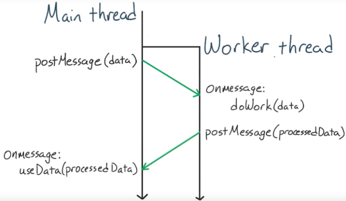
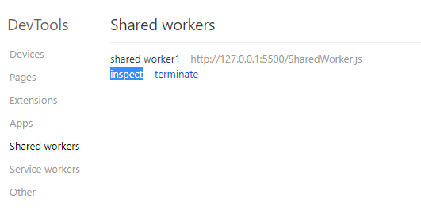
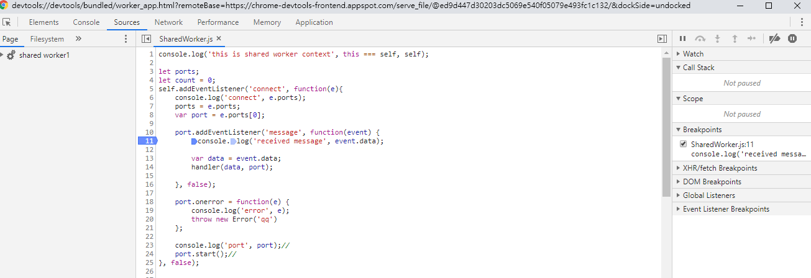
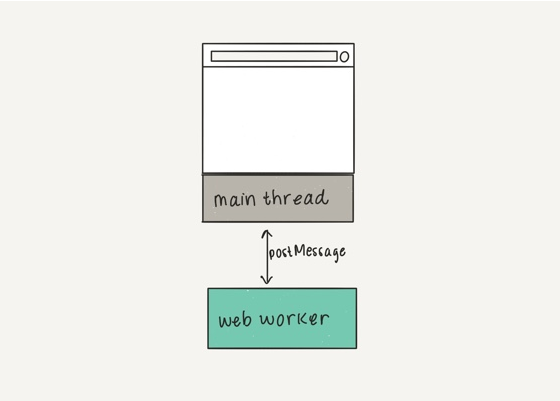
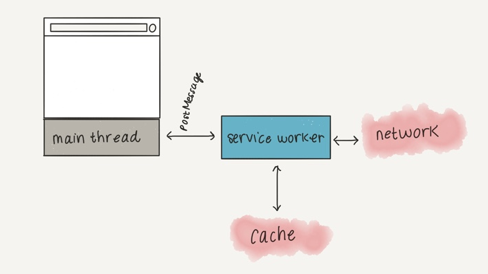

# Web Worker

## JavaScript Is Single-thread
JavaScript 語言的一大特點就是單線程，也就是說，同一個時間只能做一件事，無法同時運行多個腳本。
例如一個網站需要處理UI事件，查詢並處理大量API數據以及操作DOM，使用 ~setTimeout()~、~setInterval()~、~XMLHttprequest~，和事件處理等模擬"並行"。

當頁面UI內的計算過大時，會造成頁面效能降低，產生操作上的的延遲造成使用體驗不佳。

## Web Worker Purpose
[Web Worker](https://html.spec.whatwg.org/multipage/workers.html) 規範定義了在網路應用中產生背景執行腳本的API，藉由事件處理器來和背景腳本端互相傳送訊息，目的是**處理計算密集型任務**時不干擾使用者介面運行。



## Use Cases
* 預先抓取或緩存數據
* 即時的拼寫檢查程序
* 分析視頻或音頻數據
* 背景IO或網路服務輪詢
* 處理較大陣列或超大JSON回應
* canvas中的圖片過濾計算
* 大量的更新本地端網路數據庫

## Types of Web Workers
 執行的代碼需要保存在一個單獨的文件中，如果檔案路徑返回404，不會造成原本腳本錯誤中斷異常
* [Worker(Dedicated Worker)](https://developer.mozilla.org/en-US/docs/Web/API/Web_Workers_API/Using_web_workers) : 頁面單獨使用worker thread
* [SharedWorker](https://developer.mozilla.org/en-US/docs/Web/API/SharedWorker) : 頁面之間共享同一個worker thread
* [ServiceWorker](https://developer.mozilla.org/en-US/docs/Web/API/Service_Worker_API): 控制粒度更細膩的worker

## Worker Environment

### 作用域
`self` 和 `this` 指向的都是worker的全局作用域， [DedicatedWorkerGlobalScope](https://developer.mozilla.org/en-US/docs/Web/API/DedicatedWorkerGlobalScope) 物件代表Dedicated Worker的執行環境，[SharedWorkerGlobalScope](https://developer.mozilla.org/en-US/docs/Web/API/SharedWorkerGlobalScope)物件代表Shared Worker的執行環境

### 同源注意事項
建構 Worker 的URI必須遵從 [same-origin policy](https://developer.mozilla.org/en-US/docs/Web/Security/Same-origin_policy)

### Worker能使用的API功能
基本上 worker 能夠[執行任何事情](https://developer.mozilla.org/en-US/docs/Web/API/Web_Workers_API/Functions_and_classes_available_to_workers)，比如說 WebSockets、IndexedDB...等等
但無法操作頁面的DOM物件，必須透過 `postMessage()` 來通知頁面刷UI

Worker內可用的API:
* navigator 
* location (read only)
* XMLHRequest
* setTimeout/setInterval/requestAnimationFrame
* importScripts
* Array/Date/Math/String
* Sub WebWorker

## Worker manipulation

### 產生Dedicated Worker
只要呼叫 Worker() 建構子，傳入 JS 檔案的 URI，便可以生成一個 worker 執行緒

頁面建立worker物件:
```javascript=
var myWorker = new Worker("worker.js");
```

### 發送訊息
透過postMessage() 方法和 的onmessage 事件處理器就是交換訊息的關鍵

* 頁面處理收到worker訊息的事件
```javascript=
// add worker event
worker.onmessage = function(e) {
    console.log('receive message from worker.js', e.data);
    document.getElementById('result').textContent = e.data;
}

worker.onerror = function(e) {
    console.log(`worker error msg:${e.message},  fileName:${e.filename}, lineNo:${e.lineno}`);
}
```

* 頁面發送訊息給Worker端訊息
```javascript=
worker.postMessage({'cmd': 'start', 'msg': 'Hi'});
```

* Worker收到頁面訊息的處理事件並返回訊息給頁面
```javascript=
self.addEventListener('message', function(e) {
    var data = e.data;
    
    // handing msg and back data
    self.postMessage({ msg: 'handing done', data: ... });
}, false);
```
> worker 傳遞的資料會先被複製一份，而非共享；經過序列化後 (serialized) 傳輸，然後在另一端反序列化 (de-serialized) 取出，大部份的瀏覽器都是以 [結構化複製 (structured cloning)](https://developer.mozilla.org/en-US/docs/Web/API/Web_Workers_API/Structured_clone_algorithm) 實作這項特色

### 引入程式腳本與函式庫
Worker執行緒能存取一個全域函數 (global function), importScripts()。importScripts() 可以讓 worker 端引入相同網域的程式碼腳本與 libraries，importScripts()可接收零到數個要被輸入資源的URI

```javascript=
importScripts();                        /* imports nothing */
importScripts('foo.js');                /* imports just "foo.js" */
importScripts('foo.js', 'bar.js');      /* imports two scripts */
```

## ShareWorker開啟console方式
Chrome遊覽器URL上輸入 `chrome://inspect/` 進入後會看到Share Worker，點擊inspect就可以看到了  
  


## Web Worker VS Service Worker 
* Web Worker  

* Service Worker  


## Service Worker
* 註冊
* 安裝
* 填充離線cache(下載資源)

# Service Worker Life Cycle


## Service Worker Sample
[demo](https://bncb2v.csb.app/)

## 參考
* [[MDN]Web Worker](https://developer.mozilla.org/zh-TW/docs/Web/API/Web_Workers_API/Using_web_workers)
* [JavaScript 的多线程，Worker 和 SharedWorker](https://www.zhuwenlong.com/blog/article/590ea64fe55f0f385f9a12e5)
* [CK blog](https://blog.kevinyang.net/2019/06/07/angular-web-worker/)
* [Google developers - service worker](https://developers.google.com/web/fundamentals/primers/service-workers/?hl=zh-tw)
* [[MDN]service worker](https://developer.mozilla.org/zh-CN/docs/Web/API/Service_Worker_API/Using_Service_Workers)
* [JavaScript 平行化使用 Web Worker、SharedArrayBuffer、Atomics](https://tigercosmos.xyz/post/2020/02/web/js-parallel-worker-sharedarraybuffer/)

## Compatibility

[Can i use worker?](https://caniuse.com/?search=Worker)

## Demo Code

## Cache API

## Demo
[Link](https://jsfiddle.net/knarf7112/dhgab9fk/)
