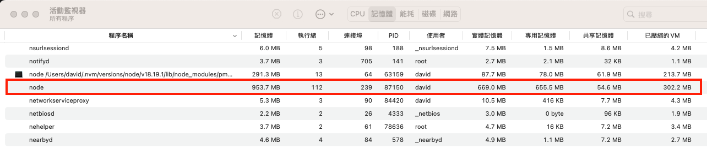

# Nodejs Worker Practice

用主執行緒開啟多個子執行緒，然後發送訊息給子執行緒，子執行緒收到後再回傳訊息給主執行緒，主執行緒會等全部都完成才關閉主執行緒，此為參考nodejs官網範例．

## 實作

代碼：
```javascript
// nodejs code

import { MessageChannel, MessagePort, BroadcastChannel, Worker, isMainThread, parentPort, threadId } from 'node:worker_threads';
import { fileURLToPath } from 'node:url'
import assert from 'node:assert'

const __filename = fileURLToPath(import.meta.url);

// 檢視當前 process id 與 thread id 以及是否為主執行緒
console.log(`[pid:${process.pid}][tid:${threadId}]isMainThread`, isMainThread, __filename);

if (isMainThread) {
  mainHandler()
} else {
  subHandler()
}

console.log(`[pid:${process.pid}][tid:${threadId}] end`)

async function delay(ms) {
  await new Promise(res => {
    setTimeout(res, ms);
  })
}

// 子執行緒回送訊息給主執行緒
async function subHandler() {
  console.time(`[pid:${process.pid}][tid:${threadId}]sub`)
  console.log(`[pid:${process.pid}][tid:${threadId}]exec sub thread receive msg`);
  // 監聽一次從主執行緒來的訊息，並取的訊息中的MessageChannel port1，透過port1回傳訊息給主執行緒，然後關閉MessageChannel物件
  parentPort.once('message', (value) => {
    console.log(`[pid:${process.pid}][tid:${threadId}] [main sendTime:${Date(value.sendTime)}]sub receive value`, value)
    assert(value.hereIsYourPort instanceof MessagePort);
    value.hereIsYourPort.postMessage('this worker is sending this');
    value.hereIsYourPort.close();
  })
  await delay(10000) // 等10秒，測試是否主執行緒會等子執行緒工作完成後，才結束主執行緒
  console.timeEnd(`[pid:${process.pid}][tid:${threadId}]sub`)
  console.log(`[pid:${process.pid}][tid:${threadId}]sub thread done`)
}

// 主執行緒開啟多個子執行緒並發送送訊息給每個子執行緒
async function mainHandler() {
  const workers = []
  for(let i = 0; i < 100; i++) {
    // await delay(2000)
    const worker = new Worker(__filename);
    const subChannel = new MessageChannel();
    // worker發送訊息並提供port1給子執行緒回傳訊息用
    worker.postMessage({ hereIsYourPort: subChannel.port1, sendTime: Date.now() }, [subChannel.port1]);
    // 主執行緒透過port2間聽從子執行緒送出的訊息
    subChannel.port2.on('message', (value) => {
      console.log(`[pid:${process.pid}][${threadId}] receive:`, value);
    });
    workers.push({
      worker, subChannel
    })
  }

  console.log(`[pid:${process.pid}][tid:${threadId}]main work done`)
}
```

活動監視器檢視thread與memory使用狀況：
