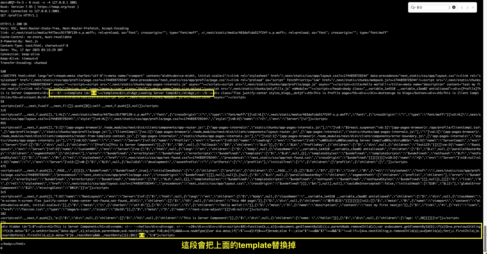

# Why React Server Component exist?

## SPA Problem
Server端發送空殼html以及很大一包的JS讓前端渲染UI

```html
// Server sends empty HTML & js for execute
<div id="root"></div>
<script src="app.js"></script>
```
大致流程如下：
1. 下載html
2. 下載js
3. 轉換並執行js
4. 呼叫api
5. 建立DOM
6. 顯示內容 

**優點:**
- 初始化只會做一次,url導航會感覺很即時,因為不會整頁重新載入

**缺點:**
- 直到js載入完成前,用戶只會看到空白的畫面
- 搜尋引擎無法為頁面建立索引,因為他們只讀取html內容,不執行後續的js
- 若用戶網路不佳或裝置不夠強大,初始化會很久,會造成期間用戶無法做任何事情

## SSR
SSR的出現就是為了解決SPA問題,所以就在服務器端先pre-render HTML內容然後才送html給用戶
 
```html
// Server runs React components and sends real HTML
<div id="root">
  <h1>Welcome John</h1>
  <div class="dashboard">
    <p>Your balance: $100</p>
    ...actual content...
  </div>
</div>
<script src="app.js"></script>
```

**優點:**
- 快速顯示第一次渲染的html內容(用戶不用等到js執行完就可看到內容)
- 對SEO更友善,爬蟲可以即時看到內容
- 對於慢速裝置的效能較好,因為不用把所有工作都丟給client端做,  
  因為服務器端會先將內容寫入html才發送出去, 樣本如下：
    ```javascript
    // server load data and render
    const html = ReactDOMServer.renderToString(<App initialData={someData} />);
    res.send(`
        <div id="root">${html}</div>
        <script>window.__INITIAL_DATA__ = ${JSON.stringify(someData)}</script>
        <script src="/client.js"></script>
      `);
    });
    ```

**缺點:**
用戶端無法有任何互動,因為僅是html的殼,這對大多數網站是沒有意義的,所以需要做"hydration".

### Hydration

`hydration`目的：
- html內的元素掛上對應的event handler
- 初始化React Virtual dom內對應的真實元素並同步組件狀態

`hydration`流程：
   1. server渲染components到html上然後送出該html
   2. client接收html並開始解析html
   3. client下載react lib(react.js, react-dom.js) + components code
   4. client執行這些相同的components並建置react virtual DOM樹
   5. client 再將react virtual DOM樹做脫水(‘hydration’)


下載react的意思是指還需要執行react本身的核心演算與component的相關邏輯然後是React-DOM,然後才是執行自己寫的component的代碼,範例如下：

```html
// server sends those along as JS files
<script src="/react.js"></script>
<script src="/react-dom.js"></script>
<script src="/your-app.js"></script>
```

所以在client端仍是React,所以需要讓react virtual DOM了解如何`hydration`.
從下載JS到 `hydration` 的流程如下：
1. React 檢視目前頁面的HTML
2. 執行下載的component組件,用來建立virtual DOM,
   可以想像就是用React.createElement呼叫這些物件數據用來展現UI
3. 開始 `hydration`
   `hydration` flow:
	1. React同時間遍歷虛擬DOM樹與真實DOM樹
	2. 每個節點逐一檢查匹配(檢查真實DOM node是對應到哪個virtaul node)
	3. 當發現虛擬DOM匹配到實際的div後
	4. 將該virtaul dom的事件處理函式掛到此真實DOM node上
	5. 然後更新狀態管理內的狀態
	6. 然後讓所有東西都是可互動的,結束

到這裡看起來應該ok了,所以問題是?
當我們送出html與js到client端,`client還是需要下載與執行,才能讓整頁有互動`,所以為什麼需要在server上渲染所有的html內容？
(OS:事件處理函式還是只能靠react去掛載到真實dom上)

## Tranditional Hydration Problem

hydration過程中會有個server與client端的node匹配問題,假設有當前時間(或產生隨機亂數),client端做`hydrate`時,組件產生的當前時間勢必與server當時產生的時間有誤差,這時候做匹配會有問題,React就不知道該如何將event handler掛到那個真實dom了. 

範例：
```javascript!
// Server renders:
function Component() {
  return <div>Hello {new Date().toString()}</div>
}

// Server HTML:
<div>Hello Mon Jan 21 2025 10:30:15</div>

// When client hydrates, it runs the component again:
<div>Hello Mon Jan 21 2025 10:30:16</div>

// React sees:
// - Server gave me HTML with "10:30:15"
// - My new render wants to show "10:30:16"
// - These don't match! Something's wrong!
```

另一個問題是`server仍然會blocking`,假設某個要render的組件內有三個子組件分別要消耗不同的時間,必須等所有組件都完成才能返回html?

範例：
```javascript!
async function HomePage() {
  const userData = await fetchUser(); // 300ms
  const profileData = await fetchProfile(); // 500ms
  const postsData = await fetchPosts(); // 1000ms

  // Server can't send ANYTHING until all 1.8 seconds pass!
  return (
    <div>
      <Nav userData={userData} />
      <Profile profileData={profileData} />
      <Posts postsData={postsData} />
    </div>
  );
}
```

當Server開始渲染html,會卡在 `renderToNodeStream` 1.8秒.
造成用戶端在1.8秒前都是空白畫面,TTFB(Time of First Byte)指標會很慘,思考一下幾點：
1. 必須等所有資料完成?
2. 能先把某些已經完成的內容送到用戶端嗎?
3. 能改變原本組件的順序
   範例原本的順序是 userData -> profileData -> postsData
   希望順序是 profileData -> userData -> postsData
   能簡單的達到嗎？

## React Suspense + Partial chunks

使用React Suspense可以讓資料快速響應,也就是讓一開始返回的html內容為fallback的內容,然後等那段資料完成後,透過streaming的形式將chunk返回,返回後就會立即append到頁面,然後透過script將原本的fallback內容替換成chunk已經渲染好的內容.

範例：
```javascript!
// 這個組件第一次寫入html時,會立即渲染Nav內容,以及Suspnese的兩個fallback內容
function ProfilePage() {
  return (
    <div>
      {/* This renders immediately */}
      <Nav />

      {/* This tells React "hey, I might not be ready" */}
      {/* If I am not ready, show this fallback */}
      <Suspense fallback={<ProfileSkeleton />}>
        <Profile />
      </Suspense>

      {/* Same here */}
      <Suspense fallback={<CommentsSkeleton />}>
        <Comments />
      </Suspense>
    </div>
  );
}

// 以下是渲染後的html
<div>
    <!-- 這是Nav組件渲染的內容 -->
    <header>
        <div>Weolcome my web site</div>
    </header>
    <!-- 這是Profile組件渲染的內容 -->
    <div data-suspense-boundary="chunk1">
        <div class="spinner">Profile Loading...</div>
    </div>
    <!-- 這是Comments組件渲染的內容 -->
    <div data-suspense-boundary="chunk2">
        <div class="spinner">Comments Loading...</div>
    </div>
<div>
```

然後當 `Profile` 的資料準備完成,就會再將內容透過原來的connection推送到前端(原理是transfer-encoding:chunked),下面範例就是推送的chunk內容,這樣就可以讓先返回的html內容渲染到頁面上.
`Comments` 組件也是相同方式推送內容.

可參考此[連結](https://hackmd.io/DXNp2A2tTvCsnPhV7Q3Cew)

```javascript!
<!-- New content chunk -->
<template data-suspense-chunk="chunk1">
  <div class="profile">Alice's Profile ...</div>
</template>

<!-- Inline script to perform the replacement -->
<script>
  document
    .querySelector('[data-suspense-boundary="chunk1"]')
    .replaceChildren(
      document.querySelector('[data-suspense-chunk="chunk1"]').content
    );
</script>
```

以上的關鍵機制是:
1. 透過標記(data-suspense-boundary)來建立一個`待補`的洞,讓等等才完成的內容可以被正確找到並替換
2. 透過`template`就不會一返回就被渲染到頁面上(template的內容是不會渲染到頁面的).
3. 透過一個小的`script`來執行內容替換
4. 透過標記(data-suspense-boundary)的id,可以讓react能夠知道事件處理該附加到誰身上,也可以同步virtual dom狀態

### Suspense 如何工作?

假設`Profile`組件被`Suspense`包裹,當試圖渲染`Profile`組件時,`Suspense`會攔截到`Profile`拋出的錯誤,如果是`promise`類型(如果不是就往上拋此錯誤),就先渲染`fallback`的組件,等到`promise`完成才會重新嘗試渲染`Profile`組件.

範例：
```html!
<!-- Profile組件被Suspense包裹 -->
<Suspense fallback={<Loading />}>
  <Profile />
</Suspense>
```

```javascript!
function Profile() {
  // This is what happens under the hood when you fetch data
  // in a "suspense-enabled" way:
  const promise = fetchData();

  if (promise.status === "pending") {
    // This is what "suspending" actually means:
    // The component throws a promise!
    throw promise;
  }

  // If we get here, we have data
  // otherwise Suspense would have caught the promise
  return <div>{data.name}</div>;
}
```

```javascript!
// Pseudo code of the Suspense catching part
try {
  // Try to render Profile
  return <Profile />;
} catch (thrownValue) {
  if (thrownValue instanceof Promise) {
    // Aha! Component isn't ready yet
    // Show loading instead
    return <Loading />;
  } else {
    // Oops, real error, let it bubble up
    throw thrownValue;
  }
}
```

### Partial Chunks

原理是是用遊覽器對於收到`Transfer-Encoding: chunked`的Header時,會保留connection,暫時不會關閉它,且視body內的資料為一個chunks,當收到chunk後就附加到html上,直到server返回的chunk size為0,就表示沒chunk要傳了.


[範例參考](https://hackmd.io/DXNp2A2tTvCsnPhV7Q3Cew)

## Core Problom

上述問題仍無法解決所有的JavaScript必須在用戶端被下載與執行,所以即使透過streaming方式片段載入內容,還是需要下載各個組件代碼(即使某些組件其實根本沒有互動性).

下載後,每個組件都會做以下流程：
1. 建立組件實體(思考：某些組件內容屬於靜態的,仍需要做?)
2. 建構virtual DOM nodes
3. 設定event handler
4. 匹配現有html內容（同步組件狀態）

然後從server送到client端的js包含：
- React + React-DOM code
- all component code
- all dependencies
- State management code
- Effect handlers
- Event handlers

以下範例為例,較低效率的點是：
- 為何下載`Profile`組件(僅單純顯示資料內容)？
- 為何要綁定`Nav`組件(僅是個連結)?
- 為何要為靜態內容提供React組件?

範例：
```
function App() {
  return (
    <Layout>
      <Nav />
      <Suspense>
        <Profile /> // Rarely needs interactivity
        <Sidebar />
      </Suspense>
      <Suspense>
        <Comments /> // Needs to be interactive
      </Suspense>
    </Layout>
  );
}
```

### Static Component

範例組件(僅用來顯示資料):
```
function Profile({ user }) {
  return (
    <div className="profile">
      <h2>{user.name}</h2>
      <span>{user.bio}</span>
    </div>
  );
}
```

若走傳統SSR(不管是不是用streaming方式),仍必須送出Profile component code,除了用來處理`props`以及該組件module scope內的東西或相依,也讓React用來:
1. 建立組件實體
2. 建立和比較virtual DOM nodes
3. 處理組件的lifecycle(mount, unmount, update, ...)
4. 設定[reconciliation process](https://legacy.reactjs.org/docs/reconciliation.html)(即差異比較的演算程序,用來更新組件或重建組件)

上述動作是因為React需要在用戶端"rebuild"整個component tree才能匹配目前的html內容且為了潛在的更新做準備,並維護virtual dom結構,**但是靜態內容根本不會有更新或互動行為**.

## React Server Component

為了解決上面問題,React將組件區分為`server component`與`client component`,`server component`用來讓server渲染html用的,`client component`用來讓用戶端渲染頁面用的,並建立`slots`給預留給`client component`使用,讓react在用戶端操作時知道哪邊該`注入`互動行為.

範例(除了顯示靜態資料也有用戶端的互動行為):
```
// Server Component - stays on server!
function Profile({ user }) {
  return <h1>{user.name}</h1>;
}

// Client Component - ships to client
"use client"
function LikeButton() {
  const [liked, setLiked] = useState(false);
  return <button onClick={() => setLiked(!liked)}>Like</button>;
}
```

## RSC Payload

範例：
```
function ServerComponent() {
  return (
    <div>
      <h1>Hello</h1>
      <ClientComponent />
    </div>
  );
}

"use client"
function ClientComponent() {
  const [count, setCount] = useState(0);
  return <button onClick={() => setCount((c) => c + 1)}>{count}</button>;
}
```

除了將送出已渲染的chunks也一併送出一個特殊結構`RSC Payload`,用來保留component boundaries.

產生的內容大致如下:
```
// Server generates RSC payload AND assigns markers
[
  ["M", "ClientComponent.js"],
  ["S", "<div><h1>Hello</h1>"],
  ["J", "ClientComponent.js", {}, "B:0"],  // Server assigns marker
  ["S", "</div>"]
]

// Server also generates initial HTML with these markers
<div>
  <h1>Hello</h1>
  <template id="B:0"></template>
</div>
```

"M"用來告訴客戶端這是個組件,請下載他
"J"用來告訴客戶端這是個module,請將它注入
"S"用來告訴客戶端這是個`server component`,請替換他的內容

> "J" 項目後面有個空物件,是因為ClientComponent沒有任何props需要傳遞,當server端有傳遞props,這物件就會有東西

### RSC Payload Structure

```
"M" - Module Reference
    - Tells client which client components it needs to load
    - Example: ["M", "Button.client.js"]

"S" - Server Component HTML
    - Static HTML from server components
    - Example: ["S", "<div>Hello</div>"]

"J" - Client Component Placeholder
    - Where to inject a client component
    - References a module, includes props, and has a marker
    - Example: ["J", "Button.client.js", {color: "blue"}, "B:0"]
    - Marker matches template id in HTML

"H" - Hint to preload module
    - Background preloading of modules
    - Example: ["H", "Modal.client.js"]

"E" - Error
    - Server-side error boundaries
    - Example: ["E", "Error message", "stack trace"]

"P" - Promise
    - For streaming data from server
    - Example: ["P", "chunk-123", Promise]

"B" - Bundle Reference
    - References to other JavaScript bundles
    - Example: ["B", "chunk-123.js"]
```

[React解析類型的原始碼](https://github.com/facebook/react/blob/9d17b562ba427adb1bced98f4231406ec573c422/packages/react-client/src/ReactFlightClientStream.js#L44-L60)

[NextJS RSC Payload](https://nextjs.org/docs/app/building-your-application/rendering/server-components#what-is-the-react-server-component-payload-rsc)

[NextJS Payload Parser(針對nextjs產生的RSC payload)](https://rsc-parser.vercel.app/)

## What's happening on the client?

當client收到這個payload會做：
1. 建置一個`VDOM`,但不用再為了所有東西
2. 匹配component與對應的slots
3. 設置`hydration`

React建置了一個VDOM,但不像以前一樣那樣為了適用於所有內容,這個透過讀取`RSC Payload`的VDOM僅在以下兩種情況才建立:
1. 父層元素包含`Client Component`
2. `Client Component`內有佔位標記(placeholder)

### React如何建置`VDOM`?

```
// RSC payload from server:
[
  ["M", "ClientComponent.js"],
  ["S", "<div><h1>Hello</h1>"],
  ["J", "ClientComponent.js", {}, "B:0"],
  ["S", "</div>"]
]

// React builds this sparse VDOM:
{
  type: "div",      // Parent structure is needed
  children: [
    // Note: No VDOM node for <h1> - it's pure server HTML!
    {
      type: ClientComponent,  // Client component gets a VDOM node
      props: {},             // Props passed from server
      marker: "B:0"          // Links to the template in HTML
    }
  ]
}
```

RSC Payload 是有順序性的,這樣才能讓`VDOM`的節點正確匹配到html上的節點,React建置這個VDOM需要做以下流程：
1. 載入 `Client Component`
2. 將組件與html上的插槽(slots)做匹配
    流程：
    1. 查找標記
    2. 找出匹配於html節點的組件
    3. 準確地告訴React 每個`Client Component`該指向那個節點
3. 讓組件可以有互動
    流程：
    1. 建立`Client Component`實體
    2. 設定組件狀態(eg: useState(0) useEffect(...)等等)
    3. 附加 event handler(eg: onClick 等事件)
    4. 將原本的template替換成此即時組件

以上流程就使React讓`Client Component`有互動性了.

## 為啥要讓 Client Component上面標記"use client"

因為預設所有的組件都是`Server Component`,這是故意設計的,目標是讓用戶端的javascript變少.

當bundler看到 `"use client"` 標記,就知道這是要打包到用戶端的組件,會將這類組件集中處理.

## 結論

開發時需要多思考組件是是用在server端或client端還是兩端,複雜度有提升不少,但`Server Component`有一個最大的好處,就是原本該組件上相依的庫都不會被送到用戶端,就不用載入一大堆相依的JS就只為了那個靜態的內容,只需要在Server端渲染html時,產生結果就好,可以省掉不少加載js的開銷.

## Reference Links

[React Server Components](https://react.dev/reference/rsc/server-components)

[Why are React Server Components actually beneficial? (full history)_2025-01](https://tigerabrodi.blog/why-is-react-server-components-actually-beneficial-full-history#heading-introduction)

[從 Next.js 13 認識 React Server Components](https://oldmo860617.medium.com/%E5%BE%9E-next-js-13-%E8%AA%8D%E8%AD%98-react-server-components-37c2bad96d90)

[How to Optimize RSC Payload Size_2025-02](https://vercel.com/guides/how-to-optimize-rsc-payload-size)

[React Server Component 的工作原理_2023-04](https://juejin.cn/post/7220061751399170103)

## 題外話

假設某個`Server Component`是需要等1秒才能有數據,在NextJS中, 若沒有用`React.Suspense`組件包裹,那返回的html就會被延遲一秒才能返回,若有包裹`React.Suspense`就會立即返回html,此時的內容是Suspense的fallback組件,當一秒後,會用原本html的connection返回一個chunk並替換內容.



[Next: Streaming](https://nextjs.org/docs/app/building-your-application/routing/loading-ui-and-streaming#what-is-streaming)
