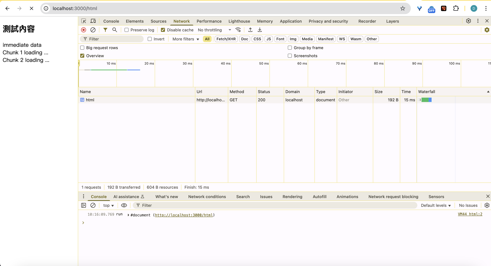
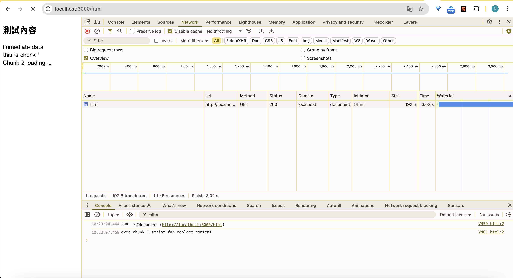
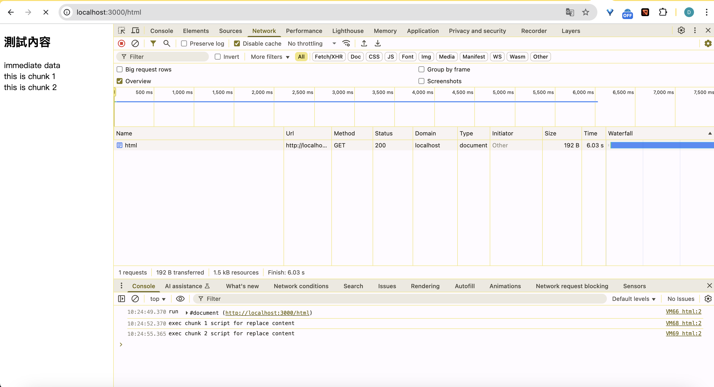
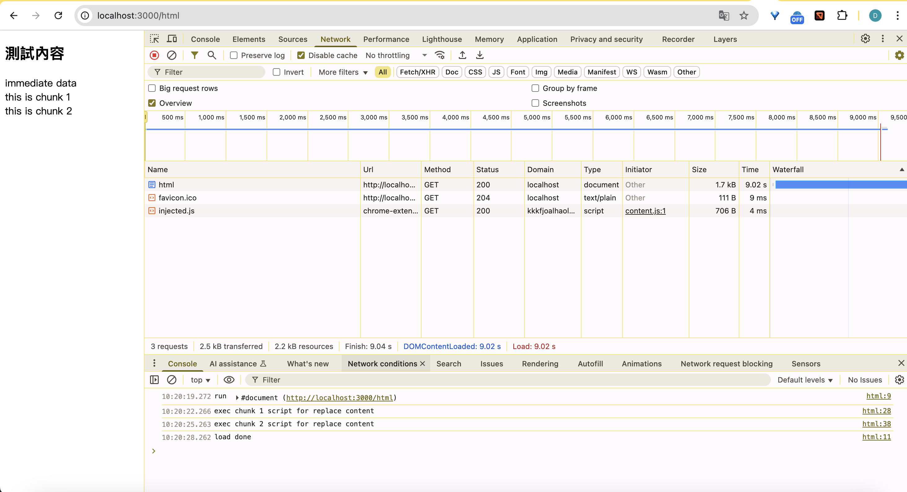

# [NodeJS] Test Http Header Transfer-Encoding 'chunked'

測試 server side sent Response Header 'Transfer-Encoing: chunked' 對於前端的效果是什麼？

(模擬Streaming Hydration)

## Code

NodeJS Server code:
```javascript
import http from 'node:http';
import fs from 'node:fs';

// 要送出的html文本
const html = `<!DOCTYPE html>
<html lang="en">
<head>
    <meta charset="UTF-8">
    <meta name="viewport" content="width=device-width, initial-scale=1.0">
    <title>測試</title>
</head>
<script>
    console.log('run', document)
    window.onloadstart = function(){ console.log('load start'); }
    window.onload = function(){ console.log('load done'); }
</script>
<body>
    <h2>測試內容</h2>
    <div>immediate data</div>
    <!-- 用來模擬Streaming SSR 第一次載入的組件1 -->
    <div data-suspense-id="chunk1">
        <div>Chunk 1 loading ...</div>
    </div>
    <!-- 用來模擬Streaming SSR 第一次載入的組件2 -->
    <div data-suspense-id="chunk2">
        <div>Chunk 2 loading ...</div>
    </div>
</body>
</html>`

const server = http.createServer((req, res) => {
    console.log('req', req.url, 'method', req.method);
    if (req.method === 'GET' && req.url === '/html') {
        // 這個可有可無,遊覽器預設還是把它當html
        res.setHeader('Content-Type', 'text/html; charset=utf-8');
        // [重點項目]告訴遊覽器暫時不要關閉connection,並持續透過此connection繼續送出chunks
        res.setHeader('transfer-encoding', 'chunked');
        const htmlBuf = Buffer.from(html)
        // 若transfer-encoding為chunked, browser會自動忽略此header
        // res.setHeader('Content-Length', htmlBuf.byteLength)
        // 送出html文本
        res.write(htmlBuf)
        // 過3秒後, 再送出 chunk 1
        setTimeout(() => {
            console.log('send chunk1')
            res.write(Buffer.from(`
            <template data-suspense-id="chunk1">
                <div>this is chunk 1</div>
            </template>
            <script>
                // chunk 1返回client後執行此script
                // 用來替換chunk 1原本的內容
                document
                  .querySelector(
                    'div[data-suspense-id="chunk1"]'
                  )
                  .replaceChildren(
                     document.querySelector(
                       'template[data-suspense-id="chunk1"]'
                     ).content
                  );
            </script>
            `))
        }, 3000);
        // 過6秒後, 再送出 chunk 2
        setTimeout(() => {
            console.log('send chunk2')
            res.write(Buffer.from(`
            <template data-suspense-id="chunk2">
                <div>this is chunk 2</div>
            </template>
            <script>
                // chunk 2返回client後執行此script
                // 用來替換chunk 2原本的內容
                document
                  .querySelector(
                    'div[data-suspense-id="chunk2"]'
                  )
                  .replaceChildren(
                     document.querySelector(
                       'template[data-suspense-id="chunk2"]'
                     ).content
                  );
            </script>
            `))
        }, 6000);
        // 過9秒後, 送出size 0 的chunk告訴遊覽器沒chunk了
        setTimeout(() => {
            console.log('send done')
            res.end() // 會將chunk size設定為0並送出,通知client沒有chunk了
        }, 9000);
        // res.end()
    }
});

const port = 3000;
server.listen(port, () => {
    console.log(`server listen port ${port} ...`);
});
```


使用 `ncat` 指令來看實際收到的內容
```bash
david@QY-fe-3 ~ % ncat -v -4 127.0.0.1 3000
Ncat: Version 7.95 ( https://nmap.org/ncat )
Ncat: Connected to 127.0.0.1:3000.
GET /html HTTP/1.1          <--- 手動輸入請求並按下enter送出

HTTP/1.1 200 OK
Content-Type: text/html; charset=utf-8
transfer-encoding: chunked
Date: Wed, 09 Apr 2025 07:17:53 GMT
Connection: keep-alive
Keep-Alive: timeout=5

25c                        <-- 這是第一次得到的chunk size與內容(size下方就是內容)
<!DOCTYPE html>
<html lang="en">
<head>
    <meta charset="UTF-8">
    <meta name="viewport" content="width=device-width, initial-scale=1.0">
    <title>測試</title>
</head>
<script>
    console.log('run', document)
    window.onloadstart = function(){ console.log('load start'); }
    window.onload = function(){ console.log('load done'); }
</script>
<body>
    <h2>測試內容</h2>
    <div>immediate data</div>
    <div data-suspense-id="chunk1">
        <div>Chunk 1 loading ...</div>
    </div>
    <div data-suspense-id="chunk2">
        <div>Chunk 2 loading ...</div>
    </div>
</body>
</html>
1bf                        <-- 經過3秒後, 第二次得到的chunk size與內容(size下方就是內容)
<template data-suspense-id="chunk1">
  <div>this is chunk 1</div>
</template>
<script>
  console.log('exec chunk 1 script for replace content');
document
  .querySelector('div[data-suspense-id="chunk1"]')
  .replaceChildren(document.querySelector(
    'template[data-suspense-id="chunk1"]'
  ).content);
</script>
1bf                        <-- 經過6秒後, 第三次得到的chunk size與內容(size下方就是內容)
<template data-suspense-id="chunk2">
  <div>this is chunk 2</div>
</template>
<script>
  console.log('exec chunk 2 script for replace content');
document
  .querySelector('div[data-suspense-id="chunk2"]')
  .replaceChildren(document.querySelector(
    'template[data-suspense-id="chunk2"]'
  ).content);
</script>
0                         <-- 經過9秒後, 第四次得到的chunk size與內容(size下方就是內容, 只剩\r\n,0表示後續沒chunk了)

david@QY-fe-3 ~ %
```

第一次response返回的html內容(包含header + html chunk)


3秒後,載入chunk 1


6秒後,載入chunk 2


9秒後,載入結束chunk(size:0 表示完成了,所以觸發window.onload事件)


## 使用 `fetch` API fetch chunks

```javascript
// fetch chunks
fetch('/html').then(res => {
    // retrieve body as ReadableStream
    const reader = res.body.getReader();
    return new ReadableStream({
        start(control) {
            return dump();
            
            function dump() {
                return reader
                    .read()
                    .then(({done, value}) =>{
                        console.log('read chunk', done, value);
                        if (done) {
                          console.log('read done');
                          control.close();
                          return;
                        }
                        // enqueue data to target stream
                        control.enqueue(value);
                    return dump()
                })
            }
        }
    })
}).then((stream) => {
    console.log('create new response of the stream', stream);
    return new Response(stream);
}).then(res => {
    res
      .text()
      .then((str) => console.log('all data is', str));
});

// first dump html content like this:
//     Uint8Array(604)[60, 33, 68, 79, 67, 84, 89, 80, 69, 32, 104, 116, 109, 108, 62, 10, 60, ...]
// after 3s, dump chunk1 like this: 
//     Uint8Array(447)[10, 32, 32, 32, 32, 32, 32, 32, 32, 32, 32, 32, 32, 60, 116, 101, 109, 112, ...]
// after 6s, dump chunk2 like this:
//     Uint8Array(447)[10, 32, 32, 32, 32, 32, 32, 32, 32, 32, 32, 32, 32, 60, 116, 101, 109, 112, ...]
// after 9s, dump close chunk
// then output all data by text content
```


## 結論

雖然HTML載入未完成,但當server已經推送部分數據時,html parser就開始動作了,並且將解析完成的內容顯示到畫面上,這對於用戶體驗是最佳的,不用等到一切都完成才能有動作.

## Reference

[MDN:Readable stream](https://developer.mozilla.org/en-US/docs/Web/API/Streams_API/Using_readable_streams)

[MDN:Transfer-Encoding](https://developer.mozilla.org/en-US/docs/Web/HTTP/Reference/Headers/Transfer-Encoding)