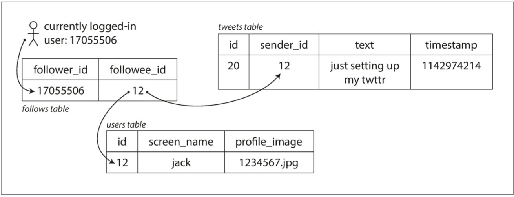
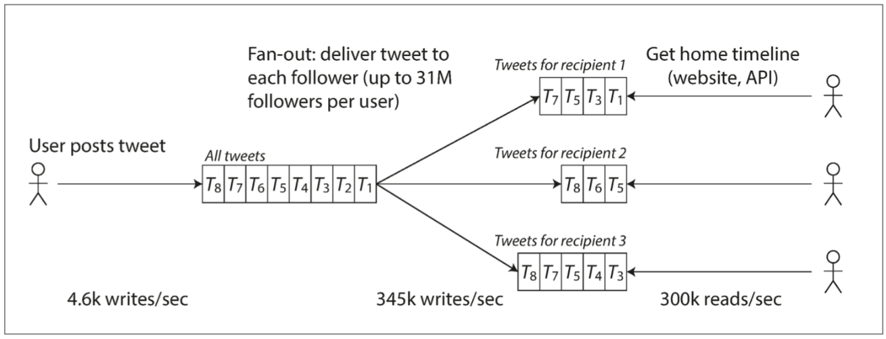

# [筆記] Designing Data-Intensive Applications

現今的系統大部分是數據密集 （_data-intensive_）而不是計算密集（_compute-intensive_），所以很少是因為ＣＰＵ算力不足而造成限制的．
數據密集比較大的問題是**資料量**或**資料複雜度**或**資料變更速度**．

一般數據密集的應用，通常有些通用流程，如下：
- 紀錄數據，讓其他應用等等可以找到至些數據（database）
- 記住一些昂貴的操作結果，加速讀取速度（cache）
- 允許使用者可以搜尋數據，或以各種方式對數據進行過濾（search indexes）
- 向其他程序發送消息，進行異步處理（stream processing）
- 定期處理累積的大量數據（batch processing）

近年來又出現了許多新的數據儲存工具，針對不同場景而設計的，例如：數據儲存可以被當成消息列隊用（Redis），消息列隊則帶有類似數據庫的持久保證（Apache Kafka）

## 數據系統的參考指標

- 可靠度（Reliability）：系統在困境(ex: 硬體故障、軟體故障、人為錯誤)中仍可正常工作（正確完成功能並能達到期望的性能水準）
- 可擴展性（Scalability）：有合理的辦法對應系統的增長（數據量、流量、複雜度）
- 可維護性（Maintainability）：不同的人（工程師，維運人員）在不同的時期，均能高效的在系統上工作（使系統保持現有行為，並可適應新的應用場景）

造成錯誤的原因叫故障（fault），能預料並對應故障的系統特性稱容錯（fault-tolerant）或韌性（resilient），設計容錯機制以防止因故障（fault）而導致系統失效（failure），比起阻止錯誤，通常更傾向容忍錯誤，但也有預防勝於治療的情況．

> 故障（fault）：通常定義為系統的一部分偏離其標準  
> 失效（failure）：整個系統停止向用戶提供服務

## 範例 - 推特的例子（2012/11）

推特的用戶向其粉絲發布新消息的數量平均約 4.6k請求/秒，尖峰則超過 12k請求/秒，用戶可查閱他們關注的人發布的推文(300k請求/秒)，處理每秒12000次寫入是簡單的，**問題在用戶關注其他用戶也被很多人關注**，所以查詢比寫入多了25倍。

推特一開始的方式，發布推文時，將新推文插入全局推文集合表格．當用戶請求自己主頁的時間線時，首先查找他關注的所有人，然後查這些被關注用戶發布的推文並按時間順序排序即可．

查詢如下：

```sql
 SELECT tweets.*, users.*
   FROM tweets
   JOIN users   ON tweets.sender_id = users.id
   JOIN follows ON follows.followee_id = users.id
   WHERE follows.follower_id = current_user
```



後來推特改另一個方法，為每個用戶的主頁時間線維護一個緩存，類似每個用戶都有一個推文收件箱，當一個用戶發布推文時，就查找所有關注該用戶的人，並將新的推文插入到用戶的推文收件箱，因此讀取主頁的請求開銷就變得很小，因爲結果已經計算好了．

如下圖所示：


方法2效果更好，因爲發推文比查詢主頁時間線的頻率低很多，所以很適合讓寫入時多做點事，這樣讀取就可以減少些工作量，但方法2有個缺點，一般推文大約會發送到75個關注者，所以每秒4.6k的寫入變成對**主頁時間線緩存**每秒345k的寫入，但某些用戶（名流）有超過3000萬的粉絲，也就是該用戶發一個推文，就有3000萬次的**主頁時間線緩存**寫入，所以最終混合兩種方法，少數擁有超大量粉絲的用戶發文時，不會寫入到**主頁時間線緩存**，當用戶讀取主頁面時間線時，分別獲取該用戶關注的名流的推文，再與用戶的**主頁時間線緩存**合併，這種混合方式就可提供良好的性能．

## 名詞說明